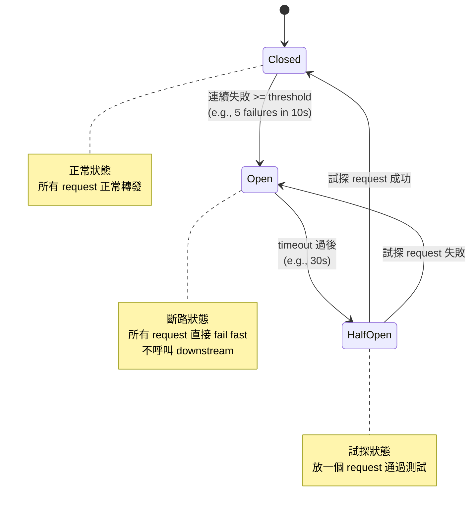
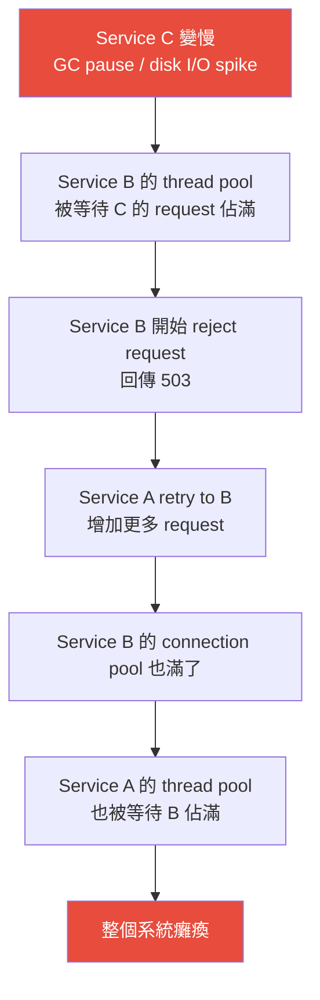

# Fault Tolerance & Redundancy：故障容錯與冗餘設計

分散式系統中，**failure 不是例外，是常態**。硬碟會壞、網路會斷、process 會 crash、甚至整個 data center 會斷電。Fault tolerance 的目標不是消除 failure，而是在 failure 發生時**系統仍能繼續正常（或降級）運作**。

---

## 1. Failure Modes 分類

### 1.1 按故障層級

| 層級 | 故障類型 | 頻率 | 影響範圍 | 典型復原時間 |
|------|---------|------|---------|------------|
| **Process** | OOM kill、unhandled exception、deadlock | 高 (每天) | 單一 instance | 秒級 (auto-restart) |
| **Node** | 硬體故障、kernel panic、disk failure | 中 (每月) | 單一 server | 分鐘級 (failover) |
| **Rack** | 電源故障、top-of-rack switch 故障 | 低 (每季) | 10-40 servers | 分鐘級 (AZ redundancy) |
| **AZ / Data Center** | 電力中斷、冷卻系統故障、光纖切斷 | 極低 (每年) | 數千 servers | 分鐘~小時 (cross-AZ failover) |
| **Region** | 自然災害、大規模網路中斷 | 極極低 | 整個區域 | 小時~天 (cross-region DR) |

**Google 的數據 (from Spanner paper)：** 在一個大型 cluster 中，每年約有 ~1000 次 single machine failure、~10 次 rack failure、~1 次 datacenter-level issue。

### 1.2 按故障行為

| 類型 | 行為 | 偵測難度 | 範例 |
|------|------|---------|------|
| **Crash Fault** | Node 停止回應，不再發送任何消息 | 易 (timeout) | Process crash, hardware failure |
| **Omission Fault** | Node 部分請求無回應（丟包） | 中 | Network congestion, overloaded server dropping requests |
| **Timing Fault** | Node 回應太慢，超過預期時間 | 中 | GC pause, disk I/O spike, noisy neighbor |
| **Byzantine Fault** | Node 發送錯誤或矛盾的資訊 | **極難** | 軟體 bug、資料損壞、惡意行為 |

**面試要知道：** 大多數 system design 只需要處理 **crash fault + timing fault**。Byzantine fault tolerance (BFT) 只有在區塊鏈或航太系統中才需要——不要在面試中過度設計。

---

## 2. Failure Detection 機制

在你能 tolerate failure 之前，你得先**偵測到 failure**。這比聽起來困難得多——在分散式系統中，「沒有回應」可能是 node 掛了，也可能只是網路延遲。

### 2.1 偵測方式比較

| 機制 | 原理 | 優點 | 缺點 |
|------|------|------|------|
| **Heartbeat** | Node 定期發送「我還活著」訊號；超時未收到 = 判定死亡 | 簡單、廣泛使用 | 需要選擇 timeout 值：太短 → false positive (GC pause 被誤判)；太長 → 偵測延遲 |
| **Ping / Health Check** | 主動詢問 target node 「你還好嗎？」 | 可以檢查 application-level 健康（不只是 process alive） | 增加 network traffic |
| **Lease** | Node 持有一個有期限的 lease；lease 到期未續約 = 判定死亡 | 提供 **mutual agreement**——持有者和觀察者對「誰擁有什麼」有共識 | Lease 續約的 timing 需要考慮 clock drift |
| **Phi Accrual Failure Detector** | 不用固定 timeout，而是根據歷史 heartbeat 間隔算出 failure 的**機率** (phi 值) | 自適應——自動調整對 network jitter 的容忍度 | 實作稍複雜 |

### 2.2 Timeout 設定的 Trade-off

```
Timeout 太短 (e.g., 100ms):
  ✓ 快速偵測 failure
  ✗ 高 false positive rate — GC pause 50ms 就被判定死亡
  ✗ 頻繁的不必要 failover (failover storm)

Timeout 太長 (e.g., 30s):
  ✓ 低 false positive — 只有真正掛掉的才會被偵測
  ✗ 偵測延遲 — 30 秒內 failure 不被處理
  ✗ 影響 user experience (30 秒的錯誤回應)
```

**典型設定：**
- Load balancer → backend health check：3-5 秒 interval，2-3 次失敗判定 unhealthy
- Database primary → replica heartbeat：1 秒 interval，10-30 秒 failover timeout
- Kubernetes liveness probe：10 秒 interval，3 次失敗 → restart container
- ZooKeeper session timeout：通常 6-30 秒

---

## 3. Recovery Patterns（故障恢復模式）

### 3.1 Retry Pattern

最基本也最容易做錯的 pattern。

**Naive retry 的問題：**
```
Server 過載 → Response timeout → Client retry → Server 收到更多 request → 更過載
= Retry Storm（正反饋迴路，把系統推到死亡）
```

**正確的 Retry 策略：**

| 策略 | 機制 | 適用場景 |
|------|------|---------|
| **Exponential Backoff** | 每次 retry 等待時間加倍：100ms → 200ms → 400ms → 800ms | 大多數場景的 baseline |
| **+ Jitter** | 在 backoff 基礎上加隨機偏移：`sleep = random(0, base * 2^attempt)` | **必須加** — 否則所有 client 同時 retry (thundering herd) |
| **Max retries** | 限制最多 retry 3-5 次 | 避免無限 retry |
| **Retry budget** | 整個 service 的 retry rate 不超過 incoming rate 的 10% | Google SRE 推薦。防止 retry 成為主要流量 |

**哪些 error 可以 retry？**

| 可以 Retry | 不可以 Retry |
|-----------|-------------|
| 503 Service Unavailable | 400 Bad Request (你的 request 有問題) |
| 429 Too Many Requests (等一下再試) | 401/403 Unauthorized (權限問題) |
| 網路 timeout | 409 Conflict (業務邏輯衝突) |
| Connection refused (server 重啟中) | 已成功但 response 遺失的非冪等操作 |

**冪等性 (Idempotency) 是 retry 的前提：**
- `GET`、`DELETE` (by ID)、`PUT` (完整替換) — 天然冪等，安全 retry
- `POST` (建立新資源)、`PATCH` (部分更新) — **不冪等**。Retry 可能造成重複操作
- 解法：client 帶 `Idempotency-Key` header，server 用這個 key 做去重

### 3.2 Circuit Breaker Pattern

當 downstream service 持續失敗時，不斷 retry 只是浪費資源。Circuit Breaker 在偵測到持續失敗後「斷路」，直接回傳 error 而不嘗試呼叫。



**Circuit Breaker 的關鍵參數：**

| Parameter | 典型值 | 設定考量 |
|-----------|--------|---------|
| **Failure threshold** | 5-10 failures in 10-60s | 太低 → 偶發 error 就觸發斷路；太高 → 反應太慢 |
| **Open duration** | 30-60 秒 | 給 downstream 足夠的恢復時間 |
| **Half-open test count** | 1-3 requests | 太多 → 恢復期的流量可能再次壓垮 downstream |
| **Success threshold to close** | 3-5 consecutive successes | 確保 downstream 真的恢復了 |

**實作：** Netflix Hystrix (已停止維護)、Resilience4j (Java)、Polly (.NET)、gobreaker (Go)

### 3.3 Bulkhead Pattern（艙壁隔離）

```
Without Bulkhead:                    With Bulkhead:
┌─────────────────────┐              ┌─────────────────────┐
│   Thread Pool (100)  │              │ Pool A (30) │Pool B (30)│Pool C (40)│
│  All services share  │              │ Service A   │Service B  │Service C  │
│  the same threads    │              │ (isolated)  │(isolated) │(isolated) │
└─────────────────────┘              └─────────────────────┘

Service A 爆了 → 100 threads       Service A 爆了 → 30 threads stuck
全部卡住 → 所有服務癱瘓            → Service B & C 不受影響
```

**核心思想：** 把資源（thread pool、connection pool、memory）分區隔離，一個 downstream 的故障不會拖垮整個系統。

**實作方式：**
- **Thread pool isolation**：每個 downstream 有自己的 thread pool（Hystrix 模式）
- **Semaphore isolation**：用 semaphore 限制同時呼叫某個 downstream 的數量（更輕量）
- **Process isolation**：microservice 本身就是 bulkhead——一個 service crash 不影響其他 service
- **Infrastructure isolation**：critical 和 non-critical 服務用不同的 DB instance / cache cluster

### 3.4 Fallback Pattern

當 primary 路徑失敗時，使用替代方案：

| Fallback 策略 | 說明 | 範例 |
|--------------|------|------|
| **Cache fallback** | 回傳 cached 的舊資料 | 商品頁的推薦列表——推薦服務掛了，顯示上次 cache 的結果 |
| **Default value** | 回傳預設值 | 使用者設定讀取失敗 → 回傳預設設定 |
| **Degraded service** | 提供功能較少的版本 | Netflix 推薦引擎掛了 → 顯示人工策展的「熱門排行榜」|
| **Failover to another service** | 切換到 backup service | Primary DB 掛了 → 切到 secondary |
| **Graceful error** | 清楚告知使用者並提供替代路徑 | 支付服務暫時不可用，顯示「請稍後再試」 |

**注意：** Fallback 本身也可能失敗。不要建立太深的 fallback chain（A fails → try B → B fails → try C → ...）。通常最多兩層。

---

## 4. Redundancy Patterns（冗餘模式）

### 4.1 Redundancy 策略比較

| 模式 | 機制 | Failover Time | 成本 | 資料遺失風險 |
|------|------|--------------|------|------------|
| **Cold Standby** | Backup 平時關機，災難時啟動並從 backup 恢復資料 | **小時級** | 最低（只需 backup storage） | 高（上次 backup 之後的資料遺失）|
| **Warm Standby** | Backup 運行中，持續接收 replication，但不服務流量 | **分鐘級** | 中（需要運行 standby instance） | 低（取決於 replication lag）|
| **Hot Standby** | Backup 運行中，接收 replication，且可服務 read 流量 | **秒級** | 高（standby 需要與 primary 同等資源） | 極低（同步 replication 可達零遺失）|
| **Active-Active** | 多個 node 同時服務讀寫流量 | **零** (無需 failover，其他 node 自動接手) | 最高（每個 node 都需要完整能力） | 需要 conflict resolution |

### 4.2 Active-Passive vs Active-Active

```
Active-Passive:                      Active-Active:
┌────────┐     ┌────────┐           ┌────────┐     ┌────────┐
│Primary │ ──→ │Standby │           │Node A  │ ←─→ │Node B  │
│(R + W) │repl │(idle)  │           │(R + W) │sync │(R + W) │
└────────┘     └────────┘           └────────┘     └────────┘
                                    兩邊同時接受讀寫
```

| Dimension | Active-Passive | Active-Active |
|-----------|---------------|---------------|
| **Failover 時間** | 秒~分鐘 (偵測 + promote standby) | 零 (流量自動切到存活的 node) |
| **資源利用率** | 50% (standby 閒置) | ~100% (所有 node 都在工作) |
| **一致性** | 簡單 — 只有一個 writer | 複雜 — 需要 conflict resolution (last-write-wins, CRDTs, application-level merge) |
| **適用場景** | 大多數 DB、stateful service | DNS (anycast)、CDN、multi-region deployment (DynamoDB Global Tables) |
| **典型實作** | PostgreSQL streaming replication + failover | Cassandra、DynamoDB Global Tables、CockroachDB |

### 4.3 多層冗餘設計

生產環境的 HA 不是靠單一機制，而是**每一層都有冗餘**：

```
Layer                 Redundancy                    Mechanism
─────                 ──────────                    ─────────
DNS                   Multiple NS records           Route 53 health check + failover
CDN                   Multi-PoP                     CDN provider 自動切換
Load Balancer         Active-passive pair            VRRP / keepalived
Application           Multiple instances             Auto-scaling + health check
Cache                 Redis Sentinel / Cluster       Automatic failover
Database              Primary + Standby + Replica    Streaming replication + automatic failover
Storage               Multi-AZ replication           S3 (99.999999999% durability)
```

---

## 5. Data Durability（資料持久性）

### 5.1 Replication 與 Durability

| 機制 | Durability 保證 | 效能影響 |
|------|----------------|---------|
| **Async replication** | 可能遺失最後幾秒的寫入（replication lag） | 零——primary 不等 replica ACK |
| **Semi-sync replication** | 至少 1 個 replica 收到（MySQL semi-sync） | 增加 1 RTT per write（intra-AZ ~0.5ms, cross-AZ ~1-2ms） |
| **Sync replication** | 所有 replica 都收到才 ACK | 增加 N × RTT per write，throughput 顯著下降 |
| **Quorum write** | W 個 replica 確認即 ACK（W + R > N 保證 consistency） | 增加 ~1 RTT（取最慢的前 W 個 replica） |

### 5.2 Write-Ahead Log (WAL)

幾乎所有 durable storage 系統都使用 WAL：

```
Write Request
    │
    ▼
[1. Write to WAL (sequential append, fsync)] ← 保證 durability
    │
    ▼
[2. Update in-memory data structure]          ← 保證 performance
    │
    ▼
[3. Eventually flush to data files]           ← checkpoint / compaction
```

**為什麼 WAL 是 sequential write？** 因為 sequential write 比 random write 快 100-1000x（SSD 上快 ~10x，HDD 上快 ~1000x）。WAL 只需要 append，所以即使 data file 的更新需要 random write，WAL 的 sequential append + fsync 仍然很快。

**fsync 的成本：**
- SSD: ~0.1-0.5 ms per fsync
- HDD: ~5-10 ms per fsync (需要等磁頭旋轉到正確位置)
- 如果 `fsync = every commit`：durability 最強，但每秒只能做 ~2000-10000 次 commit (SSD)
- 如果 `fsync = every second` (group commit)：可能遺失最近 1 秒的 commit，但 throughput 大幅提升

---

## 6. Cascading Failure（連鎖故障）

最危險的 failure 不是單一元件掛掉，而是**一個故障觸發一連串後續故障**。

### 6.1 連鎖故障的典型路徑



### 6.2 防止連鎖故障的策略

| 策略 | 作用 | 在上圖的切斷點 |
|------|------|--------------|
| **Timeout** | 不要無限等待 downstream | 切斷 B → C 的等待 |
| **Circuit Breaker** | 偵測到 C 持續失敗，停止呼叫 | 切斷 B → C 的所有呼叫 |
| **Bulkhead** | 限制呼叫 C 的 thread 數量，不佔滿整個 pool | 防止 B 的 thread pool 被單一 downstream 耗盡 |
| **Rate Limiting** | 限制 A → B 的 request rate | 防止 retry storm 壓垮 B |
| **Load Shedding** | B 過載時主動丟棄部分 request | B 主動保護自己 |
| **Backpressure** | B 告訴 A「我忙不過來，你慢一點」 | A 主動降低發送速率 |
| **Graceful Degradation** | A 在 B 不可用時回傳降級回應 | 使用者仍然得到部分服務 |

**面試金句：** 「對 downstream 的每一個呼叫都應該有 timeout + circuit breaker + retry with backoff。這三個是分散式系統的基本衛生。」

---

## 7. 面試中的 Fault Tolerance 思考框架

### Step 1: 識別 Single Points of Failure (SPOF)
畫完架構圖後，問自己：**如果這個元件掛了，整個系統會怎樣？**
- 每個 SPOF 都需要冗餘方案

### Step 2: 為每個元件選擇 Redundancy Level
- Stateless service → Auto-scaling group (多個 instance)
- Database → Primary + hot standby + read replicas
- Cache → Redis Sentinel 或 Cluster
- Load Balancer → Active-passive pair

### Step 3: 定義 Failure Detection + Recovery
- Health check interval 和 timeout 設多少？
- Failover 是自動還是手動？
- Failover 預計多久完成？(RTO)
- 可以接受遺失多少資料？(RPO)

### Step 4: 處理 Inter-Service Failure
- 每個 downstream 呼叫都加 timeout + circuit breaker + retry
- 考慮 bulkhead isolation
- 準備 fallback / degradation 策略

### Step 5: 考慮 Regional Failure (如果面試官問)
- Multi-AZ 是 baseline（大多數 managed service 預設）
- Multi-region 用於 DR 和全球低延遲
- Multi-region active-active 是最複雜的（conflict resolution、data residency）

---

## 8. 常見面試陷阱

| 陷阱 | 正確理解 |
|------|---------|
| 「加 replica 就是 fault tolerant」 | Replica 解決了 node failure，但沒解決 data center failure、cascading failure、application bug。Fault tolerance 是多層防禦 |
| 「Retry 可以解決所有 transient error」 | 不加 backoff + jitter 的 retry 會造成 retry storm，把 recovering 的 service 再次打死 |
| 「Circuit breaker 永遠是好的」 | 如果你的 service 只有一個 downstream 且沒有 fallback，circuit breaker 只是讓你 fail fast——結果一樣是 error，只是 error 得更快。Circuit breaker 的價值在於**保護 thread pool**和**給 downstream 恢復時間** |
| 「Active-active 一定比 active-passive 好」 | Active-active 需要 conflict resolution，複雜度和 bug 風險大幅增加。大部分場景 active-passive with hot standby 就夠了 |
| 「RTO = 0 是可能的」 | 理論上 active-active 可以做到 zero RTO，但 DNS propagation、client cache、state synchronization 都會導致實際的 failover 時間 > 0 |
| 「5 個 9 的 availability」 | 99.999% availability = 每年只能停機 5.26 分鐘。這意味著**所有** component 的 availability 都要更高（串聯系統的 availability = 各元件 availability 的乘積）。3 個 99.99% 的 component 串聯 = 99.97%，連 4 個 9 都達不到 |
