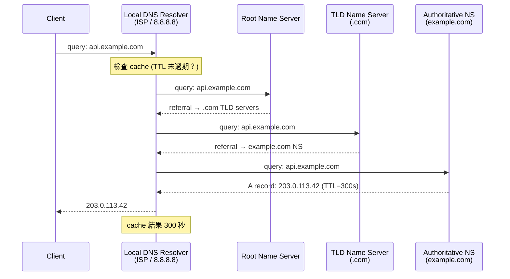
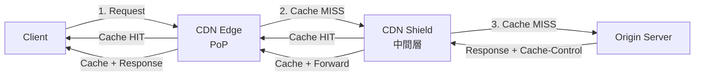

# Networking 基礎：DNS、CDN、Proxy 與連線管理

在 System Design 面試中，networking 不是考你 TCP 三次握手的細節，而是考你**理解網路元件如何影響系統的 latency、availability 和 scalability**。本文件涵蓋四個最常被用到的 networking 概念：DNS、CDN、Proxy、連線管理。

---

## 1. DNS (Domain Name System)

### 1.1 DNS 解析流程



完整的 DNS 解析（iterative query）需要 **4 次網路往返**。但實務中，Local Resolver 幾乎都有 cache，所以大部分查詢在第一步就結束。

### 1.2 DNS Record Types 與架構用途

| Record Type | 用途 | System Design 場景 |
|------------|------|-------------------|
| **A** | Domain → IPv4 address | 最基本的對應 |
| **AAAA** | Domain → IPv6 address | IPv6 環境 |
| **CNAME** | Domain → 另一個 domain (alias) | `api.example.com` → `api-lb.us-east-1.elb.amazonaws.com` |
| **NS** | 指定 domain 的 authoritative name server | DNS delegation |
| **MX** | 郵件伺服器 | 不常考 |
| **TXT** | 任意文字 | Domain 驗證、SPF |
| **SRV** | Service discovery (host + port + priority + weight) | Microservice discovery (較少用，多用 service mesh) |

### 1.3 DNS-Based Load Balancing

DNS 可以回傳多個 IP address，client 通常選第一個。透過控制回傳順序，DNS 可以做負載分散：

**Round-Robin DNS：**
- 每次查詢回傳相同 IP 但順序輪替：`[A, B, C]` → `[B, C, A]` → `[C, A, B]`
- 優點：零成本，不需額外基礎設施
- 致命缺點：**無法感知後端健康狀態**。如果 Server B 掛了，DNS 仍然會回傳它的 IP，直到 TTL 過期

**Weighted DNS：**
- Route 53 / Cloud DNS 支援 weighted routing：90% 流量到 us-east-1，10% 到 eu-west-1
- 用於 gradual migration 或 canary deployment

**Geo DNS (Latency-based routing)：**
- 根據 client 的地理位置回傳最近的 data center IP
- AWS Route 53 的 latency-based routing 就是這個機制
- 限制：geo 判斷基於 resolver IP，不是 client IP（用公司 VPN 時常出錯）

### 1.4 TTL Trade-off（面試高頻考點）

| | 短 TTL (30-60s) | 長 TTL (3600s+) |
|---|---|---|
| **Failover 速度** | 快——DNS 切換後 30-60 秒生效 | 慢——需等待最長 1 小時 |
| **DNS 查詢量** | 高——resolver cache 頻繁失效 | 低——大部分查詢走 cache |
| **Migration 彈性** | 高——快速切換 IP | 低——舊 IP 長時間被存取 |
| **控制力** | 低——client / resolver **不一定尊重 TTL**，Java DNS cache 預設 30s (positive) / 10s (negative) | 更不可靠 |

**面試必知：** DNS 的 TTL 是 **hint，不是 guarantee**。許多 client library、OS、resolver 有自己的 cache 策略。因此，DNS failover 絕不能作為唯一的 HA 機制——需要搭配 health check + load balancer。

---

## 2. CDN (Content Delivery Network)

### 2.1 CDN 運作機制



**Two-tier CDN 架構（Shield + Edge）：**

多數 CDN（CloudFront、Fastly、Cloudflare）不是簡單的「edge 直接回 origin」，而是有中間層 shield：

- **Edge PoP (Point of Presence)**：全球 200+ 節點，離使用者最近（~1-30ms RTT）
- **Shield / Mid-tier cache**：區域性集中快取，減少回 origin 的流量
- **Origin**：你的 server

沒有 shield 的情況下，如果有 200 個 edge 同時 cache miss，origin 會收到 200 個相同請求。Shield 把這 200 個 miss 收斂成 1 個——這叫 **request collapsing / coalescing**。

### 2.2 Cache 策略

| 策略 | Cache-Control Header | 適用場景 |
|------|---------------------|---------|
| **Immutable assets** | `public, max-age=31536000, immutable` | 帶 content hash 的 JS/CSS/圖片 (`app.a1b2c3.js`) |
| **Frequently updated** | `public, max-age=60, stale-while-revalidate=300` | API responses、首頁 HTML |
| **Private / Personalized** | `private, no-store` | 使用者個人資料、購物車 |
| **Conditional caching** | `public, no-cache` + ETag | 資料可快取但需要每次驗證新鮮度 |

**`stale-while-revalidate` (SWR) 是現代 CDN 的關鍵特性：**
- Cache 過期後，CDN 先回傳過期內容（stale），同時在背景向 origin 拉取新版本
- 使用者不會因為 cache miss 而多等一個 origin RTT
- 適合 latency-sensitive 但可以容忍短暫過期的場景（新聞、商品列表）

### 2.3 Cache Invalidation

> "There are only two hard things in Computer Science: cache invalidation and naming things." — Phil Karlton

| 方法 | 生效速度 | 成本 | 適用場景 |
|------|---------|------|---------|
| **TTL expiration** | 等待 TTL 過期 | 零 | 大部分靜態資源 |
| **Purge API** | 即時 (~1-5s 全球生效) | 有 API call 限制 | 緊急修正、安全漏洞 |
| **Content hash in URL** | 部署即生效 | 零（但需要 build pipeline 支援） | JS/CSS/圖片 — **最佳實踐** |
| **Surrogate keys (tags)** | 即時 | Fastly/Cloudflare 支援 | 按 tag 批次 invalidate (e.g., 所有 product-123 相關 cache) |

**面試建議：** 遇到「如何更新全球 CDN 上的內容？」直接答 **content hash + immutable cache**。這讓 cache invalidation 變成「deploy new file with new hash」，完全避開了 invalidation 的複雜性。

### 2.4 CDN 在 System Design 中的決策點

**適合 CDN 的場景：**
- 靜態資源（圖片、影片、JS/CSS）— 命中率高，效益最大
- Read-heavy API responses（商品目錄、設定檔）— 需搭配短 TTL 或 SWR
- 全球使用者分佈 — 跨大洲 RTT 從 150-300ms 降到 1-30ms

**不適合 CDN 的場景：**
- Write-heavy 或即時性要求極高的 API — cache 沒有意義
- 高度個人化內容 — cache hit rate 趨近零
- 單一區域使用者 — CDN 的價值在於全球分散

**CDN 的數字感：**
- 全球 PoP 到使用者延遲：1-30ms
- Edge 到 Origin（跨大洲）：100-200ms
- Cache hit ratio（靜態資源）：95-99%
- Cache hit ratio（動態 API）：40-70%（取決於 cardinality）

---

## 3. Proxy Patterns

### 3.1 Forward Proxy vs Reverse Proxy

```
Forward Proxy:                          Reverse Proxy:
Client → [Proxy] → Internet → Server   Client → Internet → [Proxy] → Server
         ↑ client 知道 proxy 存在                            ↑ client 不知道 proxy 存在
         保護 client 身份                                    保護 server 身份
```

| Dimension | Forward Proxy | Reverse Proxy |
|-----------|--------------|---------------|
| **誰部署** | Client 端 (企業網路管理員) | Server 端 (服務提供者) |
| **Client 感知** | Client 明確配置 proxy address | Client 不知道 proxy 存在，以為在跟 origin 通訊 |
| **典型功能** | Access control、content filtering、cache、匿名化 | Load balancing、SSL termination、cache、WAF、compression |
| **典型產品** | Squid、企業 firewall | Nginx、HAProxy、Envoy、Cloudflare |
| **System Design 相關性** | 低（較少考） | **高** — 幾乎所有架構都有 reverse proxy |

### 3.2 Sidecar Proxy (Service Mesh)

在 microservice 架構中，sidecar proxy 是一個與每個 service instance 並行部署的 proxy process（通常是 Envoy）。它攔截所有進出流量，提供：

```
┌─────────────────────┐     ┌─────────────────────┐
│ Pod A               │     │ Pod B               │
│ ┌─────┐  ┌───────┐  │     │ ┌───────┐  ┌─────┐  │
│ │App A│→ │Sidecar│──┼─────┼→│Sidecar│→ │App B│  │
│ └─────┘  └───────┘  │     │ └───────┘  └─────┘  │
└─────────────────────┘     └─────────────────────┘
```

| 功能 | 說明 |
|------|------|
| **mTLS** | Service 間自動加密，zero-trust networking |
| **Load balancing** | Client-side LB with health checking |
| **Observability** | 自動收集 latency、error rate、request count (RED metrics) |
| **Traffic control** | Retry、timeout、circuit breaker、rate limiting — 不用改 application code |
| **Canary / Traffic splitting** | 1% 流量到 v2，99% 到 v1 |

**典型實作：** Istio (Envoy sidecar)、Linkerd (linkerd2-proxy)

**什麼時候考慮 Service Mesh：**
- 10+ microservices 且需要 uniform observability / security
- Polyglot 環境（Go + Java + Python）不想每個語言各自實作 retry / circuit breaker
- **不適合**：< 5 個 service、latency 預算極緊（sidecar 增加 ~1-2ms per hop）

---

## 4. 連線管理 (Connection Management)

### 4.1 Connection Pooling

建立 TCP 連線需要三次握手 (~1 RTT)，加上 TLS 握手 (~1-2 RTT)。如果每個 request 都重新建連線：

```
Without pooling:  [TCP handshake 0.5ms] + [TLS handshake 1ms] + [Request 0.5ms] = 2ms per request
With pooling:     [Request 0.5ms] = 0.5ms per request (連線已存在)
```

**Connection Pool 的關鍵參數：**

| Parameter | 設定過小 | 設定過大 |
|-----------|---------|---------|
| **Max connections** | Request queuing、latency spike | Server 端 fd/memory 被耗盡 |
| **Min idle** | Cold start latency（第一個 request 要建連線） | 浪費 idle connections 的 memory |
| **Max idle time** | 連線頻繁重建 | 佔著連線但不用（server 可能先 close） |
| **Connection timeout** | 在 server 忙碌時快速失敗（可能太快） | 等太久才發現連不上 |

**常見 pool size 參考值：**
- Application → Database：pool size ≈ `(core_count * 2) + effective_spindle_count`（HikariCP 建議）。通常 10-30 per instance。
- Application → Redis：pool size 10-50 per instance
- Application → 外部 API：pool size 50-200 per instance（取決於 QPS）

### 4.2 HTTP/1.1 vs HTTP/2 vs HTTP/3

| Dimension | HTTP/1.1 | HTTP/2 | HTTP/3 |
|-----------|----------|--------|--------|
| **Transport** | TCP | TCP | **QUIC (UDP-based)** |
| **Multiplexing** | 無 — 一個 connection 同時只能處理一個 request (pipeline 理論存在但實際無人用) | **多路複用** — 單一 TCP connection 上並行多個 stream | **多路複用** — 每個 stream 獨立，無 head-of-line blocking |
| **Head-of-Line Blocking** | HTTP 層 + TCP 層都有 | HTTP 層解決了，**TCP 層仍然存在**（一個 packet loss 卡住整個 connection） | **完全解決** — QUIC stream 獨立 |
| **Connection Setup** | 1 RTT (TCP) + 1-2 RTT (TLS) | 同 HTTP/1.1 | **0-RTT** (resumption) 或 1 RTT (initial) — TCP + TLS 握手合併 |
| **Header Compression** | 無 | HPACK (靜態 + 動態 table) | QPACK (HPACK 適配 QUIC) |
| **Server Push** | 無 | 支援（但實務上幾乎沒人用，Chrome 已移除支援） | 支援（同樣少用） |
| **典型延遲改善** | baseline | 減少 50-80% (multiplexing 消除排隊) | 比 HTTP/2 再減少 connection setup time |

**面試重點：** 知道 HTTP/2 的 multiplexing 解決了 HTTP 層的 head-of-line blocking，但 TCP 層的仍在。HTTP/3 用 QUIC (基於 UDP) 徹底解決。gRPC 強制使用 HTTP/2 正是為了 multiplexing。

### 4.3 Keep-Alive 與 Connection Reuse

```
Without Keep-Alive:
Request 1: [TCP+TLS] [GET /a] [Response] [Close]
Request 2: [TCP+TLS] [GET /b] [Response] [Close]  ← 又花了 1.5-2ms 建連線

With Keep-Alive (HTTP/1.1 預設開啟):
Request 1: [TCP+TLS] [GET /a] [Response]
Request 2:           [GET /b] [Response]  ← 重用連線，省掉握手
...
Idle timeout → [Close]
```

**Keep-Alive 在 System Design 中的影響：**
- Load Balancer 後面的 backend 連線也需要 keep-alive，否則每個 request 都要重新建連線到 backend
- 但 keep-alive 會讓連線「黏」在特定 backend 上，影響 load balancing 的均勻性
- 解法：L7 LB 維護兩組獨立的 connection pool（client → LB, LB → backend），per-request 路由

---

## 5. 面試中的 Networking 思考框架

當你在 system design 面試中需要考慮 networking 時，按這個順序思考：

### Step 1: 使用者的 Request 怎麼到你的 Server？
```
User → [DNS] → [CDN?] → [L4 LB] → [L7 LB / API Gateway] → [Service]
```
- 全球使用者？→ Geo DNS + CDN + 多區域部署
- 單一區域？→ 簡單 DNS + LB 即可

### Step 2: 靜態 vs 動態內容
- 靜態資源（圖片、JS/CSS）→ CDN + immutable cache
- 動態但可快取 → CDN + 短 TTL 或 SWR
- 即時動態 → 直接到 origin

### Step 3: Service 之間怎麼通訊？
- 同步 → REST / gRPC (參考 `api_design.md`)
- 非同步 → Message Queue (參考 `message_queue.md`)
- 多個 service 需要統一的 observability / security → Service Mesh

### Step 4: 連線效率
- 高 QPS → Connection pooling 是必要的
- 跨服務通訊 → HTTP/2 multiplexing 或 gRPC
- 全球使用者 → 考慮 HTTP/3 / QUIC

---

## 6. 常見面試陷阱

| 陷阱 | 正確理解 |
|------|---------|
| 「用 DNS round-robin 做 load balancing」 | DNS 不做 health check，掛掉的 server 仍會收到流量。DNS 做 **global traffic distribution**，LB 做 **local load balancing**，兩者互補不互替 |
| 「CDN 只能快取靜態檔案」 | 現代 CDN 可以快取 API response（搭配適當的 Cache-Control header + surrogate keys），也可以跑 edge compute (Cloudflare Workers, Lambda@Edge) |
| 「HTTP/2 解決了所有 head-of-line blocking」 | HTTP/2 只解決了 HTTP 層的 HoL blocking。TCP 層的 HoL blocking 仍在——一個 packet loss 會卡住整個 TCP connection 的所有 stream。HTTP/3 (QUIC) 才徹底解決 |
| 「Service Mesh 是微服務的標配」 | Service Mesh 有 ~1-2ms per hop 的額外延遲和顯著的運維複雜度。< 10 個 service 通常不需要 |
| 「Connection pool 越大越好」 | Pool 過大會耗盡 server 端資源 (fd, memory, connection slots)。DB 端 100 個 app instance 各開 50 個 connection = 5000 connections，PostgreSQL 預設 `max_connections=100` 直接爆掉 |
