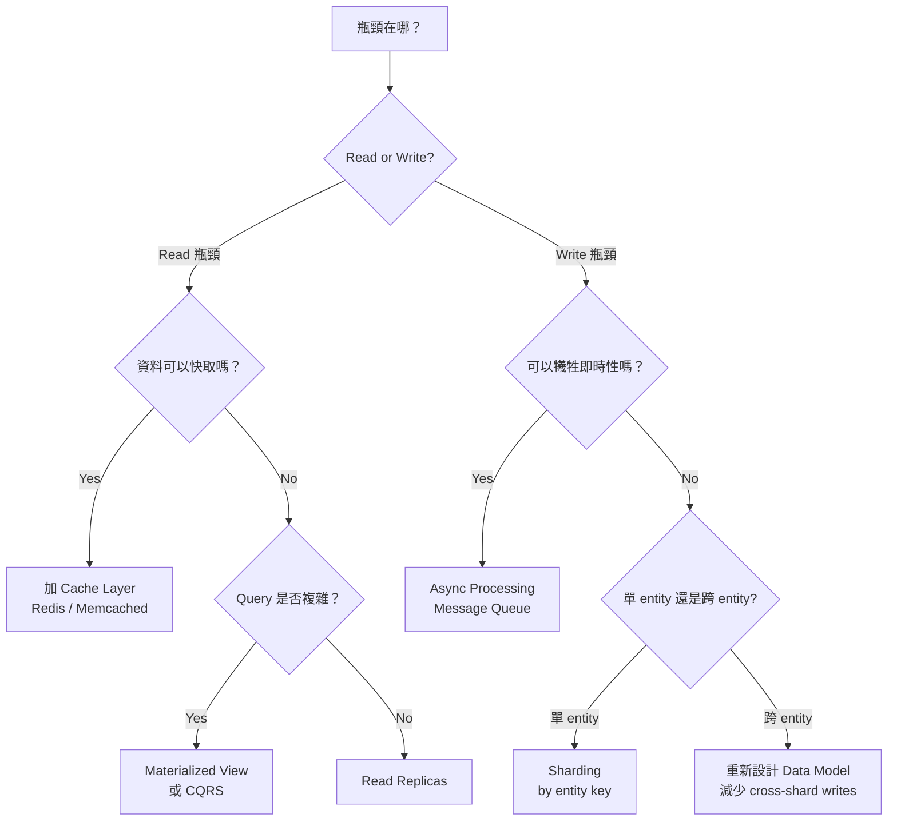

# Scalability 總論：從單機到分散式的擴展策略

Scalability 不是「加 server 就好」，而是一系列**在不同瓶頸點選擇不同策略**的架構決策。本文件建立一個系統性的 scalability 思考框架，涵蓋 vertical/horizontal scaling 的分界點、stateless/stateful service 的擴展差異、sharding 策略比較，以及 read/write scaling 的不同手段。

---

## 1. Vertical vs Horizontal Scaling

### 1.1 分界點判斷

「Vertical scaling 有上限」是正確的，但面試中你需要回答的是：**上限在哪？什麼時候必須切換到 horizontal？**

| 資源 | 單機上限（2024 年） | 觸發 Horizontal Scaling 的信號 |
|------|-------------------|------------------------------|
| **CPU** | ~256 vCPU (AWS x2idn.metal) | CPU utilization 持續 > 70%，且已無法再升級 instance type |
| **Memory** | ~24 TB (AWS u-24tb1.metal) | Working set 超過單機 RAM，開始頻繁 swap / page fault |
| **Storage** | ~64 TB SSD (單 instance) | 單 volume IOPS 上限 (~256K IOPS on io2 Block Express)；或 data 量已接近 TB 級需要分散 |
| **Network** | 100 Gbps (AWS Nitro) | 頻寬飽和，通常發生在 video streaming 或大量資料搬移 |
| **DB Connections** | PostgreSQL ~500-2000, MySQL ~2000-5000 (取決於 memory) | Connection count 持續逼近上限且 PgBouncer 已用 |

**關鍵洞察：** 對大多數 web application 而言，**單機 vertical scaling 比你想的走得更遠**。一台 16-core、64GB RAM 的 PostgreSQL 可以撐 ~10K-30K QPS (simple reads)。很多公司在 Series B 之前都不需要 sharding。

### 1.2 Vertical vs Horizontal 決策矩陣

| Dimension | Vertical Scaling | Horizontal Scaling |
|-----------|-----------------|-------------------|
| **成本曲線** | 線性 → 指數（高階硬體溢價嚴重） | 線性（commodity hardware） |
| **停機時間** | 通常需要停機升級 | Zero-downtime (rolling deploy) |
| **複雜度** | 近乎零——換大台機器即可 | 高——需處理 data distribution、consistency、coordination |
| **上限** | 物理限制（最大的機器就是上限） | 理論無限（加節點就行） |
| **適用階段** | 0 → product-market fit、early scale | Product-market fit → hyperscale |

**面試策略：** 面對 system design 題目，**先假設 vertical scaling 不夠**（否則沒東西好設計），但在估算環節指出「如果 QPS < X，單機 PostgreSQL + read replicas 就能解決」會展現你的工程判斷力。

---

## 2. Stateless vs Stateful Service Scaling

這是 scalability 最重要的分界線：**你的 service 有沒有 local state？**

### 2.1 Stateless Service

```
                    ┌─ App Server 1 ─┐
Client → [LB] ──── ├─ App Server 2 ─┤ ──→ [Shared State: DB / Cache]
                    └─ App Server 3 ─┘
                    （任何 server 都能處理任何 request）
```

**特性：**
- Request 可以被路由到任何 instance
- 加 server = 加 capacity，線性擴展
- Auto-scaling 只需 CPU/memory 監控 + 自動加減 instance
- Deployment 做 rolling update 即可，因為沒有 local state 需要遷移

**哪些東西不該放在 local state？**
- Session data → 放 Redis / DynamoDB
- 上傳中的檔案 → 直接傳到 S3 (presigned URL)
- 計算中間結果 → 如果需要跨 request 存取，放 cache

### 2.2 Stateful Service

```
Client A ──→ [Server 1: holds shard A-M]
Client B ──→ [Server 2: holds shard N-Z]
             (request 必須路由到特定 server)
```

**典型的 stateful services：**
- Database (每個 node 存放不同 shard 的資料)
- Cache cluster (Redis Cluster, 資料分佈在不同 slot)
- WebSocket server (connection 與特定 server 綁定)
- Stateful stream processing (Kafka Streams, Flink 的 state store)

**Stateful service 擴展的困難：**

| 挑戰 | 說明 |
|------|------|
| **Data rebalancing** | 加入新節點時，部分資料需要從舊節點搬到新節點。搬移期間的 availability 和 consistency？ |
| **Sticky routing** | 需要 consistent hashing 或 directory-based routing 確保 request 到正確的 node |
| **State recovery** | Node 掛掉時，如何恢復其 local state？需要 replication 或 replay from log |
| **Split-brain** | 兩個 node 都以為自己擁有同一份 data → 需要 consensus protocol |

---

## 3. Sharding Strategies（資料分片）

當單機 DB 撐不住時，sharding 是最常見的水平擴展手段。Sharding 的核心問題是：**用什麼規則決定資料放在哪個 shard？**

### 3.1 策略比較

| Dimension | Hash-Based | Range-Based | Directory-Based |
|-----------|-----------|-------------|-----------------|
| **機制** | `shard = hash(key) % N` | 按 key 的範圍分配（A-M → Shard 1, N-Z → Shard 2） | 查表（lookup table 記錄 key → shard 的對應） |
| **資料分佈** | **均勻**（好的 hash function 確保平均） | **可能不均勻**（某些 range 的資料量遠大於其他） | 可任意控制 |
| **Range Query** | **不支援** — 相鄰的 key 被 hash 到不同 shard，range scan 需要 scatter-gather | **天然支援** — 同一 range 的 key 在同一 shard | 取決於 directory 設計 |
| **Rebalancing** | **痛苦** — 改變 N 時幾乎所有 key 都要重新分配 (除非用 consistent hashing) | **較容易** — split 一個 range 成兩個，只搬一半資料 | **最靈活** — 只更新 lookup table |
| **Hot Spot** | 理論上無（hash 打散），但如果某個 key 本身極熱門仍會 hot | 容易出現（如按時間 range，最新的 shard 永遠最熱） | 可手動調整避免 |
| **實作複雜度** | 低 | 中 | 高（directory 本身成為 single point of failure，需要高可用） |
| **典型使用** | DynamoDB (partition key hash)、Cassandra、Redis Cluster | HBase (row key range)、MongoDB (range shard key)、CockroachDB | Vitess (VSchema)、自建 sharding middleware |

### 3.2 Consistent Hashing（解決 hash-based rebalancing 問題）

普通 hash sharding 的致命問題：`hash(key) % N` 中 N 改變時，幾乎所有 key 的 shard assignment 都會變。

```
N=3: hash("user-42") % 3 = 1  → Shard 1
N=4: hash("user-42") % 4 = 2  → Shard 2  ← 需要搬移！

大量資料搬移 = 長時間的高 I/O + 可能的 availability 問題
```

**Consistent Hashing 解法：**

```mermaid
graph TD
    subgraph Hash Ring
        A[Node A<br/>位置 0°] --> B[Node B<br/>位置 120°]
        B --> C[Node C<br/>位置 240°]
        C --> A
    end
    K1[Key 1<br/>hash=45°] -.-> B
    K2[Key 2<br/>hash=200°] -.-> C
    K3[Key 3<br/>hash=350°] -.-> A
    style K1 fill:#444
    style K2 fill:#444
    style K3 fill:#444
```



- 所有 node 和 key 都 hash 到同一個 ring (0 ~ 2^32-1)
- 每個 key 順時針找到的第一個 node 就是它的 shard
- **加入新 node**：只需要從它的順時針 neighbor 搬移一部分 key (約 1/N 的資料)
- **Virtual nodes**：每個實體 node 在 ring 上放 100-200 個虛擬節點，解決資料分佈不均問題

**使用 consistent hashing 的系統：** DynamoDB、Cassandra、Memcached (client-side)、Nginx upstream hashing

### 3.3 Shard Key 選擇（面試最常考）

Shard key 選錯是最難修復的架構錯誤之一，因為更換 shard key = 全量資料搬移。

**好的 shard key 必須滿足：**
1. **High cardinality** — 足夠多的 unique values 才能均勻分散（`country` 只有 ~200 個值，不夠）
2. **Even distribution** — 每個 shard 的資料量和 QPS 大致相等
3. **Query alignment** — 最常見的 query 應該只需要查一個 shard（避免 scatter-gather）

| 案例 | 好的 Shard Key | 壞的 Shard Key | 原因 |
|------|---------------|---------------|------|
| **社群貼文** | `user_id` | `created_at` | 按時間分片會讓最新的 shard 承受所有寫入 (hot shard) |
| **電商訂單** | `user_id` 或 `order_id` | `product_id` | 熱門商品會集中在少數 shard |
| **聊天訊息** | `chat_room_id` | `message_id` (snowflake) | 需要按聊天室查詢，message_id 會打散同一聊天室的訊息 |
| **多租戶 SaaS** | `tenant_id` | `user_id` | 同一 tenant 的資料通常需要一起查詢 |

**Hot spot 問題的解法：**
- **Salting**：在 key 前面加隨機數 (0-9)，把 1 個 hot key 打散到 10 個 shard。但讀取時需要查 10 個 shard 再 merge
- **Dedicated shard**：把已知的 hot entity (如超級大客戶) 分配到獨立的 shard
- **Read replicas for hot shards**：對讀取熱的 shard 加更多 replica

---

## 4. Read Scaling vs Write Scaling

讀和寫的擴展方式根本不同：

### 4.1 Read Scaling 策略

```
                    ┌─ Read Replica 1 ─┐
Client (Read) ──→   ├─ Read Replica 2 ─┤  ← 加 replica 就能擴展讀取
                    └─ Read Replica 3 ─┘

Client (Write) ──→  [Primary]  ──replication──→ [Replicas]
```

| 策略 | 機制 | 擴展倍數 | Trade-off |
|------|------|---------|-----------|
| **Read Replicas** | Primary 處理 write，replicas 處理 read | 理論上無限（加 replica） | Replication lag 導致 stale read；replica 越多，primary 的 replication 負擔越大 |
| **Cache Layer** | 在 DB 前加 Redis / Memcached | 讀 throughput 可到 500K+ ops/s | Cache invalidation 複雜度；cache 與 DB 的一致性問題 |
| **CDN** | 在 client 端快取靜態 / semi-static 內容 | 可擋掉 95%+ 的靜態資源請求 | 僅適用可快取內容 |
| **Materialized View** | 預先計算查詢結果，存成另一張表 | 把複雜 query 變成簡單 key-value lookup | 需要維護更新機制；增加寫入的工作量 |
| **CQRS** | Command (寫) 和 Query (讀) 用不同的 data model | 讀寫各自優化 | 架構複雜度大增；需要 event sourcing 或 change data capture 來同步 |

### 4.2 Write Scaling 策略

寫入擴展比讀取困難得多，因為**寫入涉及 coordination**。

| 策略 | 機制 | 擴展倍數 | Trade-off |
|------|------|---------|-----------|
| **Sharding** | 把資料分散到多個獨立的 DB instance | 線性（N 個 shard = N 倍 write capacity） | Cross-shard query 和 transaction 變得極其困難 |
| **Write-Behind Cache** | 先寫 cache，異步批次寫入 DB | 降低 DB 寫入壓力 | 資料可能在 cache 中遺失（crash 前未 flush） |
| **Append-Only Log** | 所有寫入都是 append（Kafka、LSM-tree） | 極高（sequential write 接近磁碟物理上限） | 讀取需要 merge / compaction |
| **Multi-Primary** | 多個 node 都可接受寫入 | 線性 | 衝突解決 (conflict resolution) 是核心難題；last-write-wins 或 CRDTs |
| **Batch / Async Processing** | 不即時寫入，收集後批次處理 | 取決於 batch size 和頻率 | 增加延遲；不適用需要即時確認的場景 |

### 4.3 Read vs Write Scaling 決策流程



---

## 5. Auto-Scaling 機制

### 5.1 Scaling Metrics

| Metric | 適用場景 | 注意事項 |
|--------|---------|---------|
| **CPU utilization** | 通用 compute-bound workload | Target: 60-70%。不適合 I/O-bound service |
| **Request count / QPS** | API service | 直接反映流量，但不反映每個 request 的重量 |
| **Queue depth** | Worker / Consumer service | Queue 越深 = 處理速度跟不上。Target: keep queue depth near 0 |
| **Response time (p99)** | 使用者體驗敏感的 service | Latency 上升可能是 CPU、memory、或 downstream 的問題 |
| **Custom business metric** | 特定場景 | 例如：concurrent WebSocket connections, active game sessions |

### 5.2 Scaling 策略

| 策略 | 說明 | 適用 |
|------|------|------|
| **Reactive** | 監控 metric，超過閥值才 scale out | 大多數場景；但有冷啟動延遲 |
| **Predictive** | 基於歷史模式預測流量，提前 scale | 有明確 daily/weekly pattern 的服務（如通勤時段的地圖 app） |
| **Scheduled** | 在已知的高峰時段預先 scale | 促銷活動、直播開始 |

**冷啟動延遲：** Auto-scale 從觸發到新 instance 可服務流量，通常需要 2-5 分鐘（VM 啟動 + application 初始化 + health check 通過 + LB 開始路由）。這意味著如果流量是突發的（spike），reactive auto-scaling 來不及。解法：maintain buffer capacity 或 predictive scaling。

---

## 6. Scalability 思考框架（面試用）

面對任何 system design 題目，按這個順序思考 scalability：

### Step 1: 估算規模
- DAU → Peak QPS (通常 DAU × 活躍比 ÷ 86400 × peak factor)
- 資料量 (每筆 × 總筆數 × 保留天數)
- 頻寬 (QPS × 平均 response size)

### Step 2: 單機能撐嗎？
- Web server：~10K-50K QPS (取決於 handler 複雜度)
- PostgreSQL：~10K-30K simple reads/s, ~5K-15K writes/s
- Redis：~100K-200K ops/s
- 如果 QPS 在這些範圍內，**不需要 sharding**，read replicas + cache 就夠了

### Step 3: 讀寫比是什麼？
- Read-heavy (100:1) → Cache + Read Replicas
- Write-heavy (1:1 或更高) → Sharding + Async processing
- Mixed → 分層處理，讀寫走不同路徑 (CQRS)

### Step 4: State 在哪裡？
- Stateless service → 隨意 scale out
- Stateful service → 需要 sharding strategy + rebalancing 計畫
- Session state → 抽出到 Redis

### Step 5: 哪些是已知的 hot spot？
- Celebrity problem (少數 key 的流量佔總流量的大部分)
- Temporal hot spot (最新的 shard 永遠最熱)
- 解法：salting、dedicated shard、cache

---

## 7. 常見面試陷阱

| 陷阱 | 正確理解 |
|------|---------|
| 「直接上 sharding」 | Sharding 是最後手段。先問：能不能 vertical scaling？能不能加 read replica？能不能加 cache？Premature sharding 帶來巨大的 operational complexity |
| 「Microservices = Scalability」 | Microservice 讓你可以**獨立 scale 不同元件**，但引入了 network latency、distributed transaction、operational overhead。Monolith + 適當的 cache/read replica 可能比爛的 microservice 架構 scale 得更好 |
| 「加機器就能解決一切」 | 有些問題是演算法問題（如 N+1 query、missing index），加機器只是花更多錢得到相同的爛效能。先 profile，再 scale |
| 「Consistent hashing 解決 hot spot」 | Consistent hashing 解決的是 **rebalancing** 問題，不是 hot spot。如果某個 key 天生就是熱門的，hashing 無法解決——你需要 replication 或 splitting |
| 「Read replica 沒有 trade-off」 | Replication lag 意味著 read replica 可能回傳過期資料。如果你的 use case 需要 read-after-write consistency（例如使用者更新 profile 後立即看到更新），需要路由到 primary 讀取 |
