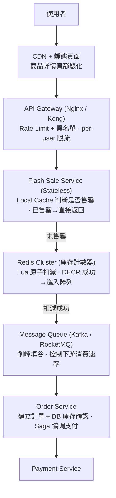

# 電商平台 (E-commerce Platform) — System Design 領域指南

> 電商是 System Design 面試中最高頻的領域之一。它涵蓋了幾乎所有分散式系統的核心挑戰：
> 高併發讀寫、分散式交易 (Distributed Transaction)、庫存一致性、突發流量應對。
> 本文件以 Senior Engineer 面試為目標深度，整理關鍵概念與架構模式。

---

## 1. 這個產業最重視什麼？

電商平台的非功能性需求 (Non-Functional Requirements) 優先順序，依業務影響排列：

### 1.1 高可用性 (High Availability)

**每分鐘的停機都是真金白銀的損失。** Amazon 曾揭露其每秒營收約 $4,722（2023 年數據），一分鐘停機意味著 ~$283K 的潛在損失。

- 目標通常是 **99.99% uptime**（每年停機 < 52.6 分鐘）
- 關鍵路徑（下單、支付）需要比一般瀏覽頁面有更高的可用性保證
- **設計原則**：Graceful degradation — 搜尋服務掛了，商品詳情頁仍可從 cache 提供；推薦服務掛了，改用靜態熱銷榜單
- 實作手段：多可用區部署 (Multi-AZ)、主備切換 (Active-Passive Failover)、Circuit Breaker、Health Check + Auto Scaling

### 1.2 庫存一致性 (Inventory Consistency)

**超賣 (Overselling) 是電商最嚴重的事故之一。** 使用者下單成功卻被告知無貨，不僅損失訂單，更損失信任。

兩種鎖策略的本質差異：

| 策略 | 機制 | 適用場景 | 缺點 |
|------|------|---------|------|
| **悲觀鎖 (Pessimistic Lock)** | `SELECT ... FOR UPDATE`，先鎖定再修改 | 庫存極少、競爭激烈 | 鎖等待導致吞吐量下降；死鎖風險 |
| **樂觀鎖 (Optimistic Lock)** | `UPDATE inventory SET stock = stock - 1 WHERE id = ? AND stock > 0`，利用 CAS 語義 | 庫存充足、衝突機率低 | 高併發時大量重試；「重試風暴」可能反噬 |

> **面試要點**：不要只說「用樂觀鎖」，要能分析在不同庫存水位下的行為差異。
> 庫存剩 10,000 件時樂觀鎖幾乎無衝突；庫存剩 5 件時衝突率飆升，此時應切換策略或使用 Redis 預扣。

### 1.3 突發流量 (Traffic Spikes)

秒殺 (Flash Sale)、雙十一、Black Friday 等場景，流量可在數秒內從日常的 10x 飆升至 100x。

- **不能單靠 Auto Scaling**：雲端 VM 啟動需要 1-3 分鐘，而流量尖峰在秒級爆發
- **核心思路**：預熱 (Pre-warm) + 多層削峰 (Multi-layer Traffic Shaping)
- 數字感覺：日常 QPS 5,000 → 秒殺瞬間 500,000 QPS，需要架構層面的根本性設計

### 1.4 低延遲的使用者體驗

**每 100ms 的頁面載入延遲 = 約 1% 的營收損失**（Google/Amazon 多次公開的數據）。

- 商品列表頁目標：**< 200ms** P99 latency
- 商品詳情頁目標：**< 150ms**（高度可快取）
- 下單流程目標：**< 500ms**（涉及多服務呼叫，需要精心編排）
- 搜尋結果頁目標：**< 300ms**

實作手段：
- CDN 靜態資源 + Edge Cache
- 商品資料多層快取 (Multi-layer Cache)
- 非同步化非關鍵路徑（記錄日誌、發通知等不阻塞主流程）

### 1.5 最終一致性的取捨 (Eventual Consistency Trade-offs)

並非所有資料都需要強一致性，但關鍵資料絕對不能妥協：

| 資料類型 | 一致性要求 | 原因 |
|---------|-----------|------|
| 商品目錄 (Product Catalog) | Eventual Consistency OK | 價格/描述延遲幾秒更新不影響業務 |
| 商品評價 (Reviews) | Eventual Consistency OK | 延遲顯示可接受 |
| **庫存 (Inventory)** | **Strong Consistency** | 超賣 = 災難 |
| **訂單 (Orders)** | **Strong Consistency** | 金流相關，不容差錯 |
| **支付 (Payment)** | **Strong Consistency** | 一分錢都不能錯 |
| 購物車 (Cart) | Eventual Consistency OK | 短暫不一致可接受，但合併策略要正確 |

---

## 2. 面試必提的關鍵概念

### 2.1 庫存扣減策略 (Inventory Deduction Strategies)

這是電商面試中被問到機率最高的單一問題。三種主流方案：

#### 方案 A：悲觀鎖 (Pessimistic Locking)

```sql
BEGIN;
SELECT stock FROM inventory WHERE sku_id = 'SKU001' FOR UPDATE;
-- 應用層檢查 stock > 0
UPDATE inventory SET stock = stock - 1 WHERE sku_id = 'SKU001';
COMMIT;
```

- **優點**：邏輯簡單，保證不超賣
- **缺點**：鎖持有期間其他請求全部阻塞；在高併發下 DB 連線池耗盡；可能死鎖
- **適用**：低併發、庫存管理後台、B2B 場景

#### 方案 B：樂觀鎖 (Optimistic Locking / CAS)

```sql
UPDATE inventory
SET stock = stock - 1, version = version + 1
WHERE sku_id = 'SKU001' AND stock > 0 AND version = @current_version;
-- affected_rows == 0 → 衝突，需重試
```

或更簡化的「無版本號」CAS：

```sql
UPDATE inventory SET stock = stock - 1
WHERE sku_id = 'SKU001' AND stock > 0;
-- 利用 MySQL 的行鎖 + 條件判斷，affected_rows == 1 表示成功
```

- **優點**：不需要顯式鎖定，吞吐量較高
- **缺點**：高衝突時大量重試浪費資源；在庫存接近 0 時衝突率急遽上升
- **適用**：中等併發、庫存充足的一般商品

#### 方案 C：Redis 預扣減 (Redis Pre-deduction)

```
-- Lua script 保證原子性
local stock = redis.call('GET', KEYS[1])
if tonumber(stock) > 0 then
    redis.call('DECR', KEYS[1])
    return 1  -- 扣減成功
else
    return 0  -- 庫存不足
end
```

- **優點**：單機 Redis ~100K+ QPS，遠超 DB；原子操作天然防超賣
- **缺點**：Redis 與 DB 之間存在一致性視窗；Redis 崩潰時需要恢復機制
- **適用**：秒殺、高併發場景

> **三者結合的實戰模式**：
> 1. Redis 做第一道防線（快速擋掉無庫存的請求）
> 2. 通過的請求進入 Message Queue 排隊
> 3. Consumer 端用樂觀鎖/悲觀鎖對 DB 做最終扣減
> 4. DB 扣減成功後反向同步 Redis（或定期校正）

### 2.2 秒殺/搶購架構 (Flash Sale Architecture)

秒殺的核心挑戰：**極短時間內的超高併發寫入**，且庫存極少（通常 < 1000 件）。

#### 多層削峰策略

```
層級 1：前端
- 按鈕點擊後 disable，防重複提交
- 隨機延遲 0-500ms 分散請求（前端抖動）
- 驗證碼 / 滑塊驗證（過濾機器人）

層級 2：CDN / Gateway
- Rate Limiting per user（如 1 req/s）
- IP 黑名單、設備指紋反作弊

層級 3：Application Layer
- 本地快取庫存狀態（JVM Local Cache）
- 庫存為 0 後直接返回「售罄」，不穿透到後端

層級 4：Redis
- Lua 原子扣減
- 成功的請求寫入 Message Queue

層級 5：Order Service
- 從 Queue 消費，建立訂單
- DB 最終扣減確認
```

#### 秒殺系統架構圖



#### 預熱策略 (Pre-warm)

- 秒殺開始前 **T-30min**：將庫存數量載入 Redis
- 秒殺開始前 **T-10min**：將商品詳情頁推送到 CDN 各節點
- 秒殺開始前 **T-5min**：Application Server 載入本地快取
- 秒殺開始前 **T-1min**：開放頁面但隱藏購買按鈕（避免 CDN 冷啟動）

### 2.3 購物車設計 (Shopping Cart Design)

看似簡單，實則涉及多種邊界情況：

#### 已登入 vs 訪客購物車

| 面向 | 已登入使用者 | 訪客 (Guest) |
|------|------------|-------------|
| 儲存位置 | Server-side (Redis / DB) | Client-side (LocalStorage / Cookie) |
| 持久性 | 永久保留 | 瀏覽器清除即消失 |
| 跨裝置 | 支援 | 不支援 |
| 容量限制 | 較寬鬆 (如 200 items) | Cookie: 4KB 限制；LocalStorage: ~5MB |
| 資料結構 | `user_id → [{sku_id, qty, added_at, ...}]` | 同左，但存於本地 |

#### 合併策略 (Cart Merge)

使用者先以訪客身份加入商品，再登入時：

1. **以伺服器端為主 (Server Wins)**：丟棄訪客車，用原有已登入購物車 — 簡單但體驗差
2. **合併取聯集 (Union Merge)**：兩邊都保留，相同商品取較大數量 — 最常用
3. **合併取最新 (Latest Wins)**：相同商品以最後修改時間為準 — 實作複雜但最精確

> **實務建議**：大多數電商採用方案 2（Union Merge），並在合併後顯示通知讓使用者確認。

#### TTL 與清理

- 已登入購物車：**90 天**未活動自動清理（或永不過期，定期提醒）
- 訪客購物車：**30 天** TTL
- Redis 儲存：使用 `EXPIRE` 設定 TTL；每次存取時重置 TTL（sliding window）

#### 購物車服務的額外考量

- **價格快照**：加入購物車時記錄當時價格，結帳時重新取得最新價格並提示使用者差異
- **庫存預檢**：不在加入購物車時鎖庫存（會造成假性缺貨），而在結帳時即時檢查
- **促銷規則**：購物車需要即時計算折扣，這可能涉及呼叫 Promotion Service

### 2.4 訂單狀態機 (Order State Machine)

訂單的生命週期是電商系統的骨幹。每個狀態轉換都有明確的觸發條件與副作用：

```
                    ┌─────────┐
                    │ CREATED │ ← 使用者提交訂單
                    └────┬────┘
                         │ 支付成功
                    ┌────▼────┐
             ┌──────│  PAID   │
             │      └────┬────┘
             │           │ 商家出貨
    支付超時/取消    ┌────▼────┐
             │      │ SHIPPED │
             │      └────┬────┘
             │           │ 物流確認送達
    ┌────────▼───┐  ┌────▼─────┐
    │ CANCELLED  │  │DELIVERED │
    └────────────┘  └────┬─────┘
                         │
              ┌──────────┼──────────┐
              │ 確認收貨   │          │ 申請退款
         ┌────▼─────┐    │    ┌─────▼─────┐
         │COMPLETED │    │    │ REFUNDING  │
         └──────────┘    │    └─────┬─────┘
                         │          │ 退款完成
                         │    ┌─────▼─────┐
                         │    │ REFUNDED   │
                         │    └───────────┘
                   超時自動確認
                   (如 15 天)
```

**關鍵設計點**：

- **每次狀態轉換必須是原子操作**：更新訂單狀態 + 發送領域事件 (Domain Event) 要在同一個 transaction 中（或使用 Outbox Pattern）
- **超時處理**：CREATED → 30 分鐘未支付自動 CANCELLED（使用延遲佇列 / 定時任務）
- **DELIVERED → COMPLETED**：超過 15 天未操作自動確認收貨
- **狀態轉換表應存於設定檔**，而非硬編碼在業務邏輯中

### 2.5 分散式交易 (Distributed Transaction)

下單涉及多個服務的協同操作：**建立訂單 + 扣減庫存 + 建立支付單**。這三者分佈在不同的微服務中，無法用單一 DB transaction 解決。

#### 為什麼不用 2PC (Two-Phase Commit)？

- 2PC 需要所有參與者同時可用，與高可用性目標衝突
- 鎖持有時間長，嚴重影響吞吐量
- Coordinator 是單點故障
- **結論**：在電商微服務架構中幾乎不用 2PC

#### Saga Pattern（推薦方案）

Saga 將一個分散式交易拆成一系列本地交易，每個步驟都有對應的**補償操作 (Compensation)**：

```
正向流程 (Happy Path):
  1. Order Service:   建立訂單 (status = CREATED)
  2. Inventory Service: 扣減庫存
  3. Payment Service:   建立支付單，呼叫支付閘道

補償流程 (Compensation - 任一步驟失敗時反向執行):
  3'. Payment Service:   取消支付 / 退款
  2'. Inventory Service: 回補庫存
  1'. Order Service:   標記訂單為 CANCELLED
```

**兩種編排方式**：

| 方式 | 機制 | 優點 | 缺點 |
|------|------|------|------|
| **Choreography（編舞）** | 每個服務監聽事件，自行決定下一步 | 去中心化，服務間鬆耦合 | 流程分散難以追蹤；循環依賴風險 |
| **Orchestration（指揮）** | 中央 Saga Orchestrator 控制流程 | 流程清晰可視化；易於監控與除錯 | Orchestrator 本身需要高可用 |

> **實務建議**：訂單這種關鍵流程建議用 **Orchestration**。流程可視化在出問題時能救命。
> 次要流程（如通知、積分等）用 Choreography 即可。

### 2.6 冪等訂單建立 (Idempotent Order Creation)

**問題場景**：使用者雙擊「送出訂單」、網路超時自動重試、前端重複提交 — 都可能導致重複訂單。

#### 解決方案：冪等鍵 (Idempotency Key)

```
流程：
1. 前端在「結帳頁面載入」時取得一個唯一的 order_token (UUID v4)
2. 送出訂單時帶上 order_token
3. 後端以 order_token 作為冪等鍵：
   a. 檢查 Redis: SETNX order_token:{token} → 如果已存在，返回原有訂單
   b. 不存在 → 建立訂單，將 order_token 存入 Redis (TTL = 24h)
   c. 同時在 orders 表中設 order_token 為 UNIQUE INDEX 作為最終防線
```

**關鍵細節**：

- `order_token` 由後端產生並返回給前端（不要讓前端自己生成，防偽造）
- Redis SETNX 提供快速路徑；DB UNIQUE INDEX 提供最終一致性保證
- TTL 設定要大於訂單超時取消的時間（通常 24h 即可）
- 冪等不只是「防重複」，更要保證重複請求返回**與第一次完全相同的結果**

---

## 3. 常見架構模式

### 3.1 商品目錄與搜尋 (Product Catalog & Search)

商品目錄是典型的**讀多寫少**場景。日常寫入（上架/更新商品）QPS 可能僅 10-100，但讀取（瀏覽/搜尋）QPS 可達 50,000+。

#### 架構

```
┌────────────┐     CDC (Debezium)     ┌──────────────────┐
│            │ ──────────────────────► │                  │
│  MySQL /   │                        │  Elasticsearch   │ ← 搜尋查詢
│  PostgreSQL│                        │  Cluster         │
│ (寫入主庫)  │     Kafka (CDC topic)   │  (搜尋索引)       │
│            │ ◄─ ─ ─ ─ ─ ─ ─ ─ ─ ─  │                  │
└─────┬──────┘                        └────────┬─────────┘
      │                                        │
      │ 寫入                              搜尋/篩選
      │                                        │
┌─────▼──────┐                        ┌────────▼─────────┐
│  商品管理   │                        │   Redis Cache     │
│  後台       │                        │   (熱門商品快取)    │
└────────────┘                        └────────┬─────────┘
                                               │
                                      ┌────────▼─────────┐
                                      │   CDN (商品圖片    │
                                      │   + 靜態詳情頁)    │
                                      └──────────────────┘
```

#### 核心設計決策

- **為什麼不直接查 DB？** 商品搜尋涉及全文搜尋 (Full-text Search)、多維篩選 (Faceted Search)、相關性排序 — 這些是 Elasticsearch 的強項，關聯式資料庫做不好
- **CDC (Change Data Capture)**：使用 Debezium 監聽 MySQL binlog，將變更寫入 Kafka，Consumer 更新 ES 索引。延遲通常 < 1 秒
- **讀取路徑**：CDN → Redis Cache → Elasticsearch → DB (fallback)
- **Cache 策略**：商品詳情頁使用 Cache-Aside，TTL = 5-15 分鐘；熱門商品可用更長 TTL

#### Cache Invalidation 策略

商品更新時如何確保 cache 不會提供過期資料：

1. **Event-driven invalidation**：商品更新 → 發送事件 → Consumer 刪除對應 cache key
2. **TTL-based**：設定合理的 TTL（5-15 分鐘），接受短暫的不一致
3. **二者結合（推薦）**：Event-driven 主動失效 + TTL 作為安全網

> **注意**：不要用「先更新 cache 再更新 DB」的模式 — 如果 DB 更新失敗，cache 就是髒資料。
> 正確做法是 **先更新 DB，再刪除 cache**（Cache-Aside Pattern）。

### 3.2 庫存服務 (Inventory Service)

庫存是電商最敏感的資料之一，架構需要同時滿足「高吞吐」和「強一致」。

#### 雙層架構：Redis (Hot Path) + DB (Source of Truth)

```
             請求進入
                │
        ┌───────▼───────┐
        │  Redis (熱路徑) │  ← DECR 原子扣減，~100K QPS
        │  庫存計數器      │     成功 → 放入 Queue
        └───────┬───────┘     失敗 → 直接返回「庫存不足」
                │ 成功
        ┌───────▼───────┐
        │  Message Queue │  ← 削峰，控制寫入 DB 的速率
        └───────┬───────┘
                │
        ┌───────▼───────┐
        │  DB (真實庫存)  │  ← 最終扣減，CAS 確保一致
        │  Source of Truth│     失敗 → 回補 Redis + 通知用戶
        └───────────────┘
```

#### 同步機制

Redis 與 DB 之間的庫存數字可能因各種原因出現偏差（Redis 重啟、扣減成功但 Queue 訊息遺失等）。需要校正機制：

1. **定時校正 (Scheduled Reconciliation)**：每 5-10 分鐘執行一次，以 DB 為準覆寫 Redis 值。在非秒殺期間執行
2. **異常回補**：DB 扣減失敗時，主動 `INCR` 回補 Redis
3. **監控告警**：Redis 值與 DB 值偏差超過閾值（如 5%）時告警

#### 庫存分層 (Inventory Segmentation)

大型電商的進階做法：

- **總庫存 (Total Stock)**：倉庫實際存量
- **可售庫存 (Available Stock)**：總庫存 - 已鎖定量 - 安全庫存
- **鎖定庫存 (Reserved/Locked Stock)**：已下單但尚未支付/出貨的量
- **安全庫存 (Safety Stock)**：預留給特殊管道（如客服補發）的量

> 面試中至少要提到「可售庫存」和「鎖定庫存」的區分。下單時是鎖定庫存，支付成功後才真正扣減。
> 訂單取消/超時，需要回補鎖定庫存。

### 3.3 訂單服務 (Order Service)

#### 狀態機 + 事件驅動

訂單服務的核心是一個嚴謹的狀態機（見 2.4），每次狀態轉換都會產生領域事件。

**問題**：如何確保「更新訂單狀態」和「發送事件」的原子性？如果狀態更新成功但事件發送失敗，下游服務就不知道發生了什麼。

#### Outbox Pattern（推薦方案）

```
┌─────────────────── 同一個 DB Transaction ───────────────────┐
│                                                              │
│  1. UPDATE orders SET status = 'PAID' WHERE id = ?           │
│  2. INSERT INTO outbox (event_type, payload, created_at)     │
│     VALUES ('ORDER_PAID', '{"order_id": 123, ...}', NOW())  │
│                                                              │
└──────────────────────────────────────────────────────────────┘
                         │
                         │ 非同步輪詢 / CDC
                         ▼
              ┌─────────────────────┐
              │   Kafka / Message   │
              │   Queue             │
              └──────────┬──────────┘
                         │
           ┌─────────────┼─────────────┐
           ▼             ▼             ▼
     Inventory      Payment      Notification
     Service        Service      Service
```

**運作方式**：

1. 訂單狀態更新與 outbox 記錄寫入**同一個 DB transaction** — 保證原子性
2. 一個獨立的 **Outbox Relay** 程序定期掃描 outbox 表，將未發送的事件推到 Kafka
3. 或更優雅地：使用 CDC (Debezium) 直接監聽 outbox 表的 binlog 變更
4. 事件成功發送後標記 outbox 記錄為已處理

**為什麼不直接在 application code 裡發 Kafka 訊息？**

```java
// 錯誤做法 ❌
updateOrderStatus(orderId, "PAID");  // DB 操作
kafkaProducer.send("order_paid", payload);  // 網路呼叫

// 如果 DB 成功但 Kafka 發送失敗 → 狀態不一致
// 如果 Kafka 成功但 DB 失敗 → 更糟，幽靈事件
```

> Outbox Pattern 是解決「資料庫更新 + 訊息發送」原子性的業界標準做法。面試中提到這個會大加分。

### 3.4 秒殺系統架構 (Flash Sale System Architecture)

綜合前面的概念，完整的秒殺系統架構如下：

```
 ┌────────────────────────────────────────────────────────────────────┐
 │                           使用者請求                                │
 └───────────────────────────────┬────────────────────────────────────┘
                                 │
 ┌───────────────────────────────▼────────────────────────────────────┐
 │  CDN Layer                                                         │
 │  - 靜態頁面 (HTML/CSS/JS) 從 CDN 返回                               │
 │  - 商品圖片、描述等靜態內容                                           │
 │  - 秒殺按鈕倒數計時由前端 JS 控制                                     │
 │  攔截率: ~70% 請求在此層返回                                         │
 └───────────────────────────────┬────────────────────────────────────┘
                                 │ 動態請求 (下單 API)
 ┌───────────────────────────────▼────────────────────────────────────┐
 │  API Gateway / Rate Limiter                                        │
 │  - Per-user rate limit: 1 req / 5s                                 │
 │  - Token bucket / Sliding window 演算法                              │
 │  - IP 黑名單、Bot 偵測                                               │
 │  攔截率: ~20% 請求在此層被擋                                         │
 └───────────────────────────────┬────────────────────────────────────┘
                                 │ 合法請求
 ┌───────────────────────────────▼────────────────────────────────────┐
 │  Flash Sale Application Service (Stateless, 水平擴展)               │
 │  - 本地快取 (Local Cache) 標記「是否已售罄」                           │
 │  - 售罄 → 直接返回，不查 Redis                                       │
 │  - 未售罄 → 呼叫 Redis 扣減                                         │
 │  攔截率: 售罄後 ~99% 在此層返回                                      │
 └───────────────────────────────┬────────────────────────────────────┘
                                 │ 可能有庫存
 ┌───────────────────────────────▼────────────────────────────────────┐
 │  Redis Cluster                                                     │
 │  - Lua Script 原子扣減: if stock > 0 then DECR                     │
 │  - 成功 → 產生 order_token，寫入 Queue                              │
 │  - 失敗 → 返回「售罄」，更新 Local Cache 標記                         │
 └───────────────────────────────┬────────────────────────────────────┘
                                 │ 扣減成功
 ┌───────────────────────────────▼────────────────────────────────────┐
 │  Message Queue (Kafka / RocketMQ)                                  │
 │  - 削峰填谷：上游 50 萬 QPS → 下游以 5,000 QPS 穩定消費              │
 │  - 保證 at-least-once delivery                                     │
 │  - 前端輪詢訂單狀態 或 WebSocket 推送結果                             │
 └───────────────────────────────┬────────────────────────────────────┘
                                 │
 ┌───────────────────────────────▼────────────────────────────────────┐
 │  Order Service                                                     │
 │  - 建立訂單 (冪等，使用 order_token)                                  │
 │  - DB 最終庫存確認 (CAS)                                             │
 │  - 啟動 Saga: 訂單 → 支付 → 庫存確認                                 │
 │  - 30 分鐘未支付 → 自動取消 + 回補庫存                                │
 └───────────────────────────────────────────────────────────────────┘
```

**數字推演 (Back-of-the-envelope)**：

假設一場秒殺活動：100 萬使用者同時搶 1,000 件商品

| 層級 | 進入 QPS | 攔截/處理 | 通過 QPS |
|------|---------|----------|---------|
| CDN (靜態) | ~700K | 靜態頁面返回 | ~300K (動態 API) |
| Rate Limiter | 300K | 限流擋掉重複 | ~50K |
| App Local Cache | 50K | 售罄後攔截 | ~10K (初期) → 0 |
| Redis | 10K | Lua DECR | ~1K (成功) |
| Message Queue | 1K | 排隊 | 1K |
| Order Service | 1K | 建單 | 1K orders |

> 核心思想：**每一層都在大量攔截無效請求**，只讓極少數有效請求抵達後端服務。

---

## 4. 技術選型偏好

### 4.1 資料庫 (Database)

| 用途 | 推薦技術 | 理由 |
|------|---------|------|
| 訂單 / 支付 | **MySQL (InnoDB) / PostgreSQL** | ACID 保證；成熟的 transaction 支援；訂單資料結構化程度高 |
| 庫存 (熱路徑) | **Redis** | 單機 10 萬+ QPS；Lua Script 原子操作；毫秒級延遲 |
| 庫存 (Source of Truth) | **MySQL / PostgreSQL** | 持久化 + ACID；Redis 崩潰時的恢復依據 |
| 商品搜尋 | **Elasticsearch** | 全文搜尋、多維篩選、相關性排序；倒排索引天然適合搜尋場景 |
| 商品目錄 (讀) | **Redis + Elasticsearch** | Redis 快取熱門商品；ES 處理搜尋查詢 |
| 使用者行為 / 日誌 | **ClickHouse / Apache Druid** | 列式儲存，聚合查詢極快；適合分析場景 |
| 購物車 | **Redis (Hash)** | 結構 `HSET cart:{user_id} {sku_id} {qty}`；支援 EXPIRE |

#### 訂單資料庫的分庫分表 (Sharding) 策略

當單表訂單量超過 5000 萬行時，需要分表：

- **Sharding Key**：`user_id`（因為查詢幾乎都是「查某個使用者的訂單」）
- **分表策略**：`user_id % 1024` 分成 1024 張表
- **問題**：商家端查詢（「查某個商家的所有訂單」）需要走另一份索引 — 通常用 ES 或獨立的商家訂單寬表
- **歸檔**：超過 6 個月的訂單搬到冷儲存 (Cold Storage)，如 TiDB / S3 + Athena

### 4.2 快取 (Cache)

電商系統的快取是多層架構，每一層有不同的職責：

```
Request → CDN Cache → Local Cache (JVM) → Redis → Database
          (靜態資源)   (極熱資料)          (溫熱資料)  (冷資料)
```

| 層級 | 技術 | TTL | 適用資料 | 命中率目標 |
|------|------|-----|---------|----------|
| **CDN** | CloudFront / CloudFlare | 5-60 min | 商品圖片、靜態頁面 | > 95% |
| **Local Cache** | Caffeine / Guava Cache | 10-60 sec | 極熱門商品、分類目錄 | > 80% |
| **Redis** | Redis Cluster | 5-30 min | 商品詳情、使用者 session | > 90% |
| **DB** | MySQL Read Replica | N/A | 所有資料 | Fallback |

#### 快取失效策略 (Cache Invalidation for Product Updates)

商品更新（價格變動、描述修改）的快取失效流程：

```
商品更新 API
    │
    ├─ 1. 更新 DB (Source of Truth)
    │
    ├─ 2. 發送事件 (Kafka: product_updated)
    │
    └─ 3. Consumer 收到事件後：
         ├─ 刪除 Redis cache key: DEL product:{id}
         ├─ 刪除/更新 Local Cache (透過 pub/sub 通知所有實例)
         └─ 清除 CDN cache (API call to CDN provider)
```

**常見的坑**：

- **Cache Stampede（快取雪崩）**：熱門商品 cache 過期瞬間，大量請求穿透到 DB。解法：加鎖 (Singleflight) 或 TTL 加隨機抖動
- **Cache Penetration（快取穿透）**：查詢不存在的商品，每次都穿透到 DB。解法：Bloom Filter 或快取空值 (TTL = 1 min)
- **Cache Breakdown（快取擊穿）**：單一熱點 key 過期。解法：不設定過期，改用 event-driven invalidation；或使用邏輯過期 (Logical Expiry)

### 4.3 訊息佇列 (Message Queue)

| 用途 | 推薦技術 | 理由 |
|------|---------|------|
| 訂單事件流 | **Kafka** | 高吞吐 (百萬 msg/s)；持久化；支援 replay；Consumer Group 天然適合多下游 |
| 秒殺削峰 | **Kafka / RocketMQ** | 高吞吐 + 持久化；RocketMQ 在國內電商生態更成熟 |
| 非同步任務 (Email, SMS) | **SQS / RabbitMQ** | SQS 全託管免運維；RabbitMQ 延遲低、路由靈活 |
| 延遲訊息 (訂單超時取消) | **RocketMQ / Redis Sorted Set** | RocketMQ 原生支援延遲等級；Redis ZRANGEBYSCORE 模擬延遲佇列 |

> **面試提示**：不要只說「用 Kafka」。要說明**為什麼選 Kafka 而不是 SQS** — 因為訂單事件需要被多個下游消費（庫存、通知、數據分析），Kafka 的 Consumer Group 模型天然支援，而 SQS 是 point-to-point。

---

## 5. 面試加分提示與常見陷阱

### 加分提示

1. **從業務場景出發，不要上來就畫架構圖**
   - 先釐清：日活多少？商品量級？是否有秒殺場景？讀寫比例？
   - 粗略估算：QPS、儲存量、頻寬需求
   - 再根據需求選擇架構

2. **提到 Outbox Pattern**
   - 大多數候選人知道 Saga，但不知道如何保證「狀態更新 + 事件發送」的原子性
   - 提到 Outbox Pattern + CDC 會讓面試官眼前一亮

3. **區分讀路徑與寫路徑 (Read Path vs Write Path)**
   - 商品瀏覽是讀路徑 → CDN + Cache + ES
   - 下單是寫路徑 → Rate Limit + Queue + DB
   - 兩條路徑的 SLA、架構、擴展策略完全不同

4. **庫存的多層含義**
   - 不要只說「扣庫存」。要區分可售庫存、鎖定庫存、實際庫存
   - 下單時鎖定，支付成功後扣減，取消時回補

5. **冪等性是必備話題**
   - 每個寫入操作都要考慮冪等：建立訂單、支付回調、庫存扣減
   - 要能說出具體實作方式（idempotency key + SETNX + DB unique constraint）

6. **數字直覺 (Back-of-the-envelope)**
   - Amazon 級：~50K orders/min，~300M products
   - 中型電商：~1K orders/min，~5M products
   - 訂單記錄 ~1KB/row → 1 億訂單 ≈ 100GB（單機 DB 可處理）

### 常見陷阱

1. **「用 Redis 做庫存就好了」**
   - Redis 不是持久化儲存。Redis 崩潰時庫存數字會遺失
   - 必須有 DB 作為 Source of Truth + 定期校正機制

2. **「用分散式鎖解決超賣」**
   - 分散式鎖（如 Redlock）有性能瓶頸且實作複雜
   - 更好的做法是 Redis Lua 原子操作 或 DB CAS

3. **忽略支付回調的複雜性**
   - 第三方支付（Stripe, PayPal）的回調可能重複、延遲、亂序
   - 必須冪等處理 + 狀態機驗證（不能從 SHIPPED 回到 PAID）

4. **購物車鎖庫存**
   - 加入購物車時不應該鎖庫存（否則惡意使用者可以清空所有庫存）
   - 庫存只在下單時鎖定，且有超時釋放機制

5. **搜尋直接查 MySQL**
   - 全文搜尋、模糊匹配、多維篩選 — MySQL 的 LIKE 查詢根本扛不住
   - 必須用 Elasticsearch 等搜尋引擎，通過 CDC 同步

6. **忽略資料歸檔**
   - 訂單表持續增長，3 年後可能數十億行
   - 需要歸檔策略：熱資料（3 個月）在主庫，冷資料搬到分析型儲存

---

## 6. 經典面試題

### 題目 1：設計一個電商下單系統 (Design an Order Placement System)

**考察重點**：
- 庫存扣減策略（悲觀鎖 vs 樂觀鎖 vs Redis 預扣）
- 分散式交易（Saga Pattern + 補償機制）
- 冪等訂單建立（Idempotency Key）
- 訂單狀態機設計
- 支付超時自動取消（延遲佇列）

**關鍵追問**：「如果支付成功的回調遺失了怎麼辦？」→ 主動查詢支付狀態的 polling 機制 + 對帳系統

<details>
<summary>點擊查看參考思路</summary>

#### 高層架構
使用者提交訂單後，API Gateway 進行限流與身分驗證，請求進入 Order Service。Order Service 作為 Saga Orchestrator，依序協調庫存鎖定（Inventory Service）、訂單建立（DB 寫入）、支付發起（Payment Service）。整體採用非同步事件驅動，透過 Outbox Pattern 保證狀態變更與事件發送的原子性。

#### 核心元件
- **API Gateway**：限流、認證、冪等性初步檢查（order_token）
- **Order Service (Saga Orchestrator)**：狀態機管理、流程編排、超時處理
- **Inventory Service**：Redis 預扣減（快速路徑）+ DB CAS 最終確認
- **Payment Service**：對接第三方支付閘道、處理回調、冪等性保證
- **Message Queue (Kafka)**：服務間事件傳遞、削峰
- **Delayed Queue / Scheduler**：30 分鐘未支付自動取消

#### 關鍵決策與 Trade-off
| 決策點 | 選項 A | 選項 B | 建議 |
|--------|--------|--------|------|
| 庫存扣減方式 | DB 樂觀鎖 (CAS) | Redis 預扣減 + DB 最終確認 | 中低併發用 CAS；高併發用 Redis 雙層 |
| Saga 編排方式 | Choreography（事件驅動） | Orchestration（中央協調） | 訂單核心路徑用 Orchestration，可視化易除錯 |
| 事件發送原子性 | Application 直接發 Kafka | Outbox Pattern + CDC | Outbox Pattern，避免 DB 成功但 Kafka 失敗的不一致 |
| 超時取消機制 | 定時掃表 | Delayed Message Queue | Delayed Queue 更即時；掃表作為兜底 |

#### 粗略估算
- 中型電商：~1,000 orders/min → ~17 QPS 寫入，DB 單機可承受
- 訂單記錄 ~1KB/row → 1 億訂單 ≈ 100GB
- 單表超過 5,000 萬行考慮按 user_id 分表

#### 面試時要主動提到的點
- 冪等性：order_token (UUID) + Redis SETNX + DB UNIQUE INDEX 三道防線
- 支付回調遺失處理：定時 polling 支付閘道查詢狀態 + 每日對帳批次
- 訂單狀態機不可逆轉：不能從 SHIPPED 回到 PAID，用狀態轉換表而非 if-else
- Outbox Pattern 是保證「DB 更新 + 事件發送」原子性的業界標準做法

</details>

---

### 題目 2：設計秒殺系統 (Design a Flash Sale System)

**考察重點**：
- 多層削峰架構（CDN → Rate Limiter → Local Cache → Redis → Queue）
- 預熱策略（Cache/CDN/Local Cache）
- Redis Lua 原子扣減
- 前端防重複提交
- 數字推演：100 萬使用者搶 1,000 件商品，每層需要攔截多少流量？

**關鍵追問**：「秒殺開始後 0.5 秒商品賣完，之後的請求怎麼處理？」→ Local Cache 標記售罄，不穿透到 Redis

<details>
<summary>點擊查看參考思路</summary>

#### 高層架構
秒殺的本質是「用多層漏斗在盡可能靠近使用者的地方攔截無效請求」。從前端 → CDN → API Gateway → Application Local Cache → Redis → Message Queue → Order Service，每一層都大量過濾，最終只有極少數有效請求到達 DB。搭配預熱策略，確保秒殺開始瞬間所有快取層已就緒。

#### 核心元件
- **前端**：按鈕 disable 防重複提交、隨機延遲 0-500ms 分散請求、驗證碼過濾機器人
- **CDN**：靜態頁面（HTML/CSS/JS/商品圖片）從 CDN 返回，攔截 ~70% 請求
- **API Gateway (Nginx/Kong)**：per-user rate limit (1 req/5s)、IP 黑名單、Bot 偵測
- **Flash Sale Service (Stateless)**：JVM Local Cache 標記售罄狀態，售罄後直接返回不查 Redis
- **Redis Cluster**：Lua Script 原子扣減 (`if stock > 0 then DECR`)，成功則產生 order_token 寫入 Queue
- **Message Queue (Kafka/RocketMQ)**：削峰填谷，上游 50 萬 QPS → 下游 5,000 QPS 穩定消費
- **Order Service**：冪等建單 + DB 最終庫存確認 + Saga 協調支付

#### 關鍵決策與 Trade-off
| 決策點 | 選項 A | 選項 B | 建議 |
|--------|--------|--------|------|
| 庫存扣減位置 | 僅 DB (CAS) | Redis 預扣 + DB 最終確認 | Redis 雙層，DB 單機扛不住秒殺 QPS |
| 售罄通知方式 | 每次查 Redis | Local Cache 標記 + broadcast 通知 | Local Cache，避免售罄後仍大量打 Redis |
| 結果回傳方式 | 同步等待 | 非同步排隊 + 前端輪詢/WebSocket | 非同步，同步模式下游根本撐不住 |
| 活動隔離 | 共用叢集 | 獨立部署秒殺專用服務 | 獨立部署，避免影響日常交易 |

#### 粗略估算
- 100 萬使用者搶 1,000 件商品
- CDN 攔截 ~70% → 30 萬動態請求
- Rate Limiter 攔截 ~80% → ~5 萬請求
- Local Cache（售罄後）攔截 ~99% → 初期 ~1 萬穿透
- Redis 處理 ~1 萬，成功 ~1,000
- Queue → Order Service：1,000 筆訂單，DB 輕鬆承受

#### 面試時要主動提到的點
- 預熱時間表：T-30min 載入 Redis、T-10min 推 CDN、T-5min 載入 Local Cache、T-1min 開放頁面
- 售罄後的處理是重中之重：Local Cache 標記 + 廣播通知所有實例，不再穿透 Redis
- Redis 與 DB 庫存不一致時以 DB 為準，定時校正 + 監控告警
- 秒殺服務應獨立部署，與日常交易服務隔離，避免雪崩

</details>

---

### 題目 3：設計商品搜尋系統 (Design a Product Search System)

**考察重點**：
- Elasticsearch 索引設計（商品屬性、多語言、同義詞）
- CDC 同步機制（MySQL → Kafka → ES）
- 搜尋相關性排序（TF-IDF, BM25, 加入銷量/評分權重）
- Typeahead / 自動補全（Trie 或 ES Completion Suggester）
- Cache 策略（熱門搜尋詞快取結果）

**關鍵追問**：「如果 ES 與 DB 的資料不一致怎麼辦？」→ 定期全量校正 + CDC 延遲監控 + 降級方案（直接查 DB read replica）

<details>
<summary>點擊查看參考思路</summary>

#### 高層架構
商品目錄寫入 MySQL（Source of Truth），透過 CDC (Debezium) 監聽 binlog 變更，經由 Kafka 同步到 Elasticsearch 建立搜尋索引。搜尋請求走 Redis Cache → Elasticsearch 的讀取路徑，熱門搜尋詞結果直接從 Cache 返回。Typeahead 使用 ES Completion Suggester 或獨立的 Trie 結構提供毫秒級自動補全。

#### 核心元件
- **MySQL / PostgreSQL**：商品目錄 Source of Truth，商品管理後台寫入
- **Debezium (CDC)**：監聽 MySQL binlog，將商品變更事件寫入 Kafka，延遲通常 < 1 秒
- **Kafka**：CDC 事件傳輸、解耦寫入端與索引端
- **Elasticsearch Cluster**：全文搜尋、多維篩選 (Faceted Search)、相關性排序
- **Redis Cache**：快取熱門搜尋詞結果（TTL 5-15 min），攔截重複查詢
- **Search Service**：查詢改寫（同義詞擴展、拼寫糾錯）、排序策略、降級邏輯

#### 關鍵決策與 Trade-off
| 決策點 | 選項 A | 選項 B | 建議 |
|--------|--------|--------|------|
| 同步方式 | 雙寫 (Application 同時寫 DB + ES) | CDC (Debezium binlog → Kafka → ES) | CDC，避免雙寫一致性問題與程式碼耦合 |
| 搜尋排序 | 純文字相關性 (BM25) | BM25 + 業務權重 (銷量/評分/轉換率) | 混合排序，業務指標直接影響營收 |
| 自動補全 | Trie (自建) | ES Completion Suggester | ES Suggester 維護成本低；超大規模再考慮獨立 Trie |
| Cache 粒度 | 按搜尋詞快取 | 按搜尋詞 + 篩選條件組合快取 | 按搜尋詞快取高頻查詢，組合太多則只快取 Top N |

#### 粗略估算
- 商品量：500 萬件，每件 ~2KB ES document → ~10GB 索引（單節點可處理）
- 搜尋 QPS：~50,000 讀取，ES 3-node cluster 可承受
- 寫入 QPS：~100（商品更新），CDC 延遲 < 1s
- 快取命中率目標 > 80%（熱門搜尋詞高度集中）

#### 面試時要主動提到的點
- 為什麼不直接查 MySQL：全文搜尋、Faceted Search、相關性排序是 ES 的核心優勢，LIKE 查詢無法勝任
- ES 與 DB 不一致的三層防線：CDC 即時同步 + 定期全量校正（每天凌晨）+ CDC 延遲監控告警
- 降級方案：ES 叢集不可用時，退回查 DB read replica（功能受限但可用）
- 搜尋結果 Cache 需加 TTL 隨機抖動，避免大量 key 同時過期造成 Cache Stampede

</details>

---

### 題目 4：設計購物車系統 (Design a Shopping Cart System)

**考察重點**：
- 已登入 vs 訪客購物車的儲存策略
- 合併策略（登入時的 cart merge）
- 價格快照 vs 即時價格
- 庫存預檢時機（加入時 vs 結帳時）
- 購物車資料的 TTL 與清理

**關鍵追問**：「使用者在手機加了商品，到電腦上看不到怎麼辦？」→ 訪客車是 client-side，登入後才有跨裝置同步；或使用 device fingerprint 嘗試關聯

<details>
<summary>點擊查看參考思路</summary>

#### 高層架構
購物車系統分為兩條路徑：已登入使用者的購物車存在 Server-side（Redis Hash 為主存，DB 為持久化備份），訪客購物車存在 Client-side（LocalStorage）。使用者登入時觸發 Cart Merge，以 Union Merge 策略合併兩端資料。購物車頁面即時呼叫 Promotion Service 計算折扣，結帳時即時檢查庫存與最新價格。

#### 核心元件
- **Cart Service**：CRUD 操作、合併邏輯、TTL 管理
- **Redis (Hash)**：`HSET cart:{user_id} {sku_id} {qty}`，主要儲存層，支援 EXPIRE
- **MySQL / PostgreSQL**：購物車持久化備份（Redis 崩潰恢復用）
- **Promotion Service**：即時計算折扣規則、優惠券適用
- **Product Service**：提供最新價格與庫存狀態
- **Client-side Storage**：訪客購物車使用 LocalStorage（~5MB 容量）

#### 關鍵決策與 Trade-off
| 決策點 | 選項 A | 選項 B | 建議 |
|--------|--------|--------|------|
| 合併策略 | Server Wins（丟棄訪客車） | Union Merge（聯集，相同商品取較大數量） | Union Merge，體驗最佳且實作合理 |
| 價格處理 | 加入時記錄快照價格 | 每次載入取最新價格 | 快照 + 結帳時比對最新價，有差異則提示使用者 |
| 庫存預檢 | 加入購物車時檢查 | 結帳時才檢查 | 結帳時檢查；加入時鎖庫存會被惡意利用造成假性缺貨 |
| 持久化策略 | 僅 Redis | Redis + DB 雙寫 | Redis 為主 + 非同步寫 DB，兼顧性能與持久性 |

#### 粗略估算
- 購物車平均 5 items/user，每 item ~200 bytes → 每使用者 ~1KB
- 1,000 萬活躍使用者 → ~10GB Redis 記憶體，單機可處理
- 購物車讀 QPS ~50,000（頁面載入）、寫 QPS ~10,000（增刪改）

#### 面試時要主動提到的點
- 加入購物車時絕對不鎖庫存，否則惡意使用者可以把所有商品加入購物車來清空庫存
- 訪客購物車是 client-side，天生不支援跨裝置；登入後才有跨裝置同步
- TTL 策略：已登入 90 天、訪客 30 天；每次存取重置 TTL（sliding window）
- Cart Merge 後應顯示通知讓使用者確認合併結果，避免困惑

</details>

---

### 題目 5：設計電商推薦系統 (Design a Recommendation System for E-commerce)

**考察重點**：
- 推薦策略：Collaborative Filtering (CF)、Content-based、Hybrid
- 即時推薦 vs 離線推薦（Real-time: 用戶瀏覽行為 → Kafka → Feature Store → Model Serving）
- 資料管線：User behavior events → Kafka → Spark/Flink → Feature Store → Model
- AB Testing 架構（流量分桶、指標追蹤）
- 冷啟動問題（新使用者/新商品）

**關鍵追問**：「推薦結果如何做到毫秒級返回？」→ 預計算 + 快取；即時部分只做 re-ranking，不做全量推薦

<details>
<summary>點擊查看參考思路</summary>

#### 高層架構
推薦系統分為離線管線與線上服務兩部分。離線管線：使用者行為事件（瀏覽、點擊、購買）透過 Kafka 收集，Spark/Flink 批次處理產生使用者特徵與物品特徵存入 Feature Store，離線模型（Collaborative Filtering / Embedding）預計算候選集存入 Redis。線上服務：請求進入時從 Redis 取出預計算候選集，結合即時特徵（當前 session 行為）做 re-ranking，最終返回個人化推薦結果。

#### 核心元件
- **Event Collector (Kafka)**：收集使用者行為事件（瀏覽、加購、購買、停留時間）
- **Offline Pipeline (Spark/Flink)**：批次訓練模型、產生 user/item embedding、計算相似度矩陣
- **Feature Store (Redis / DynamoDB)**：儲存使用者特徵與物品特徵，線上服務毫秒級讀取
- **Candidate Generation**：離線預計算 Top-N 候選集，存入 Redis
- **Ranking Service (Online)**：即時 re-ranking，融合即時特徵（當前 session、context）
- **AB Testing Framework**：流量分桶、多策略並行、指標追蹤（CTR、CVR、GMV）

#### 關鍵決策與 Trade-off
| 決策點 | 選項 A | 選項 B | 建議 |
|--------|--------|--------|------|
| 推薦策略 | Collaborative Filtering (CF) | Content-based | Hybrid：CF 為主 + Content-based 補充冷啟動 |
| 計算模式 | 全量即時推薦 | 離線預計算 + 線上 re-ranking | 離線 + re-ranking，全量即時推薦延遲不可控 |
| 特徵儲存 | MySQL | Redis / 專用 Feature Store | Redis，線上推薦需要 < 10ms 特徵讀取延遲 |
| 冷啟動處理 | 隨機推薦 | 基於商品屬性 + 熱銷榜單 | 新使用者用熱銷榜 + 屬性推薦；新商品用 Content-based boosting |

#### 粗略估算
- 日活 1,000 萬使用者，每人平均產生 50 個行為事件 → 5 億事件/天 → ~6,000 events/s
- 推薦請求 QPS：~30,000（每次頁面載入觸發）
- 候選集：每使用者預計算 Top-500，存入 Redis → ~2KB/user → ~20GB
- re-ranking 延遲目標 < 50ms（只對 500 個候選排序）

#### 面試時要主動提到的點
- 推薦結果毫秒級返回的關鍵：離線預計算候選集 + 線上只做輕量 re-ranking
- 冷啟動是必考追問：新使用者用熱銷榜單 + 註冊資料推斷偏好；新商品用 Content-based 特徵匹配 + 探索流量分配
- AB Testing 不可或缺：所有策略變更必須經過 AB Test 驗證，核心指標是 CTR × CVR（不只看點擊率）
- 推薦系統需要反饋迴路：曝光但未點擊 = 負向信號，避免推薦結果越來越窄（Filter Bubble）

</details>

---

### 題目 6：設計電商庫存管理系統 (Design an Inventory Management System)

**考察重點**：
- 多倉庫庫存分配（距離使用者最近的倉庫優先）
- 庫存分層（總庫存、可售庫存、鎖定庫存、安全庫存）
- 庫存預警與自動補貨
- 跨服務庫存一致性（Redis + DB 雙層架構）
- 庫存審計日誌 (Audit Log)：每一筆庫存變動都要有可追溯的記錄

**關鍵追問**：「如果 Redis 和 DB 的庫存數字不一致怎麼辦？」→ 定時校正任務 + 監控告警 + 以 DB 為準的恢復流程

<details>
<summary>點擊查看參考思路</summary>

#### 高層架構
庫存管理系統採用 Redis (Hot Path) + DB (Source of Truth) 雙層架構。線上扣減請求先經 Redis 原子操作快速判定，成功後透過 Message Queue 非同步寫入 DB 做最終確認。系統支援多倉庫庫存分配，依據使用者地理位置選擇最近倉庫，並維護總庫存、可售庫存、鎖定庫存、安全庫存四個維度的分層管理。所有庫存變動寫入 Audit Log 作為可追溯記錄。

#### 核心元件
- **Inventory Service**：庫存查詢、扣減、回補的核心邏輯
- **Redis Cluster**：庫存計數器，Lua Script 原子扣減，~100K QPS
- **MySQL / PostgreSQL**：庫存 Source of Truth，按 warehouse_id + sku_id 分表
- **Message Queue (Kafka)**：Redis 扣減成功後非同步通知 DB 確認
- **Warehouse Routing Service**：根據使用者位置 + 倉庫庫存水位選擇最佳倉庫
- **Reconciliation Job**：定時（每 5-10 分鐘）校正 Redis 與 DB 的庫存偏差
- **Audit Log (Append-only)**：每筆庫存變動記錄（who/what/when/why），不可修改

#### 關鍵決策與 Trade-off
| 決策點 | 選項 A | 選項 B | 建議 |
|--------|--------|--------|------|
| 扣減時機 | 下單時直接扣減 | 下單時鎖定，支付成功後扣減 | 鎖定模式，取消時回補鎖定量而非真實庫存 |
| 多倉庫分配 | 單一倉庫模型 | 按地理位置就近分配 | 就近分配降低物流成本；缺貨時 fallback 到其他倉 |
| Redis 與 DB 同步 | 同步寫入（雙寫） | Redis 先扣 + 非同步 DB 確認 | 非同步確認，雙寫有一致性問題且延遲高 |
| Audit Log 儲存 | 同一 DB | 獨立的 Append-only 儲存 | 獨立儲存（如 Kafka + ClickHouse），避免影響主 DB 性能 |

#### 粗略估算
- 50 萬 SKU × 10 倉庫 = 500 萬庫存記錄，每條 ~200 bytes → ~1GB（DB 單機輕鬆）
- 日常庫存扣減 QPS ~5,000，Redis 單機可處理
- 秒殺高峰 ~100,000 QPS，需要 Redis Cluster
- Audit Log：每天 ~500 萬條變動記錄 × 500 bytes → ~2.5GB/天，需定期歸檔

#### 面試時要主動提到的點
- 庫存四層模型：總庫存 = 可售庫存 + 鎖定庫存 + 安全庫存；下單鎖定 → 支付扣減 → 取消回補
- Redis 與 DB 不一致的三道防線：異常時主動 INCR 回補 Redis + 定時校正任務 + 偏差 > 5% 告警
- 校正任務只在非秒殺期間執行，避免校正覆寫正在進行的扣減操作
- 多倉庫路由策略：優先就近 → 庫存充足的倉庫 → 拆單（部分商品從不同倉庫出貨，提示使用者）
- Audit Log 是合規需求，每筆變動必須記錄操作人、操作類型、變動量、前後值

</details>
