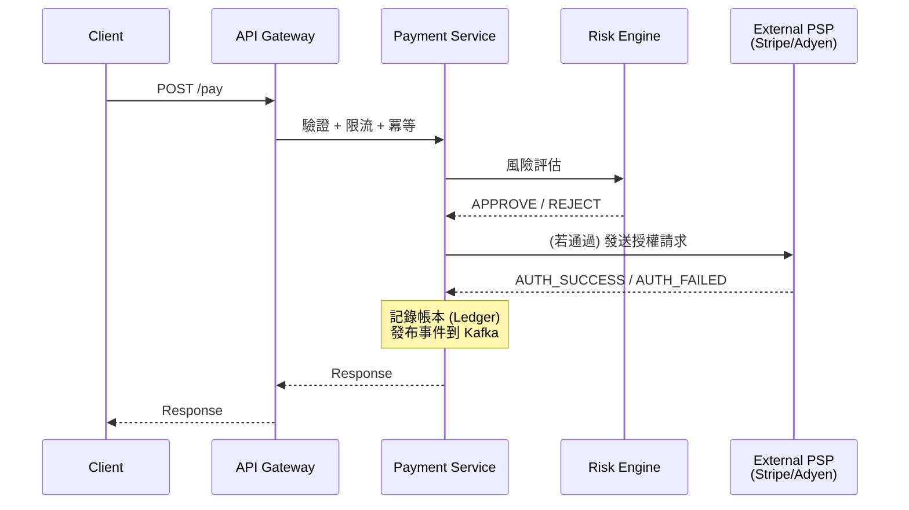

# 金融科技與支付系統 (FinTech & Payments)

## 1. 這個產業最重視什麼？

金融科技與支付系統的非功能性需求 (Non-functional Requirements) 有著與其他產業截然不同的優先級排序。在大多數互聯網產品中，可用性 (Availability) 是至高無上的；但在金融領域，**錢不能出錯**這件事凌駕於一切之上。

### 優先級排序

```
資料正確性 > 冪等性 > 稽核軌跡 > 法規合規 > 一致性優先的可用性 > 對帳
```

---

### 1.1 資料正確性 (Data Correctness)

**核心原則：錢，不能算錯。**

在社群媒體上少顯示一則貼文，使用者可能不會注意到；但在支付系統中少算一分錢，就可能觸發法規調查。金融系統對資料正確性的要求是**零容忍**。

- **強一致性 (Strong Consistency)**：每一次讀取都必須反映最新的寫入結果。帳戶餘額不允許出現「暫時不一致」的窗口，否則使用者可能因為看到舊餘額而重複消費（超額提領 Overdraft）。
- **ACID 交易**：核心帳本操作必須是原子性的。「A 扣款成功但 B 入帳失敗」這種狀態絕不允許存在。
- **精確數值計算**：永遠使用定點數 (Fixed-point / Decimal) 而非浮點數。在資料庫層使用 `DECIMAL` 或以最小貨幣單位（如「分」）儲存整數。IEEE 754 浮點數的 `0.1 + 0.2 ≠ 0.3` 問題在金融場景下是致命的。

**面試金句：** 「在金融系統中，我們追求的是 correctness over performance。寧可讓交易慢一點，也不能讓餘額算錯。」

---

### 1.2 冪等性 (Idempotency)

**核心原則：同一筆操作，執行一次和執行一百次的結果必須完全相同。**

網路是不可靠的。Client 發出扣款請求後可能遭遇 Timeout，此時 Client 不知道 Server 是否已經成功處理。最安全的策略就是重試——但如果沒有冪等性保障，重試就會導致重複扣款。

**Idempotency Key 模式：**

```
Client 端：
  1. 在發起交易前，產生一個唯一的 Idempotency Key（通常是 UUID v4）
  2. 將 Key 放入 HTTP Header：X-Idempotency-Key: <uuid>
  3. 若收到 Timeout / 5xx，用同一個 Key 重試

Server 端：
  1. 收到請求，先查詢 DB：SELECT * FROM idempotency_keys WHERE key = ?
  2. 若已存在且狀態為 COMPLETED → 直接回傳先前的 Response（不重新執行）
  3. 若已存在且狀態為 PROCESSING → 回傳 409 Conflict（請稍候）
  4. 若不存在 → INSERT INTO idempotency_keys (key, status) VALUES (?, 'PROCESSING')
     → 執行業務邏輯 → 更新狀態為 COMPLETED 並儲存 Response
```

**實作要點：**
- 在 `idempotency_keys` 表上建立 UNIQUE 約束，利用資料庫層級的衝突檢測避免競態條件 (Race Condition)。
- Idempotency Key 需設定過期時間（通常 24–72 小時），避免表無限增長。
- Key 的 scope 應該綁定到特定使用者 + 操作類型，防止跨使用者碰撞。

---

### 1.3 稽核軌跡 (Audit Trail)

**核心原則：每一次狀態變更都必須被記錄，且不可竄改。**

金融系統必須能回答「這筆錢是怎麼從 A 到 B 的？」「誰在什麼時間做了什麼操作？」這類問題。這不僅是技術需求，更是法規要求。

- **追加寫入日誌 (Append-only Log)**：帳本資料只做 INSERT，永遠不做 UPDATE 或 DELETE。餘額變更透過新增一筆交易紀錄來實現，而非直接修改餘額欄位。
- **事件溯源 (Event Sourcing)**：將每一次狀態變更記錄為一個不可變的事件。當前狀態可以透過重播所有事件來推導。這天生就是一個完整的稽核軌跡。
- **時間戳與操作者**：每筆紀錄必須包含 `created_at`（UTC 時間戳）、`actor_id`（操作者）、`source_ip`、`change_reason`。
- **防竄改機制**：可使用 Hash Chain（類似區塊鏈的原理），每筆紀錄包含前一筆紀錄的 Hash，形成不可竄改的鏈。

---

### 1.4 法規合規 (Compliance)

| 法規 / 標準 | 涵蓋範圍 | 技術影響 |
|-------------|----------|---------|
| **PCI-DSS** | 信用卡資料處理 | 卡號必須加密儲存（Tokenization）、網路隔離、定期滲透測試、存取日誌 |
| **SOX** | 上市公司財務報告 | 財務資料不可竄改、變更必須有審批流程、存取控制 |
| **GDPR / 個資法** | 使用者個人資料 | 資料最小化、被遺忘權（但與稽核軌跡衝突——需用假名化 Pseudonymization 解決） |
| **資料駐留 (Data Residency)** | 跨境資料傳輸 | 特定國家的資料必須儲存在該國的資料中心。影響資料庫部署拓撲。 |
| **KYC / AML** | 身份驗證 / 反洗錢 | 交易監控、可疑活動報告、大額交易通報 |

**技術要求：**
- **加密**：靜態加密 (Encryption at Rest) + 傳輸加密 (Encryption in Transit / TLS)。敏感欄位（如卡號）使用欄位級加密 (Field-level Encryption)。
- **Tokenization**：用無意義的 Token 取代真實卡號，真實卡號只儲存在獨立的、高度安全的 Token Vault 中。
- **最小權限原則 (Least Privilege)**：服務帳號只能存取其所需的最少資源。

---

### 1.5 可用性 vs 一致性的取捨

在 CAP 定理 (CAP Theorem) 的框架下，金融系統明確選擇 **CP (Consistency + Partition Tolerance)** 而非 AP。

**為什麼？**

```
場景：使用者帳戶餘額 $100，同時從兩個裝置發起 $80 的消費

AP 系統（最終一致性）：
  裝置 A 讀到 $100 → 扣款 $80 → 成功 → 餘額 $20
  裝置 B 讀到 $100 → 扣款 $80 → 成功 → 餘額 $20
  最終合併：餘額 = -$60 ← 超額支出！

CP 系統（強一致性）：
  裝置 A 讀到 $100 → 取得鎖 → 扣款 $80 → 餘額 $20 → 釋放鎖
  裝置 B 讀到 $20 → 扣款 $80 → 餘額不足 → 拒絕交易 ✓
```

**面試金句：** 「在金融系統中，我們寧可暫時拒絕服務（降低可用性），也不能讓兩個節點對同一帳戶的餘額有不同的看法（違反一致性）。一筆錯誤的扣款造成的損失，遠大於幾秒鐘的服務中斷。」

但這不代表整個系統都要強一致性。可以分層處理：

| 子系統 | 一致性需求 | 原因 |
|--------|----------|------|
| 核心帳本 (Ledger) | **強一致性** | 餘額必須精確 |
| 交易狀態 | **強一致性** | 不可出現重複扣款 |
| 通知服務 | 最終一致性 | 晚幾秒收到通知可接受 |
| 分析報表 | 最終一致性 | 報表延遲數分鐘可接受 |
| 搜尋索引 | 最終一致性 | 交易搜尋延遲數秒可接受 |

---

### 1.6 對帳 (Reconciliation)

**核心原則：信任，但要驗證 (Trust, but verify)。**

即使系統設計得再完美，分散式環境中的 Bug、網路問題、第三方服務的行為異常都可能導致資料不一致。對帳就是最後一道防線。

- **內部對帳**：比對自家帳本系統與交易資料庫的餘額是否一致。通常每日執行。
- **外部對帳**：比對自家紀錄與銀行 / 支付通路方的紀錄。通常在 T+1（隔日）收到對帳檔後進行。
- **差異處理**：發現差異後，進入人工審查或自動修復流程（視金額與類型而定）。

```
┌────────────────────────────────────────────────────────────┐
│                    每日對帳流程                              │
├────────────────────────────────────────────────────────────┤
│                                                            │
│   [自家帳本]          [銀行對帳檔]                           │
│       │                    │                               │
│       ▼                    ▼                               │
│   ┌────────────────────────────┐                           │
│   │     對帳引擎 (Reconciler)   │                           │
│   │  比對: 交易ID、金額、狀態    │                           │
│   └─────────┬──────────────────┘                           │
│             │                                              │
│      ┌──────┼──────┐                                       │
│      ▼      ▼      ▼                                       │
│   [匹配]  [差異]  [單邊]                                    │
│    (OK)  (金額不符) (只存在一邊)                              │
│            │         │                                     │
│            ▼         ▼                                     │
│      [人工審查佇列 / 自動修正]                                │
│                                                            │
└────────────────────────────────────────────────────────────┘
```

---

## 2. 面試必提的關鍵概念

### 2.1 雙重記帳法 (Double-entry Bookkeeping)

**是什麼？**

每一筆金融交易都必須同時記錄等額的借方 (Debit) 和貸方 (Credit)，確保整體系統永遠平衡（所有借方之和 = 所有貸方之和）。

**為什麼在金融科技中重要？**

這不僅是會計慣例，更是一個**內建的錯誤檢測機制**。如果任何時間點上所有帳戶的借貸方不平衡，就代表系統有 Bug。

**具體範例：使用者 Alice 支付 $100 給商家 Bob**

| 帳戶 | 借方 (Debit) | 貸方 (Credit) |
|------|-------------|--------------|
| Alice 的錢包帳戶 | $100 | |
| Bob 的錢包帳戶 | | $100 |

驗證：借方總和 ($100) = 貸方總和 ($100) ✓

**更複雜的範例：帶手續費的支付**

Alice 支付 $100 給 Bob，平台收取 $2.5 手續費：

| 帳戶 | 借方 (Debit) | 貸方 (Credit) |
|------|-------------|--------------|
| Alice 的錢包帳戶 | $100 | |
| Bob 的錢包帳戶 | | $97.50 |
| 平台手續費帳戶 | | $2.50 |

驗證：借方總和 ($100) = 貸方總和 ($97.50 + $2.50 = $100) ✓

**資料庫設計：**

```sql
CREATE TABLE ledger_entries (
    id              BIGSERIAL PRIMARY KEY,
    transaction_id  UUID NOT NULL,           -- 同一筆交易的多個 entries 共享此 ID
    account_id      BIGINT NOT NULL,
    entry_type      VARCHAR(6) NOT NULL,     -- 'DEBIT' 或 'CREDIT'
    amount          DECIMAL(19,4) NOT NULL,  -- 永遠為正數
    currency        CHAR(3) NOT NULL,        -- ISO 4217: USD, TWD, etc.
    created_at      TIMESTAMPTZ NOT NULL DEFAULT NOW(),
    description     TEXT
);

-- 餘額 = SUM(CREDIT) - SUM(DEBIT) 對該 account_id
-- 或者用 materialized view / 快取餘額 + 觸發器維護
```

**關鍵：** `ledger_entries` 表是 append-only 的。要「撤銷」一筆交易，不是刪除原紀錄，而是新增一筆反向的交易紀錄。

---

### 2.2 冪等性設計 (Idempotent API Design)

**完整實作流程：**

```
Client                           Server
  │                                │
  │  POST /payments               │
  │  X-Idempotency-Key: abc-123   │
  │  {amount: 100, to: "Bob"}     │
  │ ─────────────────────────────► │
  │                                │── BEGIN TX
  │                                │── INSERT INTO idempotency_keys
  │                                │     (key='abc-123', status='PROCESSING')
  │                                │     ON CONFLICT → 查詢已存在的紀錄
  │                                │       ├── status=COMPLETED → 回傳快取的 Response
  │                                │       └── status=PROCESSING → 回傳 409
  │                                │── 執行扣款邏輯
  │                                │── UPDATE idempotency_keys
  │                                │     SET status='COMPLETED', response='{...}'
  │                                │── COMMIT TX
  │  ◄───────────────────────────  │
  │  HTTP 200 {payment_id: "p1"}  │
  │                                │
  │  (Timeout! 不確定是否成功...)     │
  │                                │
  │  POST /payments  (重試)         │
  │  X-Idempotency-Key: abc-123   │
  │ ─────────────────────────────► │
  │                                │── 發現 key='abc-123' 已存在且 COMPLETED
  │  ◄───────────────────────────  │
  │  HTTP 200 {payment_id: "p1"}  │  ← 回傳相同結果，不重複扣款
```

**DB Schema：**

```sql
CREATE TABLE idempotency_keys (
    key         VARCHAR(255) PRIMARY KEY,
    user_id     BIGINT NOT NULL,
    status      VARCHAR(20) NOT NULL DEFAULT 'PROCESSING',
    request_path VARCHAR(255) NOT NULL,
    request_body JSONB,
    response_code INT,
    response_body JSONB,
    created_at  TIMESTAMPTZ NOT NULL DEFAULT NOW(),
    expires_at  TIMESTAMPTZ NOT NULL DEFAULT NOW() + INTERVAL '72 hours',
    UNIQUE (key, user_id)  -- scope 到使用者層級
);

CREATE INDEX idx_idempotency_expires ON idempotency_keys (expires_at);
-- 定期清理過期紀錄：DELETE FROM idempotency_keys WHERE expires_at < NOW();
```

---

### 2.3 Saga 模式 vs 2PC (Two-Phase Commit)

在支付流程中，一筆交易往往涉及多個服務（扣款、風控、通知、第三方支付通路）。如何保證跨服務的資料一致性？

**2PC (Two-Phase Commit)：**

```
協調者 (Coordinator)
  │
  ├── Phase 1: PREPARE
  │   ├── 扣款服務 → "準備好了" (VOTE YES)
  │   ├── 風控服務 → "準備好了" (VOTE YES)
  │   └── 支付通路 → "準備好了" (VOTE YES)
  │
  └── Phase 2: COMMIT
      ├── 扣款服務 → COMMIT ✓
      ├── 風控服務 → COMMIT ✓
      └── 支付通路 → COMMIT ✓
```

- **優點：** 強一致性保證。所有參與者要嘛全部提交，要嘛全部回滾。
- **缺點：** 同步阻塞（所有參與者在 Phase 1 和 Phase 2 之間持有鎖）、協調者單點故障、不適合跨網路延遲高的場景、擴展性差。
- **適用場景：** 同一資料庫叢集內的跨表交易、延遲要求極低的場景。

**Saga 模式：**

```
步驟 1: 扣款服務 → 凍結 $100     (補償: 解凍 $100)
    │
    ▼
步驟 2: 風控服務 → 風險評估通過   (補償: 取消風控紀錄)
    │
    ▼
步驟 3: 支付通路 → 發送支付請求   (補償: 發送退款請求)
    │
    ▼
步驟 4: 帳本服務 → 記錄交易完成

如果步驟 3 失敗：
    步驟 2 補償 ← 取消風控紀錄
    步驟 1 補償 ← 解凍 $100
```

- **優點：** 非同步、不持鎖、每個服務獨立管理自己的交易、擴展性好。
- **缺點：** 最終一致性（中間狀態可見）、補償邏輯複雜、需要處理補償本身失敗的情況。
- **適用場景：** 跨多個微服務的業務流程、涉及外部第三方 API 的場景。

**決策指南：**

| 維度 | 2PC | Saga |
|------|-----|------|
| 一致性 | 強一致 | 最終一致 |
| 延遲 | 高（同步等待所有參與者） | 低（非同步執行） |
| 擴展性 | 差 | 好 |
| 複雜度 | 協調者邏輯 | 補償邏輯 |
| 跨外部服務 | 不可能（外部 API 不支援 2PC） | **唯一選擇** |
| 適用場景 | 同一 DB 叢集內 | 跨微服務、跨組織 |

**面試金句：** 「在支付系統中，由於必須和外部銀行/支付通路互動，而外部 API 不支援 2PC 協議，Saga 模式是實務上唯一可行的選擇。但在自家帳本系統內部，單一資料庫的 ACID 交易就足夠了。」

---

### 2.4 狀態機 (State Machine)

**是什麼？**

將支付交易的生命週期建模為一組有限的狀態 (State) 和允許的轉換 (Transition)，明確定義「從哪個狀態可以轉移到哪個狀態」。

**為什麼重要？**

防止非法狀態轉換。例如，一筆已經「退款完成」的交易不應該被再次「授權」。沒有狀態機約束，系統容易因為並發請求或 Bug 而進入不合法的狀態。

**支付交易狀態機：**

```
                    ┌──────────────────────────────────────────────┐
                    │              支付交易狀態機                     │
                    ├──────────────────────────────────────────────┤
                    │                                              │
                    │   CREATED ──────► AUTHORIZED ──────► CAPTURED│
                    │     │               │                   │    │
                    │     │               │                   │    │
                    │     ▼               ▼                   ▼    │
                    │   FAILED         VOIDED             SETTLED  │
                    │                                       │      │
                    │                                       │      │
                    │                                       ▼      │
                    │                                   REFUNDED   │
                    │                                   (部分/全額)  │
                    │                                              │
                    └──────────────────────────────────────────────┘

狀態說明：
  CREATED    → 交易已建立，尚未發送至支付通路
  AUTHORIZED → 支付通路已預授權，金額已凍結但尚未扣款
  CAPTURED   → 已從持卡人帳戶扣款
  SETTLED    → 資金已實際入帳至商家帳戶（通常 T+1 或 T+2）
  REFUNDED   → 已退款（可部分退款）
  VOIDED     → 授權已取消（在 Capture 前取消）
  FAILED     → 交易失敗（餘額不足、風控拒絕、通路錯誤等）
```

**合法轉換表：**

| 從 \ 到 | CREATED | AUTHORIZED | CAPTURED | SETTLED | REFUNDED | VOIDED | FAILED |
|---------|---------|-----------|---------|---------|---------|--------|--------|
| CREATED | | ✓ | | | | | ✓ |
| AUTHORIZED | | | ✓ | | | ✓ | ✓ |
| CAPTURED | | | | ✓ | | | ✓ |
| SETTLED | | | | | ✓ | | |
| REFUNDED | | | | | | | |
| VOIDED | | | | | | | |
| FAILED | | | | | | | |

**程式碼層面的實作：**

```python
VALID_TRANSITIONS = {
    'CREATED':    ['AUTHORIZED', 'FAILED'],
    'AUTHORIZED': ['CAPTURED', 'VOIDED', 'FAILED'],
    'CAPTURED':   ['SETTLED', 'FAILED'],
    'SETTLED':    ['REFUNDED'],
    'REFUNDED':   [],
    'VOIDED':     [],
    'FAILED':     [],
}

def transition_payment(payment, new_status):
    if new_status not in VALID_TRANSITIONS[payment.status]:
        raise InvalidTransitionError(
            f"Cannot transition from {payment.status} to {new_status}"
        )
    # 使用樂觀鎖 (Optimistic Locking) 防止並發衝突
    rows_updated = db.execute("""
        UPDATE payments
        SET status = %s, version = version + 1, updated_at = NOW()
        WHERE id = %s AND status = %s AND version = %s
    """, [new_status, payment.id, payment.status, payment.version])

    if rows_updated == 0:
        raise ConcurrentModificationError("Payment was modified concurrently")
```

---

### 2.5 最終一致性的對帳機制

**是什麼？**

在使用 Saga 模式或最終一致性設計的系統中，定期執行批次比對，偵測並修復資料不一致。

**為什麼重要？**

再好的分散式系統都可能出現邊緣案例：消費者崩潰在處理到一半的時間點、Message Queue 的訊息遺失、第三方回呼 (Callback) 遺漏。對帳是最後的安全網。

**典型實作：**

```
┌──────────────────────────────────────────────────────────────────┐
│                     對帳排程 (每小時 / 每日)                       │
├──────────────────────────────────────────────────────────────────┤
│                                                                  │
│  1. 撈出所有「超時未完成」的交易                                     │
│     SELECT * FROM payments                                       │
│     WHERE status = 'PROCESSING'                                  │
│     AND updated_at < NOW() - INTERVAL '30 minutes'               │
│                                                                  │
│  2. 向支付通路查詢真實狀態                                          │
│     GET /v1/charges/{charge_id}                                  │
│                                                                  │
│  3. 比對並修正                                                    │
│     ├── 通路說成功，我方說處理中 → 更新為成功，補發入帳事件           │
│     ├── 通路說失敗，我方說處理中 → 更新為失敗，觸發退款補償           │
│     └── 通路查無紀錄，我方說處理中 → 標記異常，進入人工審查           │
│                                                                  │
│  4. 餘額校驗                                                      │
│     SUM(所有 ledger_entries) 是否等於帳戶快取餘額？                  │
│     不等於 → 觸發警報，用 ledger 重新計算餘額                        │
│                                                                  │
└──────────────────────────────────────────────────────────────────┘
```

---

### 2.6 防重複扣款 (Duplicate Payment Prevention)

這是冪等性在支付場景的具體應用，需要多層防線：

**第一層：Client 端去重**
- 按鈕點擊後立即 disable，防止使用者雙擊。
- 產生 Idempotency Key 並附加到請求中。

**第二層：API Gateway 層**
- 檢查 Idempotency Key 是否已存在於快取（Redis）。
- 若存在，直接回傳先前的 Response。

**第三層：Service 層**
- 資料庫層級的 UNIQUE 約束在 `idempotency_keys` 表上。
- 扣款前檢查交易狀態：`SELECT status FROM payments WHERE idempotency_key = ?`
- 使用 `SELECT ... FOR UPDATE` 或樂觀鎖防止並發。

**第四層：對帳層**
- 每日對帳發現重複交易後，自動或人工觸發退款。

```
防禦深度 (Defense in Depth)：

  [使用者雙擊] → 按鈕 disable ─────────────── 第 1 層
       │
       ▼
  [網路重試]   → Idempotency Key + Redis 快取 ─ 第 2 層
       │
       ▼
  [並發請求]   → DB UNIQUE + 狀態檢查 + 鎖 ──── 第 3 層
       │
       ▼
  [邊緣案例]   → 對帳 Job ──────────────────── 第 4 層
```

---

## 3. 常見架構模式

### 3.1 支付閘道架構 (Payment Gateway)

一筆典型的線上支付流程：



**四階段支付流程 (Auth → Capture → Settle → Reconcile)：**

```
時間軸 ──────────────────────────────────────────────────────►

T+0 秒         T+0~數秒        T+1~數天          T+1~T+3
┌───────┐    ┌──────────┐    ┌──────────┐    ┌──────────────┐
│ Auth  │───►│ Capture  │───►│ Settle   │───►│ Reconcile    │
│ 授權   │    │ 請款     │    │ 清算     │    │ 對帳         │
│       │    │          │    │          │    │              │
│凍結額度│    │實際扣款   │    │資金入帳   │    │比對銀行紀錄   │
│在持卡人│    │從持卡人   │    │到商家帳戶 │    │確認無差異     │
│帳戶   │    │帳戶      │    │          │    │              │
└───────┘    └──────────┘    └──────────┘    └──────────────┘
```

- **Auth（授權）**：向發卡行確認持卡人額度足夠，凍結金額。此時錢還沒有實際移動。
- **Capture（請款）**：向發卡行確認要實際扣款。有些場景會延遲 Capture（如飯店預授權）。
- **Settlement（清算）**：發卡行將資金轉入收單行，再進入商家帳戶。通常 T+1 到 T+3 個工作天。
- **Reconciliation（對帳）**：比對自家紀錄與收單行/發卡行的清算檔。

---

### 3.2 帳本系統 (Ledger System)

```
┌──────────────────────────────────────────────────────────────┐
│                     帳本系統架構                               │
├──────────────────────────────────────────────────────────────┤
│                                                              │
│  ┌─────────────────────────────────────────────┐             │
│  │           寫入路徑 (Write Path)              │             │
│  │                                             │             │
│  │  Payment Service                            │             │
│  │       │                                     │             │
│  │       ▼                                     │             │
│  │  ┌─────────────────────────────────┐        │             │
│  │  │ Ledger Write Service            │        │             │
│  │  │ - 驗證雙重記帳 (Debit = Credit) │        │             │
│  │  │ - 驗證狀態機轉換合法             │        │             │
│  │  │ - 冪等性檢查                     │        │             │
│  │  └──────────┬──────────────────────┘        │             │
│  │             │                               │             │
│  │             ▼                               │             │
│  │  ┌──────────────────────┐                   │             │
│  │  │ PostgreSQL (Primary) │                   │             │
│  │  │ ledger_entries 表    │                   │             │
│  │  │ (Append-only)        │──── WAL ───►Replica│            │
│  │  └──────────┬───────────┘                   │             │
│  │             │                               │             │
│  │             ▼                               │             │
│  │  ┌────────────────────┐                     │             │
│  │  │ Kafka (事件發佈)    │                     │             │
│  │  │ topic: ledger.events│                    │             │
│  │  └────────────────────┘                     │             │
│  └─────────────────────────────────────────────┘             │
│                                                              │
│  ┌─────────────────────────────────────────────┐             │
│  │           讀取路徑 (Read Path)               │             │
│  │                                             │             │
│  │  Balance Query Service                      │             │
│  │       │                                     │             │
│  │       ├──► Redis Cache (熱門帳戶餘額快取)     │             │
│  │       │    TTL: 短 / Write-through 更新      │             │
│  │       │                                     │             │
│  │       └──► PostgreSQL Replica               │             │
│  │            (讀取密集查詢分流)                  │             │
│  └─────────────────────────────────────────────┘             │
│                                                              │
└──────────────────────────────────────────────────────────────┘
```

**帳本系統的核心設計原則：**

1. **不可變性 (Immutability)**：所有紀錄只做 INSERT。要修正錯誤，新增一筆「沖正」(Reversal) 紀錄，而非修改原紀錄。
2. **雙重記帳**：每筆交易必須產生等額的 Debit 和 Credit entries。
3. **餘額由紀錄推導**：帳戶餘額 = `SUM(CREDIT) - SUM(DEBIT)` for 該帳戶。可用 materialized balance 做快取加速，但帳本紀錄是唯一的事實來源 (Source of Truth)。
4. **嚴格排序**：同一帳戶的交易必須有明確的先後順序，避免並發寫入導致的餘額錯誤。

---

### 3.3 Event Sourcing for 金流

**為什麼 Event Sourcing 天生適合金融系統？**

傳統 CRUD 模型只儲存「當前狀態」。Event Sourcing 儲存「導致當前狀態的所有事件」。在金融系統中：

- **帳本本身就是一連串事件**：「存入 $100」「扣款 $50」「退款 $20」—— 餘額是這些事件的推導結果。
- **天生的稽核軌跡**：不需要額外的稽核 Log，事件流本身就是完整的歷史。
- **支持時間旅行 (Time Travel)**：可以重播事件到任意時間點，算出該時間點的餘額。對帳、偵錯、監管調查都非常有用。
- **支持多種讀取模型 (Projection)**：同一組事件可以投影出不同的讀取模型——餘額視圖、交易歷史視圖、風控統計視圖。

```
事件儲存 (Event Store)：
┌────┬──────────────┬────────┬────────┬──────────────────────┐
│ ID │ aggregate_id │ seq_no │  type  │       payload        │
├────┼──────────────┼────────┼────────┼──────────────────────┤
│  1 │ acct-001     │      1 │ OPENED │ {owner:"Alice"}      │
│  2 │ acct-001     │      2 │ CREDIT │ {amount:100,src:".."}│
│  3 │ acct-001     │      3 │ DEBIT  │ {amount:30,dst:".."}│
│  4 │ acct-001     │      4 │ DEBIT  │ {amount:20,dst:".."}│
│  5 │ acct-001     │      5 │ CREDIT │ {amount:10,src:".."}│
└────┴──────────────┴────────┴────────┴──────────────────────┘

重播計算餘額：
  Event 1: 開戶                     → 餘額 $0
  Event 2: 入帳 $100                → 餘額 $100
  Event 3: 扣款 $30                 → 餘額 $70
  Event 4: 扣款 $20                 → 餘額 $50
  Event 5: 入帳 $10                 → 餘額 $60  ← 當前餘額

快照 (Snapshot)：
  當事件量大時，為避免每次都重播全部事件，
  定期建立快照：{seq_no: 3, balance: $70}
  之後只需從快照開始重播後續事件即可。
```

---

### 3.4 CQRS (Command Query Responsibility Segregation)

將寫入模型 (Command) 和讀取模型 (Query) 分離。在金融系統中特別有價值，因為寫入和讀取的需求差異極大。

```
                    ┌──────────────────────────────────┐
                    │             CQRS 架構             │
                    ├──────────────────────────────────┤
                    │                                  │
  寫入命令 ────►    │  ┌────────────────────┐          │
  (轉帳、扣款)      │  │  Command Service   │          │
                    │  │  - 業務規則驗證     │          │
                    │  │  - 狀態機檢查       │          │
                    │  │  - 寫入帳本 (PG)    │          │
                    │  └────────┬───────────┘          │
                    │           │                      │
                    │           ▼                      │
                    │  ┌────────────────────┐          │
                    │  │  Event Bus (Kafka) │          │
                    │  └─┬──────┬───────┬───┘          │
                    │    │      │       │              │
                    │    ▼      ▼       ▼              │
                    │  [餘額   [交易   [風控            │
                    │   投影]   歷史]   統計]           │
                    │    │      │       │              │
                    │    ▼      ▼       ▼              │
                    │  Redis  Elastic  ClickHouse      │
                    │                                  │
  讀取查詢 ────►    │  ┌────────────────────┐          │
  (餘額、帳單)      │  │   Query Service    │          │
                    │  │  - 從投影中讀取     │          │
                    │  │  - 不接觸主帳本     │          │
                    │  └────────────────────┘          │
                    │                                  │
                    └──────────────────────────────────┘
```

**好處：**
- 寫入路徑可以專注在正確性（ACID、強一致性）。
- 讀取路徑可以專注在效能（快取、預計算、不同的儲存引擎）。
- 讀寫負載不互相干擾——讀取密集的餘額查詢不會影響帳本寫入的延遲。

**注意：** 寫入事件到投影更新之間有延遲（通常毫秒到秒級）。使用者剛完成轉帳就查詢餘額，可能看到舊餘額。解法：寫入成功後，在回應中直接返回最新餘額（Read Your Own Writes），而非依賴投影。

---

### 3.5 Outbox Pattern（可靠事件發佈）

**問題：** 如何在寫入資料庫和發佈事件到 Kafka 之間保證一致性？

```
不可靠的做法（雙寫問題 Dual Write Problem）：
  1. BEGIN TX → INSERT INTO payments → COMMIT TX  ✓
  2. kafka.send(payment_event)                    ✗ ← 如果這步失敗呢？
  結果：DB 有紀錄但 Kafka 沒有事件 → 下游系統永遠不知道這筆交易
```

**Outbox Pattern 解法：**

```
┌──────────────────────────────────────────────────────────┐
│                    Outbox Pattern                        │
├──────────────────────────────────────────────────────────┤
│                                                          │
│  Payment Service:                                        │
│  ┌────────────────────────────────────┐                  │
│  │ BEGIN TX                           │                  │
│  │   INSERT INTO payments (...)       │  同一個 DB       │
│  │   INSERT INTO outbox (              │  同一個 TX       │
│  │     event_type, payload, status    │                  │
│  │   )                                │                  │
│  │ COMMIT TX                          │                  │
│  └────────────────────────────────────┘                  │
│                                                          │
│  Outbox Relay (獨立 Process):                             │
│  ┌────────────────────────────────────┐                  │
│  │ 持續輪詢 outbox 表：               │                  │
│  │   SELECT * FROM outbox             │                  │
│  │   WHERE status = 'PENDING'         │                  │
│  │   ORDER BY created_at LIMIT 100    │                  │
│  │                                    │                  │
│  │ 發佈到 Kafka                       │                  │
│  │ 成功後更新 status = 'PUBLISHED'     │                  │
│  └────────────────────────────────────┘                  │
│                                                          │
│  替代方案：CDC (Change Data Capture)                      │
│  ┌────────────────────────────────────┐                  │
│  │ Debezium 監聽 PostgreSQL WAL       │                  │
│  │ 自動捕捉 outbox 表的新紀錄          │                  │
│  │ 轉發至 Kafka                       │                  │
│  │ （不需要輪詢，延遲更低）            │                  │
│  └────────────────────────────────────┘                  │
│                                                          │
└──────────────────────────────────────────────────────────┘
```

**為什麼不用 2PC？**
- Kafka 不支援 XA Transaction（2PC 的標準協議）。
- 即使用其他 Message Queue 支援 XA，2PC 的延遲和可用性代價在高吞吐量的支付系統中是不可接受的。
- Outbox Pattern 更簡單、更可靠，且與現有的 DB 事務完美整合。

---

## 4. 技術選型偏好

### 資料庫：PostgreSQL 是首選

| 維度 | PostgreSQL | MongoDB / DynamoDB |
|------|-----------|-------------------|
| ACID 交易 | **原生支援** | 有限支援 (MongoDB 4.0+) / 單項目層級 |
| 強一致性 | **預設行為** | 需要額外配置 |
| 雙重記帳的 SUM 查詢 | **高效** | 聚合管線較慢 |
| Schema 約束 | **強制 CHECK/UNIQUE** | Schema-free，約束靠應用層 |
| 成熟的金融生態系 | **豐富** | 相對薄弱 |
| 稽核工具 | pgaudit, 觸發器 | 自行實作 |

**為什麼 NoSQL 不適合核心帳本？**
- 金融帳本的查詢模式是高度結構化的：按帳戶查詢、按時間範圍聚合、跨帳戶的餘額驗證。關聯式資料庫天生擅長這些。
- 最終一致性在帳本場景下是不可接受的——你不能讓兩個副本對同一帳戶有不同的餘額。
- 雙重記帳的約束（Debit = Credit）最適合用 DB 層級的 CHECK 約束來保證。

**例外：** 非核心子系統可以用 NoSQL。例如交易搜尋用 Elasticsearch、風控特徵儲存用 Redis、分析報表用 ClickHouse。

---

### Message Queue：Kafka 的角色

| 需求 | 為什麼 Kafka |
|------|-------------|
| 稽核軌跡 | 保留期可設定為永久，所有事件可重播 |
| 事件溯源 | Append-only Log 就是事件儲存的自然形態 |
| 多消費者 | 帳本服務、通知服務、分析服務各自消費同一事件流 |
| 高吞吐量 | Sequential I/O + Zero-copy，百萬級 msg/s |
| Exactly-once 語意 | 冪等 Producer + 交易型 Consumer（需搭配應用層冪等性） |

**注意 Exactly-once 的邊界：**
- Kafka 的 Exactly-once 保證的是 **Kafka 內部** 的 produce-consume 鏈路。
- **端到端的 Exactly-once 必須在應用層實現冪等 Consumer。** 這是面試中經常被考的點。

---

### 最終一致性的使用邊界

```
┌────────────────────────────────────────────────────────────────┐
│  強一致性 (Strong Consistency)    │  最終一致性 (Eventual)       │
├──────────────────────────────────┼────────────────────────────┤
│  核心帳本 (Ledger)               │  通知服務 (推播、Email)      │
│  餘額查詢 (Balance)              │  分析報表 (Dashboard)       │
│  交易狀態機                       │  搜尋索引                   │
│  冪等性檢查                       │  行銷推薦                   │
│  風控即時決策                      │  對帳報告（本身就是延遲的）   │
└──────────────────────────────────┴────────────────────────────┘
```

**面試金句：** 「我不會對整個系統都要求強一致性——那會犧牲太多效能和可用性。我會劃出一條清楚的邊界：所有涉及金錢流動的路徑必須強一致；其餘的讀取模型和輔助服務可以接受毫秒到秒級的最終一致性。」

---

## 5. 面試加分提示與常見陷阱

### 加分提示

1. **主動提到冪等性**：在面試官還沒問之前就說「這個 API 必須設計成冪等的」，展現你對金融系統的深刻理解。
2. **畫出狀態機**：當討論支付流程時，主動畫出狀態機圖，說明合法轉換和非法轉換。
3. **區分 Auth 和 Capture**：很多候選人把「授權」和「扣款」混為一談。清楚解釋四階段流程 (Auth → Capture → Settle → Reconcile) 會大大加分。
4. **提到對帳**：在設計結束時主動說「最後，我會設計一個每日對帳 Job 來偵測不一致」，展現你知道分散式系統不可能百分之百可靠。
5. **提到 Outbox Pattern**：當需要在 DB 寫入和事件發佈之間保證一致性時，主動提出 Outbox Pattern 而非 2PC。
6. **用具體數字說話**：「一筆信用卡交易的授權延遲通常在 1-3 秒，結算在 T+1 到 T+3」。

### 常見陷阱

1. **用浮點數表示金額**：這是最常見的致命錯誤。永遠用 `DECIMAL` 或整數（以最小貨幣單位儲存）。
2. **忽略冪等性**：設計 API 時沒有考慮重試安全性，讓面試官自己問「如果 Client 重試會怎樣？」這就已經扣分了。
3. **對整個系統用最終一致性**：「反正大家都用微服務 + 最終一致性」——在金融系統中，這句話會直接讓面試官對你的判斷力產生質疑。
4. **忘記補償邏輯**：提出 Saga 模式但沒有設計每一步的補償操作。Saga 沒有補償就不是 Saga。
5. **把帳本當 CRUD 設計**：對帳本做 UPDATE/DELETE 是大忌。帳本必須是 append-only 的。
6. **忽略外部依賴的不可靠性**：第三方支付通路可能超時、回傳錯誤、甚至回呼遺漏。設計中必須包含重試、超時處理和對帳機制。

### 「支付服務在交易中途崩潰怎麼辦？」

這是金融系統面試的經典壓力測試問題。結構化的回答：

**第一步：識別崩潰時間點**

```
崩潰點分析：

  1. 扣款前崩潰 → 無影響，用戶重試即可（冪等性保護）
  2. 已扣款，未記帳 → 最危險！
  3. 已記帳，未通知 → 影響較小
  4. 已通知，未更新狀態 → 重試可修復
```

**第二步：解釋恢復機制**

- **Saga 的補償**：如果在步驟 2 崩潰，Saga 協調者會在服務恢復後繼續執行未完成的步驟，或觸發補償（退回扣款）。
- **Idempotency Key**：服務恢復後，可以安全重試未完成的操作，Idempotency Key 確保不會重複扣款。
- **Outbox Pattern**：即使服務崩潰，事件已經安全地寫入 Outbox 表（與業務資料在同一個 DB 事務中）。服務恢復後，Outbox Relay 會繼續發佈。
- **對帳 Job**：最後一道防線。即使上述所有機制都出了問題，每日對帳會發現「已扣款但未入帳」的異常交易，並觸發修復流程。

**第三步：總結**

「所以我的設計是多層防禦的：冪等性讓重試安全、Saga 提供補償機制、Outbox 保證事件不遺失、對帳是最後的安全網。任何單一層失敗都有下一層兜底。」

---

## 6. 經典面試題

### 6.1 設計一個 P2P 轉帳系統（如 Venmo / 街口支付）

**核心挑戰：**
- 雙重記帳：A 帳戶扣款 + B 帳戶入帳必須原子操作
- 餘額不能為負數（除非有信用額度）
- 高並發下的餘額一致性（SELECT ... FOR UPDATE 或樂觀鎖）
- 與銀行的充值/提現流程（外部依賴的不可靠性）

<details>
<summary>點擊查看參考思路</summary>

#### 高層架構
系統核心由 Transfer Service 負責接收轉帳請求，透過 Ledger Service 以雙重記帳法執行原子性的帳本寫入（同一 PostgreSQL Transaction 內完成 A 扣款 + B 入帳），並透過 Wallet Service 管理錢包餘額與充值/提現流程。外部銀行互動使用 Saga 模式處理，確保失敗時能正確補償。

#### 核心元件
- **Transfer Service**：接收轉帳請求、驗證參數、檢查冪等性、協調整個轉帳流程
- **Ledger Service**：執行雙重記帳寫入，確保每筆交易 Debit = Credit，append-only 設計
- **Wallet Service**：管理錢包餘額快取（Redis write-through）、處理充值/提現的非同步銀行互動
- **Notification Service**：非同步推播轉帳結果通知（最終一致性即可）
- **Reconciliation Job**：每日對帳，比對 Ledger 餘額與快取餘額、銀行端紀錄

#### 關鍵決策與 Trade-off
| 決策點 | 選項 A | 選項 B | 建議 |
|--------|--------|--------|------|
| 餘額一致性 | `SELECT ... FOR UPDATE`（悲觀鎖） | 樂觀鎖（version column） | 高爭用帳戶用悲觀鎖，一般帳戶用樂觀鎖 |
| 餘額儲存 | 每次從 Ledger SUM 計算 | Materialized balance + 快取 | Materialized balance，由 Ledger 做 Source of Truth |
| 銀行充值/提現 | 同步等待銀行回應 | 非同步 + Webhook 回呼 | 非同步，銀行回呼延遲可達 1-3 天 |
| 內部轉帳 vs 跨行 | 統一流程 | 分開處理 | 分開：內部用單一 DB TX，跨行用 Saga |

#### 粗略估算
- 假設 1000 萬活躍用戶，每人每天平均 2 筆轉帳 → 峰值 QPS ≈ 20M / 86400 × 3（峰值倍數）≈ 700 QPS
- 每筆轉帳產生 2 條 ledger_entries → 寫入 QPS ≈ 1400
- 每筆 ledger_entry ≈ 200 bytes → 日增量 ≈ 40M × 200B ≈ 8 GB/天

#### 面試時要主動提到的點
- 冪等性設計：Client 產生 Idempotency Key，防止網路重試導致重複轉帳
- 餘額檢查與扣款必須在同一個 Transaction 內（避免 TOCTOU 問題）
- 熱點帳戶（如商家收款帳戶）需要特殊處理：可拆分子帳戶分散鎖競爭
- 充值/提現是與外部銀行的非同步流程，必須有狀態機追蹤 + 對帳機制

</details>

### 6.2 設計一個支付閘道（如 Stripe / 綠界）

**核心挑戰：**
- 多支付通路路由（依成功率、費率、可用性動態選擇）
- Auth → Capture → Settle → Reconcile 四階段流程
- 冪等性設計（Merchant 的重試不會導致重複扣款）
- 商家對帳報表（T+1 產出，需與銀行端對帳）

<details>
<summary>點擊查看參考思路</summary>

#### 高層架構
支付閘道作為商家與多家 PSP/銀行之間的抽象層，對外提供統一 API，對內透過 Router 根據成功率、費率、可用性動態選擇最佳支付通路。核心以狀態機管理 Auth → Capture → Settle → Reconcile 四階段生命週期，搭配 Outbox Pattern 確保事件可靠發佈。

#### 核心元件
- **Gateway API**：面向商家的統一 RESTful API，負責認證、限流、冪等性檢查
- **Payment Router**：智慧路由引擎，依據通路成功率（滑動窗口統計）、費率、可用性做動態選擇，支援 fallback
- **PSP Adapter Layer**：為每家 PSP（Stripe、Adyen、銀行直連）實作統一介面的 Adapter，隔離外部差異
- **State Machine Engine**：管理交易生命週期，確保狀態轉換合法性
- **Settlement Service**：每日批次處理清算，產出商家對帳報表
- **Reconciliation Engine**：T+1 比對自家紀錄與 PSP/銀行的清算檔

#### 關鍵決策與 Trade-off
| 決策點 | 選項 A | 選項 B | 建議 |
|--------|--------|--------|------|
| 路由策略 | 靜態規則（按商家配置） | 動態路由（即時成功率 + 費率優化） | 混合：商家可指定偏好，系統在偏好內做動態優化 |
| Auth 與 Capture | 合併（一步完成） | 分離（先授權後請款） | 分離，支持飯店預授權、延遲扣款等場景 |
| 通路故障處理 | 直接回傳失敗 | 自動 fallback 到備用通路 | 自動 fallback，但需記錄路由決策供對帳 |
| 對帳頻率 | 每日批次 | 即時逐筆 | 每日批次為主 + 異常交易即時告警 |

#### 粗略估算
- 中型支付閘道：日交易量 500 萬筆 → 峰值 QPS ≈ 5M / 86400 × 5 ≈ 290 QPS
- 每筆交易涉及 1 次 Auth + 1 次 Capture → 對外 PSP 呼叫峰值 ≈ 580 QPS
- 交易紀錄 ≈ 500 bytes/筆 → 日增量 ≈ 2.5 GB，年增量 ≈ 900 GB

#### 面試時要主動提到的點
- 冪等性由商家傳入的 Idempotency Key 保證，Gateway 層做第一道檢查（Redis），DB 層做第二道
- 通路選擇需要 Circuit Breaker：某通路連續失敗超過閾值則暫時停用
- Auth 和 Capture 之間可能間隔數天（如飯店場景），需要設計授權過期機制
- 商家 Webhook 回呼需要重試機制（指數退避 + 最大重試次數）

</details>

### 6.3 設計一個數位錢包系統（如 Apple Pay / Line Pay）

**核心挑戰：**
- 帳本系統設計（雙重記帳、append-only）
- 餘額快取策略（CQRS：寫入走帳本、讀取走快取）
- 充值/提現的非同步流程（銀行轉帳可能需要 1-3 天）
- 交易限額（每日/每月限額的原子性檢查）

<details>
<summary>點擊查看參考思路</summary>

#### 高層架構
數位錢包核心是一套 CQRS 架構的帳本系統：寫入路徑經過 Ledger Write Service 做雙重記帳寫入 PostgreSQL（append-only），讀取路徑透過 Balance Query Service 從 Redis 快取取得餘額。充值/提現透過 Funding Service 與銀行非同步互動，使用狀態機追蹤每筆資金流動的生命週期。

#### 核心元件
- **Ledger Service**：append-only 的雙重記帳帳本，每筆操作（消費、充值、提現、退款）都產生對應的 Debit/Credit entries
- **Balance Service（CQRS Read Side）**：Redis write-through 快取熱門帳戶餘額，寫入帳本時同步更新快取
- **Funding Service**：處理充值（銀行→錢包）和提現（錢包→銀行），管理與銀行的非同步互動
- **Limit Service**：原子性檢查並更新每日/每月交易限額，使用 Redis INCRBY + EXPIREAT 實現
- **Transaction History Service**：從 Kafka 消費 ledger events，寫入 Elasticsearch 供用戶查詢

#### 關鍵決策與 Trade-off
| 決策點 | 選項 A | 選項 B | 建議 |
|--------|--------|--------|------|
| 餘額快取更新 | Write-through（同步寫快取） | Write-behind（非同步寫快取） | Write-through，餘額不容許延遲不一致 |
| 限額檢查 | 在 DB Transaction 內檢查 | Redis 原子操作（INCRBY） | Redis，低延遲且支援滑動窗口；但需搭配 DB 做最終驗證 |
| 充值確認 | 等銀行同步回應 | 先建立「處理中」狀態，等 Webhook | Webhook 非同步，銀行轉帳本質就是非同步的 |
| 帳本分片 | 單一 PostgreSQL | 按 account_id 分片 | 初期單一 DB 足夠，當帳戶數破千萬再考慮分片 |

#### 粗略估算
- 2000 萬用戶，日活 500 萬，每人日均 3 筆消費 → 峰值 QPS ≈ 15M / 86400 × 3 ≈ 520 QPS
- 餘額查詢遠多於消費（每次打開 App 都查餘額）→ 讀取 QPS ≈ 5000+（Redis 輕鬆應對）
- ledger_entries 日增量 ≈ 30M × 200B ≈ 6 GB/天

#### 面試時要主動提到的點
- 充值/提現是非同步的，用戶看到「處理中」狀態是正常的，需要清楚的 UI 狀態展示
- 餘額的 Source of Truth 永遠是 Ledger（`SUM(CREDIT) - SUM(DEBIT)`），Redis 快取只是加速層
- 限額檢查必須在扣款之前且與扣款在同一原子操作內，否則會有 Race Condition
- 需要設計「凍結金額」概念：授權時凍結、Capture 時實際扣款，避免超額消費

</details>

### 6.4 設計一個即時風控系統（Fraud Detection）

**核心挑戰：**
- 延遲要求 < 100ms（不能阻塞支付流程太久）
- 規則引擎 + ML 模型的混合架構
- 特徵計算（近 5 分鐘的交易頻率、歷史消費模式）
- 即時串流處理（Kafka Streams / Flink）

<details>
<summary>點擊查看參考思路</summary>

#### 高層架構
風控系統採用雙軌並行架構：同步路徑（< 100ms）處理即時交易決策，由規則引擎（確定性規則如黑名單、速度檢查）和輕量 ML 模型（fraud score）組成；非同步路徑透過 Flink 進行串流特徵計算和深度模型分析，結果回饋到特徵儲存供同步路徑使用。兩條路徑互相補強，平衡延遲與準確度。

#### 核心元件
- **Rule Engine**：低延遲的確定性規則檢查（黑名單、白名單、地理圍欄、速度限制），規則可熱更新
- **ML Scoring Service**：輕量模型（如 XGBoost）在線推論，回傳 fraud score（0-100）
- **Feature Store**：Redis 儲存即時特徵（近 5 分鐘交易次數、24 小時累計金額），Flink 持續更新
- **Stream Processor（Flink）**：消費交易事件流，計算滑動窗口特徵、偵測異常模式、更新 Feature Store
- **Case Management Service**：高風險交易進入人工審查佇列，審查結果回饋為模型訓練資料
- **Decision Aggregator**：綜合 Rule Engine 和 ML 分數做最終決策（APPROVE / REVIEW / REJECT）

#### 關鍵決策與 Trade-off
| 決策點 | 選項 A | 選項 B | 建議 |
|--------|--------|--------|------|
| 即時特徵計算 | 預計算存 Redis（查詢快） | 請求時即時計算（最新） | 預計算，100ms 內無法做複雜聚合查詢 |
| 模型部署 | 嵌入式（同進程） | 獨立 Model Serving（gRPC） | 嵌入式延遲更低，但更新需重啟；建議用 gRPC + 模型版本切換 |
| 規則 vs ML 權重 | 規則優先（ML 輔助） | ML 優先（規則兜底） | 規則優先：黑名單直接拒絕，ML 處理灰色地帶 |
| 假陽性處理 | 直接拒絕 | 進入人工審查 | 中高分進審查，超高分直接拒絕，降低用戶摩擦 |

#### 粗略估算
- 每筆交易需在 < 100ms 內回傳決策 → Rule Engine < 10ms、Feature Store 查詢 < 5ms、ML 推論 < 30ms
- 支付 QPS 500 → 風控 QPS 也是 500（每筆交易都經過風控）
- Feature Store：每個用戶約 50 個特徵 × 8 bytes ≈ 400 bytes → 1000 萬活躍用戶 ≈ 4 GB（Redis 輕鬆容納）

#### 面試時要主動提到的點
- 風控系統必須有 graceful degradation：如果 ML 服務超時，退回到規則引擎決策，絕不阻塞支付
- 特徵的時間窗口設計（1 分鐘、5 分鐘、1 小時、24 小時）直接影響偵測效果
- 模型需要持續用最新的欺詐案例重新訓練（feedback loop），否則會被新型攻擊繞過
- 合規要求：風控決策必須可解釋（Explainability），純黑箱模型在金融監管下可能不被接受

</details>

### 6.5 設計一個跨境匯款系統

**核心挑戰：**
- 多幣種帳本（每個幣種獨立的帳本，匯率轉換作為獨立交易）
- 匯率波動風險（鎖定匯率的有效期）
- 法規合規（KYC/AML、資料駐留）
- 中間行（Correspondent Bank）的路由選擇

<details>
<summary>點擊查看參考思路</summary>

#### 高層架構
跨境匯款系統將一筆匯款拆解為三個獨立交易：(1) 來源幣種扣款、(2) 匯率轉換（FX Transaction）、(3) 目標幣種入帳。每個幣種維護獨立帳本，匯率轉換本身作為一筆獨立的雙重記帳交易記錄。整體流程以 Saga 編排，因為涉及多國銀行和中間行的外部依賴。

#### 核心元件
- **Transfer Orchestrator**：Saga 協調者，編排整個跨境匯款流程（KYC 驗證 → 匯率鎖定 → 扣款 → 路由 → 入帳）
- **Multi-currency Ledger**：每個幣種獨立帳本，匯率轉換記為「USD 帳本 Debit + TWD 帳本 Credit」，匯率作為交易 metadata
- **FX Service**：提供即時匯率報價，支援匯率鎖定（Quote Lock，通常有效期 30 秒 ~ 15 分鐘）
- **Corridor Router**：選擇最佳匯款路徑（直連銀行 vs 中間行），考量費率、速度、合規要求
- **Compliance Service**：KYC/AML 檢查、制裁名單篩查（OFAC、EU Sanctions）、大額交易通報
- **Data Residency Manager**：確保各國資料儲存在合規的地理位置

#### 關鍵決策與 Trade-off
| 決策點 | 選項 A | 選項 B | 建議 |
|--------|--------|--------|------|
| 匯率鎖定 | 短期鎖定（30 秒） | 長期鎖定（15 分鐘） | 短期鎖定 + 過期後重新報價，降低匯率風險敞口 |
| 帳本結構 | 單一帳本多幣種欄位 | 每幣種獨立帳本 | 獨立帳本，避免跨幣種 SUM 錯誤，每個帳本餘額獨立平衡 |
| 中間行路由 | 固定路徑 | 動態路由（費率+速度優化） | 動態路由，但需合規白名單過濾 |
| 資料駐留 | 中央化資料庫 | 各地區獨立部署 | 各地區獨立部署核心資料，跨區只傳輸必要的交易指令 |

#### 粗略估算
- 跨境匯款 QPS 相對低但單筆金額高：日交易量 10 萬筆 → 峰值 QPS ≈ 10
- 每筆匯款產生 4-6 條 ledger entries（扣款 + FX + 入帳 + 手續費）→ 寫入 QPS ≈ 60
- 端到端延遲：即時匯款 5-30 秒（如 SWIFT gpi），傳統路徑 1-5 個工作天
- KYC/AML 檢查延遲 < 2 秒（批量篩查預計算 + 即時增量檢查）

#### 面試時要主動提到的點
- 匯率轉換必須作為獨立交易記錄，不能隱含在轉帳中，否則無法正確稽核和對帳
- 匯率鎖定有時間窗口，過期必須重新報價，FX Service 需要管理匯率風險敞口
- 不同國家的法規差異極大（如中國的外匯管制、歐盟的 SEPA 即時轉帳），需要可配置的合規規則引擎
- SWIFT 報文格式（MT103 等）的解析和產生是與傳統銀行對接的關鍵技術點

</details>

### 6.6 設計一個訂閱制扣款系統（Recurring Billing）

**核心挑戰：**
- 排程扣款的可靠執行（排程器故障恢復、冪等重試）
- 扣款失敗的重試策略（Smart Retry：依據失敗原因調整重試間隔）
- 降級處理（卡過期、餘額不足→通知用戶→寬限期→暫停服務）
- 按比例退款（Proration）的計算邏輯

<details>
<summary>點擊查看參考思路</summary>

#### 高層架構
系統核心由 Billing Scheduler 定期掃描到期訂閱並產生扣款任務，透過 Message Queue 分發給 Billing Worker 執行。Worker 呼叫 Payment Service 完成實際扣款，失敗時依據 Smart Retry 策略安排重試。整體設計強調冪等性（每個 billing cycle + subscription ID 為一個冪等單位）和可靠性（任務持久化 + 冪等重試）。

#### 核心元件
- **Billing Scheduler**：Cron-like 排程器（建議用 DB-backed 排程避免單點故障），掃描 `subscriptions` 表中 `next_billing_date <= NOW()` 的記錄
- **Billing Worker**：從 Queue 取得扣款任務，執行扣款邏輯，處理成功/失敗分支
- **Smart Retry Engine**：依失敗原因分類重試策略 — 餘額不足（隔天重試）、卡過期（通知用戶更新）、暫時性錯誤（指數退避）
- **Dunning Service**：管理扣款失敗後的催收流程 — 通知用戶 → 寬限期 → 降級 → 暫停服務 → 取消訂閱
- **Proration Calculator**：處理升降級時的按比例計費 — 計算已使用天數的費用差額
- **Invoice Service**：每個 billing cycle 產生正式 Invoice，作為帳務和稽核依據

#### 關鍵決策與 Trade-off
| 決策點 | 選項 A | 選項 B | 建議 |
|--------|--------|--------|------|
| 排程器設計 | 單一 Cron Job | DB-backed 分散式排程 | DB-backed：`SELECT ... FOR UPDATE SKIP LOCKED` 實現多 Worker 競爭 |
| 重試策略 | 固定間隔 | Smart Retry（依失敗原因調整） | Smart Retry：卡片被拒（等用戶處理）vs 暫時性錯誤（快速重試） |
| 扣款時機 | 精確到秒 | 批次處理（每小時一批） | 批次處理，減少對 PSP 的請求壓力，失敗批次易於重試 |
| Proration | 按天計算 | 按秒計算 | 按天計算，足夠精確且邏輯簡單，避免爭議 |

#### 粗略估算
- 100 萬訂閱用戶，月繳為主 → 每天平均 33,000 筆扣款（100 萬 / 30 天）
- 假設 5% 首次失敗率 → 每天約 1,650 筆需要重試
- 扣款高峰（月初 1-3 號）可能集中 40% 的量 → 峰值日 13 萬筆 → 峰值 QPS ≈ 150（分散到 24 小時內）
- 每筆 Invoice ≈ 1 KB → 月增量 ≈ 1 GB

#### 面試時要主動提到的點
- 冪等性的 scope 是 `subscription_id + billing_period`，同一個帳期內不論重試幾次只扣一次
- 扣款失敗不應立即取消訂閱，業界標準是 3-7 天寬限期 + 多次重試（通常 3-5 次）
- Smart Retry 的核心：decline code 分類 — hard decline（卡被盜、帳號關閉 → 不重試）vs soft decline（餘額不足 → 隔天重試）
- 升降級的 Proration 要考慮：用戶在 billing cycle 中段升級時，需退還舊方案未使用天數的費用，並收取新方案剩餘天數的費用

</details>
