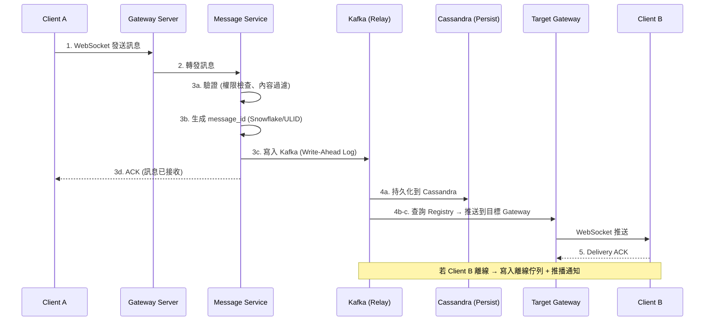

# 即時通訊系統 (Real-time Messaging / Chat)

即時通訊是現代網路應用中最具挑戰性的系統設計題目之一。它同時考驗候選人對**網路協定 (Network Protocol)**、**分散式系統 (Distributed Systems)**、**資料儲存 (Data Storage)** 和**併發處理 (Concurrency)** 的理解深度。從 WhatsApp 到 Slack、從 LINE 到 Discord，每一個成功的即時通訊產品背後都有一套精密的系統架構。

---

## 1. 這個產業最重視什麼？

即時通訊系統的核心價值主張是「讓使用者感覺對話是即時發生的」。以下是產業最重視的六大面向：

### 低延遲 (Low Latency)

訊息從發送到接收必須讓使用者「感覺是即時的」。業界標準是**端到端延遲 < 200ms**。這意味著從使用者 A 按下送出到使用者 B 螢幕上顯示訊息，整個鏈路（網路傳輸 + 伺服器處理 + 推送 + 渲染）必須在 200 毫秒內完成。

- WhatsApp 的目標是 p99 < 300ms，p50 < 150ms
- 延遲超過 500ms 使用者會明顯感覺到「卡頓」，超過 1 秒會認為系統有問題
- **樂觀更新 (Optimistic Update)**：客戶端在收到伺服器確認前就先顯示訊息（帶 pending 標記），大幅改善體感延遲

### 訊息可靠性 (Message Reliability)

**訊息絕對不能丟失**，這是即時通訊最基本的要求。即使在糟糕的網路環境下（地鐵、電梯、弱訊號區域），系統也必須保證訊息最終送達。

- 採用 **至少一次投遞 (At-least-once Delivery)** 語義，搭配**客戶端去重 (Client-side Deduplication)** 機制
- 每則訊息帶有全域唯一的 `message_id`，客戶端根據此 ID 去重
- 伺服器端透過**寫入確認 (Write Acknowledgement)** 回應，客戶端未收到確認則重試
- 離線訊息暫存於伺服器，等使用者上線後補推

### 訊息排序 (Message Ordering)

在同一對話中，訊息的順序至關重要。「你好」「我是小明」如果順序反了，語意完全不同。

- **對話內排序 (Per-conversation Ordering)**：同一對話中的訊息必須嚴格有序
- **跨對話不需要全域排序**：不同對話之間的訊息順序無需一致
- 使用**單調遞增的訊息 ID (Monotonically Increasing Message ID)** 確保排序（如 Snowflake ID 或 ULID）
- 分散式環境下，透過對同一對話的訊息路由到同一分區 (Partition) 來保證順序

### 離線支援 (Offline Support)

使用者不會 24 小時在線。系統必須妥善處理離線場景。

- 離線期間收到的訊息必須暫存，使用者上線時批量推送
- 客戶端本地維護 `last_synced_message_id`，重連時從該 ID 開始拉取未讀訊息
- 多裝置同步 (Multi-device Sync)：同一帳號在手機和電腦上都能收到完整訊息歷史
- 離線推播通知 (Push Notification) 提醒使用者有新訊息

### 在線狀態 (Presence)

使用者期望看到對方是否在線、是否正在輸入、最後上線時間。

- **在線 / 離線 / 忙碌 / 請勿打擾** 等狀態顯示
- **正在輸入 (Typing Indicator)**：短暫的即時狀態，通常 3-5 秒超時
- **最後上線時間 (Last Seen)**：隱私敏感功能，需要使用者授權
- 在線狀態的更新頻率需要在**即時性**和**系統負擔**之間取得平衡

### 端到端加密 (E2E Encryption)

對於隱私導向的應用，端到端加密確保連伺服器都無法讀取訊息內容。

- **Signal Protocol**：業界標準，WhatsApp、Signal、Facebook Messenger 都採用
- 核心機制：**雙重棘輪算法 (Double Ratchet Algorithm)**，每則訊息使用不同的加密金鑰
- 伺服器只負責轉發加密過的密文 (Ciphertext)，無法解密
- 挑戰：群組加密的金鑰管理、多裝置同步、訊息搜尋功能受限

---

## 2. 面試必提的關鍵概念

### 長連線管理 (Long-lived Connections)

即時通訊的核心在於伺服器能夠「主動」推送訊息給客戶端，這需要一個持久的連線通道。

#### 三種方案比較

| 方案 | 機制 | 延遲 | 資源消耗 | 適用場景 |
|------|------|------|----------|----------|
| **Long Polling** | Client sends HTTP request, server holds until data available or timeout | 中等 (~1-2s) | 高 (頻繁建連) | 降級方案 / 防火牆限制場景 |
| **Server-Sent Events (SSE)** | Server → Client 單向串流，基於 HTTP | 低 | 中 | 單向推送 (通知) |
| **WebSocket** | 全雙工 (Full-duplex)，單一 TCP 連線 | 最低 | 最低 | 即時通訊首選 |

#### 為什麼 WebSocket 是聊天系統的首選？

1. **全雙工通訊**：客戶端和伺服器可以同時收發訊息，不像 SSE 只能單向
2. **低開銷**：握手完成後，每次訊息傳輸只需 2-14 bytes 的 frame header，遠低於 HTTP header
3. **即時性**：訊息可以在毫秒級別推送，無需等待輪詢週期
4. **連線複用**：一個 WebSocket 連線可以承載所有對話的訊息，無需為每個對話建立獨立連線

#### 連線管理的關鍵考量

- **心跳機制 (Heartbeat / Ping-Pong)**：定期（30-60秒）發送心跳包偵測斷線，避免 NAT 超時關閉連線
- **斷線重連 (Reconnection)**：指數退避 (Exponential Backoff) 策略避免重連風暴
- **連線數上限**：單台伺服器可支撐約 50萬-100萬 WebSocket 連線（取決於記憶體和檔案描述符）

### 訊息同步模型

客戶端如何與伺服器保持訊息同步是核心設計問題。

#### Push-based（推送模型）

伺服器在收到新訊息時主動透過 WebSocket 推送給線上的接收者。

- 優點：延遲最低，使用者即時收到訊息
- 缺點：如果推送失敗（網路抖動），訊息可能遺漏
- 適用：使用者在線時的即時推送

#### Pull-based（拉取模型）

客戶端主動以 `last_message_id` 向伺服器請求新訊息。

- 優點：可靠性高，客戶端完全掌控同步進度
- 缺點：存在拉取間隔造成的延遲
- 適用：離線後重新上線的訊息同步

#### 混合模型（業界最佳實踐）

```
在線時：Push (WebSocket 即時推送)
離線轉在線時：Pull (以 last_synced_id 拉取缺漏訊息)
背景同步：定期 Pull 確保一致性
```

**同步協議 (Sync Protocol) 設計要點：**

1. 客戶端維護每個對話的 `last_synced_seq`（最後同步的序號）
2. 重連時，發送 `sync_request(conversation_id, last_synced_seq)` 給伺服器
3. 伺服器回傳 `last_synced_seq` 之後的所有訊息
4. 如果缺漏訊息過多（例如離線一周），改用分頁拉取 (Paginated Pull) 避免一次載入過多

### 訊息儲存

#### 訊息 ID 生成

訊息 ID 必須滿足兩個要求：**全域唯一** + **可排序**。

| 方案 | 格式 | 優點 | 缺點 |
|------|------|------|------|
| **Snowflake ID** | 64-bit: timestamp(41) + machine_id(10) + sequence(12) | 有序、緊湊 | 需要協調 machine_id |
| **ULID** | 128-bit: timestamp(48) + randomness(80) | 有序、無需協調 | 比 Snowflake 大一倍 |
| **UUID v7** | 128-bit: timestamp-based UUID | 標準化、有序 | 較新，支援度不一 |

#### 儲存結構

以**對話 (Conversation)** 為分區鍵 (Partition Key)，訊息 ID 為排序鍵 (Sort Key)：

```
Table: messages
Partition Key: conversation_id
Sort Key: message_id (time-sortable)

{
  conversation_id: "conv_abc123",
  message_id: "01ARZ3NDEKTSV4RRFFQ69G5FAV",  // ULID
  sender_id: "user_001",
  content: "你好！",
  content_type: "text",         // text / image / video / file
  created_at: 1679000000000,
  status: "delivered"           // sent / delivered / read
}
```

這種結構天然支持「取得某對話最近 N 則訊息」的查詢模式。

### 群組訊息 (Group Chat)

群組訊息的核心挑戰是**扇出 (Fan-out)** 策略。

#### 寫入時扇出 (Fan-out on Write) — 小群組

發送訊息時，伺服器立即為每個群組成員的收件匣寫入一份副本。

```
User A sends "Hello" to Group (A, B, C, D)
→ Write to B's inbox
→ Write to C's inbox
→ Write to D's inbox
```

- **適用**：成員數 < 500 的群組
- **優點**：讀取快速（每人只需讀自己的收件匣）
- **缺點**：寫入放大 (Write Amplification)，一則訊息 N 次寫入

#### 讀取時扇出 (Fan-out on Read) — 大型群組 / 頻道

訊息只寫入一次到群組的訊息流中，成員在讀取時各自拉取。

```
User A sends "Hello" to Channel (10,000 members)
→ Write once to channel's message stream
→ Each member reads from the stream when they open the channel
```

- **適用**：成員數 > 500 的群組或頻道 (Channel)
- **優點**：寫入效率高
- **缺點**：讀取時需要合併 (Merge) 多個來源，延遲稍高

#### 混合策略（業界常見）

- 小群組 (< 200 人)：Fan-out on Write
- 大型群組 / 頻道：Fan-out on Read
- 閾值可根據寫入頻率動態調整

### 已讀回執 (Read Receipts)

已讀回執的挑戰在於**規模**：一個 100 人的群組，每則訊息最多有 100 個已讀狀態更新。

#### Per-user Read Pointer（每人讀取指標）

不為每則訊息記錄已讀狀態，而是為每個使用者在每個對話中維護一個「已讀指標」：

```
Table: read_receipts
{
  conversation_id: "conv_abc",
  user_id: "user_001",
  last_read_message_id: "msg_0042"
}
```

- **含義**：`user_001` 在 `conv_abc` 中已讀到 `msg_0042` 為止
- **未讀訊息數**：`count(messages WHERE message_id > last_read_message_id)`
- 這樣只需 O(使用者數 x 對話數) 的儲存，而非 O(使用者數 x 訊息數)

#### 1:1 對話的已讀回執

- 簡單明瞭：只需追蹤對方讀到哪則訊息
- 顯示雙勾（送達）和藍勾（已讀）

#### 群組的已讀回執

- 儲存每個成員的 `last_read_message_id`
- 「3 人已讀」= 統計 `last_read_message_id >= target_message_id` 的成員數
- 通常用非同步更新 (Async Update)，不要求即時精確

### 在線狀態系統 (Presence)

在線狀態是一個看似簡單、實際非常消耗資源的功能。假設 1 億日活使用者，每人有 200 個好友，狀態更新的扇出量驚人。

#### 心跳機制 (Heartbeat-based Presence)

```
Client → Server: Heartbeat every 30 seconds
Server: If no heartbeat for 90 seconds → mark user offline
```

- 設定**寬限期 (Grace Period)**：避免短暫網路抖動導致頻繁上下線
- 心跳間隔需要在**準確性**和**資源消耗**之間權衡

#### 分散式在線狀態：Gossip Protocol

當 WebSocket 閘道有數百台機器時，一台機器上的在線狀態變更需要傳播到其他機器。

- **Gossip Protocol**：每個節點定期隨機向若干鄰居節點交換狀態資訊，最終全叢集收斂
- 收斂時間 = O(log N)，N 為節點數
- 適合在線狀態這種「最終一致性 (Eventual Consistency) 即可」的場景

#### 狀態訂閱模型

- 使用者只訂閱好友清單中的人的在線狀態
- 當好友上線/離線時，伺服器推送狀態更新
- 大型群組中不推送在線狀態（太多更新會壓垮客戶端）

### 推播通知 (Push Notification)

當使用者離線或 App 在背景時，需要透過作業系統級別的推播通知提醒使用者。

#### 整合 APNS / FCM

```
訊息流程:
1. 訊息到達伺服器
2. 檢查接收者是否在線 (WebSocket 連線是否存在)
3. 若在線 → WebSocket 推送
4. 若離線 → 呼叫 Push Notification Service
   - iOS → Apple Push Notification Service (APNS)
   - Android → Firebase Cloud Messaging (FCM)
5. 推播內容包含：發送者名稱、訊息預覽、badge count
```

#### 推播的注意事項

- **合併通知 (Notification Coalescing)**：短時間內大量訊息時，合併為「你有 5 則未讀訊息」
- **靜音對話 (Muted Conversation)**：伺服器端過濾，不發送推播
- **推播負載限制**：APNS payload 最大 4KB，FCM 最大 4KB
- **Token 管理**：裝置推播 Token 會過期，需要定期更新

---

## 3. 常見架構模式

### 整體架構概覽

```
┌─────────────────────────────────────────────────────────────────────┐
│                         Client Layer                                │
│  ┌──────────┐  ┌──────────┐  ┌──────────┐  ┌──────────┐           │
│  │ iOS App  │  │Android App│  │ Web App  │  │Desktop App│           │
│  └────┬─────┘  └────┬─────┘  └────┬─────┘  └────┬─────┘           │
│       └──────────────┴──────────────┴──────────────┘                │
│                         │ WebSocket / HTTPS                         │
└─────────────────────────┼───────────────────────────────────────────┘
                          ▼
┌─────────────────────────────────────────────────────────────────────┐
│                    Load Balancer (L4/L7)                             │
│            (Sticky sessions by user_id for WebSocket)               │
└─────────────────────────┬───────────────────────────────────────────┘
                          ▼
┌─────────────────────────────────────────────────────────────────────┐
│                   WebSocket Gateway Layer                            │
│  ┌──────────┐  ┌──────────┐  ┌──────────┐  ┌──────────┐           │
│  │ Gateway 1│  │ Gateway 2│  │ Gateway 3│  │ Gateway N│            │
│  │ (50K conn)│ │ (50K conn)│ │ (50K conn)│ │ (50K conn)│           │
│  └────┬─────┘  └────┬─────┘  └────┬─────┘  └────┬─────┘           │
│       └──────────────┴──────────────┴──────────────┘                │
│                         │                                           │
│         Connection Registry (Redis): user_id → gateway_id           │
└─────────────────────────┬───────────────────────────────────────────┘
                          ▼
┌─────────────────────────────────────────────────────────────────────┐
│                      Service Layer                                  │
│  ┌───────────┐  ┌───────────┐  ┌───────────┐  ┌───────────┐       │
│  │  Message   │  │  Presence  │  │   Group    │  │   User     │      │
│  │  Service   │  │  Service   │  │  Service   │  │  Service   │      │
│  └─────┬─────┘  └─────┬─────┘  └─────┬─────┘  └─────┬─────┘       │
└────────┼──────────────┼──────────────┼──────────────┼───────────────┘
         ▼              ▼              ▼              ▼
┌─────────────────────────────────────────────────────────────────────┐
│                      Data Layer                                     │
│  ┌───────────┐  ┌───────────┐  ┌───────────┐  ┌───────────┐       │
│  │ Cassandra  │  │   Redis    │  │   Kafka    │  │ PostgreSQL │      │
│  │ (Messages) │  │ (Presence, │  │ (Message   │  │ (Users,    │      │
│  │            │  │  Sessions) │  │  Relay)    │  │  Groups)   │      │
│  └───────────┘  └───────────┘  └───────────┘  └───────────┘       │
└─────────────────────────────────────────────────────────────────────┘
```

### WebSocket 閘道層 (WebSocket Gateway Layer)

閘道層是整個系統最關鍵的一層，負責管理數百萬個 WebSocket 連線。

#### 核心職責

1. **連線管理**：接受 WebSocket 握手、維持心跳、處理斷線
2. **協定轉換**：將 WebSocket 訊息轉換為內部 RPC 呼叫
3. **連線註冊**：在 Connection Registry 中記錄 `user_id → gateway_id` 的映射

#### 水平擴展策略

- 每台閘道機器管理固定數量的連線（例如 5 萬個）
- 透過 **Connection Registry**（通常是 Redis）記錄每個使用者連線在哪台閘道上
- 新增機器時，新連線自然分配到新機器；舊機器不受影響
- **無需 Session Affinity**：因為 Connection Registry 提供了查詢機制，任何服務都能找到目標使用者的閘道

#### 閘道當機處理

```
Gateway 3 crash detected (heartbeat timeout)
→ Connection Registry: remove all entries for Gateway 3
→ Affected clients: detect disconnect, reconnect to any available gateway
→ New gateway: register new user_id → gateway_id mapping
→ Client: send sync_request(last_synced_seq) to catch up missed messages
```

### 訊息路由 (Message Routing)

核心問題：使用者 A 連接在 Gateway 1，使用者 B 連接在 Gateway 5，A 發送訊息給 B，如何路由？

#### 方案一：透過 Message Broker（推薦）

```
User A (Gateway 1) sends message
→ Gateway 1 → Message Service
→ Message Service persists to DB
→ Message Service publishes to Kafka (topic: user_B's partition)
→ Gateway 5 (subscribes to relevant partitions) receives message
→ Gateway 5 pushes to User B via WebSocket
```

#### 方案二：直接伺服器間通訊

```
User A (Gateway 1) sends message
→ Gateway 1 queries Connection Registry: "Where is User B?"
→ Registry returns: "Gateway 5"
→ Gateway 1 sends RPC to Gateway 5
→ Gateway 5 pushes to User B
```

- 方案一更可靠（Kafka 持久化）、解耦更好
- 方案二延遲更低，但需要處理 Gateway 間的連線管理

### 訊息儲存架構

訊息的完整寫入流程：



**為什麼先寫 Kafka 再寫 DB？**

- Kafka 寫入速度極快（append-only log），可以快速回覆 ACK 給發送者
- DB 寫入可以非同步進行，不阻塞使用者體驗
- 即使 DB 暫時不可用，訊息也不會丟失（Kafka 持久化）

### 離線訊息佇列 (Offline Message Queue)

```
離線訊息處理流程:

1. 訊息到達，檢測接收者離線
   → 訊息持久化到 DB (照常)
   → 寫入該使用者的離線佇列 (Redis List 或 DB 表)
   → 發送推播通知

2. 使用者重新上線:
   → 建立 WebSocket 連線
   → 發送 sync_request(last_synced_seq_per_conversation)
   → 伺服器回傳所有缺漏訊息 (批量推送)
   → 客戶端確認收到 → 清除離線佇列

離線佇列結構:
Table: offline_messages
{
  user_id: "user_002",        -- Partition Key
  message_id: "msg_xxx",      -- Sort Key
  conversation_id: "conv_abc",
  payload: {...}               -- 完整訊息內容
}
```

**設計考量：**

- 離線佇列設定 TTL（例如 30 天），過期的訊息只從主表讀取
- 如果離線期間訊息量龐大，採用分頁載入避免一次性傳輸過多
- 優先推送最新對話的訊息，讓使用者最快看到最重要的內容

### 搜尋 (Message Search)

全文搜尋是即時通訊的進階功能，允許使用者搜尋歷史訊息。

#### 架構

```
訊息寫入 → Kafka → Cassandra (主儲存)
                  → Elasticsearch (延遲索引，用於搜尋)

搜尋流程:
Client → API Server → Elasticsearch
→ 回傳符合條件的 message_ids
→ 從 Cassandra 取得完整訊息內容
→ 回傳給 Client
```

#### 設計要點

- **延遲索引 (Delayed Indexing)**：訊息寫入 ES 可以有幾秒延遲，不影響即時通訊體驗
- **索引範圍**：只索引使用者有權限的對話中的訊息
- **權限控制**：搜尋結果必須過濾掉使用者沒有權限的對話
- **端到端加密衝突**：如果啟用 E2E 加密，伺服器端搜尋不可行，需要客戶端本地搜尋

---

## 4. 技術選型偏好

### 資料庫

| 用途 | 推薦選型 | 理由 |
|------|----------|------|
| **訊息儲存** | Cassandra / ScyllaDB | 寫入密集 (Write-heavy)、時序資料 (Time-series-like)、天然支援 partition key + sort key 的查詢模式、線性擴展 |
| **訊息儲存 (替代)** | HBase | 類似 Cassandra 的特性，適合已有 Hadoop 生態的團隊；Facebook Messenger 使用 HBase |
| **使用者/群組 metadata** | PostgreSQL | 關聯式查詢（好友關係、群組成員）、強一致性、使用者資料量相對可控 |
| **離線佇列/暫存** | Redis (Lists) | 高效的列表操作 (LPUSH/RPOP)、TTL 支援、記憶體級速度 |

#### 為什麼 Cassandra 適合訊息儲存？

1. **寫入最佳化**：Cassandra 使用 LSM-Tree，寫入幾乎等同 append-only，吞吐量極高
2. **分區模型契合**：`conversation_id` 作為 partition key，`message_id` 作為 clustering key，完美對應「取某對話最近 N 則訊息」的查詢
3. **線性擴展**：新增節點即可增加容量和吞吐量，無需停機
4. **高可用**：多副本 (Replication Factor = 3)，任一節點故障不影響服務

### 快取 (Cache)

| 用途 | 方案 | 說明 |
|------|------|------|
| **在線狀態** | Redis (Hash / Set) | `presence:{user_id} → {status, last_seen, gateway_id}`，設定 TTL 自動過期 |
| **Session 管理** | Redis (String) | `session:{token} → {user_id, device_info}`，用於 WebSocket 認證 |
| **Connection Registry** | Redis (Hash) | `conn:{user_id} → {gateway_id, connected_at}`，閘道層核心 |
| **最近訊息快取** | Redis (Sorted Set) | 快取每個對話最近 50 則訊息，score = message_id，避免頻繁讀取 Cassandra |
| **未讀計數** | Redis (Hash) | `unread:{user_id} → {conv_1: 3, conv_2: 7}`，避免每次都 count DB |

### 訊息佇列 (Message Queue)

**Kafka** 是即時通訊系統的首選訊息佇列，核心原因：

1. **分區排序保證**：Kafka 保證同一 partition 內訊息有序。將 `conversation_id` hash 到同一 partition，即可保證同一對話的訊息順序
2. **持久化**：訊息持久化到磁碟，即使 consumer 暫時故障也不會丟失
3. **高吞吐量**：單叢集可處理百萬級 messages/sec
4. **Consumer Group**：多個 Message Service 實例共同消費，水平擴展處理能力

```
Kafka Topic 設計:

Topic: chat-messages
  Partition 0: conv_001, conv_005, conv_009 ...
  Partition 1: conv_002, conv_006, conv_010 ...
  Partition 2: conv_003, conv_007, conv_011 ...
  ...
  Partition N: ...

分區策略: hash(conversation_id) % num_partitions
→ 同一對話的所有訊息進入同一 partition
→ 保證對話內訊息的順序性
```

### 通訊協定 (Protocol)

| 協定 | 適用場景 | 特點 |
|------|----------|------|
| **WebSocket** | Web / Desktop / Mobile 主要連線 | 全雙工、低延遲、瀏覽器原生支援 |
| **MQTT** | IoT 裝置 / 低頻寬行動裝置 | 極低開銷 (最小 2 bytes header)、QoS 支援、適合不穩定網路 |
| **gRPC** | 服務間內部通訊 | 高效的二進位序列化 (Protobuf)、串流支援、強型別 |
| **HTTP/2** | API 呼叫 (非即時) | 用於訊息歷史查詢、使用者管理等非即時操作 |

---

## 5. 面試加分提示與常見陷阱

### 加分提示

#### 1. WebSocket 伺服器當機的處理

這是面試官最愛追問的場景。完整回答應包含：

```
當機偵測:
- 其他伺服器透過心跳偵測到 Gateway 3 無回應
- 或由外部監控系統 (如 ZooKeeper / etcd) 偵測

復原流程:
1. Connection Registry 清除 Gateway 3 的所有連線記錄
   (可用 Redis 的 key TTL 自動過期，或由健康檢查主動清除)
2. 受影響的客戶端偵測到 WebSocket 斷線
3. 客戶端使用指數退避 (Exponential Backoff) 重連到任意可用閘道
4. 新閘道在 Connection Registry 中註冊新的映射
5. 客戶端發送 sync_request 補齊當機期間遺漏的訊息
6. 當機期間發給這些使用者的訊息已經在 Kafka 中持久化
   → 使用者重連後透過 sync 機制取回

關鍵設計:
- 訊息不依賴 Gateway 在記憶體中暫存 → 無狀態閘道
- 訊息的持久化和投遞是解耦的 → Gateway 當機不導致訊息丟失
```

#### 2. 分散式系統中的訊息排序

面試中常見的陷阱題：「如何保證訊息順序？」

**正確思路：**
- **不要追求全域排序**：全域排序需要中心化的序號產生器，是性能瓶頸
- **對話級排序就夠了**：同一對話的訊息有序即可
- **利用 Kafka partition**：同一對話路由到同一 partition，Kafka 保證 partition 內有序
- **衝突處理**：極端情況下（例如 partition leader 切換），可能出現短暫亂序，客戶端根據 `message_id`（含時間戳）重新排列

**面試加分回答：**
> 「我們不需要全域排序，只需要因果排序 (Causal Ordering)。透過在同一對話中使用嚴格遞增的序號，搭配 Kafka 的 partition 級排序保證，可以用最小的開銷實現對話內的訊息排序。如果需要更強的保證，可以引入向量時鐘 (Vector Clock)，但對於大多數聊天場景，Lamport Timestamp 就足夠了。」

#### 3. 大規模已讀回執

已讀回執在千人群組中會產生巨大的寫入量。

**最佳化策略：**
- **批次更新 (Batching)**：不是每次滑動都更新已讀狀態，而是每 5 秒批次更新一次
- **最後一則即可**：只記錄每人最後已讀的 message_id，不需要每則訊息的已讀狀態
- **異步處理**：已讀回執更新透過 Kafka 異步處理，不阻塞主要訊息流
- **分級策略**：
  - 1:1 對話：即時推送已讀狀態
  - 小群組 (< 100 人)：即時推送
  - 大群組 (> 100 人)：只顯示已讀人數，不顯示具體誰讀了
  - 超大頻道 (> 1000 人)：不提供已讀回執功能

### 常見陷阱

#### 陷阱一：忽略多裝置同步

很多候選人只考慮「一個使用者一個裝置」的場景。現代即時通訊必須支援多裝置：

- 同一帳號在手機、平板、電腦上同時在線
- 訊息需要推送到**所有裝置**
- 已讀狀態需要跨裝置同步（手機上讀了，電腦上也要標記已讀）
- Connection Registry 需要支援 `user_id → [gateway_1, gateway_3]`（多個連線）

#### 陷阱二：把在線狀態當作強一致性問題

在線狀態天然是「最終一致性」的場景，不需要強一致性：

- 使用者上線後，好友看到「在線」有 2-3 秒延遲完全可以接受
- 不要為了在線狀態使用分散式鎖或共識算法
- 用 Gossip Protocol 或簡單的 Pub/Sub 即可

#### 陷阱三：忽略 Thundering Herd（驚群效應）

伺服器維護或當機後，大量客戶端同時重連：

- 如果所有客戶端立即重連，會造成連線風暴
- **解法**：客戶端重連時加入隨機抖動 (Jitter) 的指數退避
- 例如：`wait_time = min(base * 2^attempt + random(0, 1000ms), max_wait)`

#### 陷阱四：低估訊息儲存量

假設 DAU 1 億，每人每天發送 40 則訊息：

```
每日訊息量: 100M * 40 = 4B messages/day
每則訊息平均: ~200 bytes (含 metadata)
每日儲存量: 4B * 200B = 800 GB/day
每年儲存量: ~290 TB/year (不含備份和副本)
含 3 副本: ~870 TB/year

→ 必須使用可水平擴展的分散式儲存系統
→ 需要規劃資料保留策略 (Retention Policy)
→ 考慮冷熱分離：近期訊息在 SSD，歷史訊息在 HDD/S3
```

#### 陷阱五：忽略訊息內容安全與合規

- 內容審核 (Content Moderation)：偵測並過濾垃圾訊息、惡意連結
- 資料保留法規：不同國家對訊息保留有不同法律要求
- 端到端加密與法規之間的矛盾
- 檢舉機制：使用者檢舉訊息時，如何在 E2E 加密下提供證據

---

## 6. 經典面試題

### 題目一：設計 WhatsApp / LINE 等 1:1 聊天系統

**考察重點：**
- WebSocket 連線管理與訊息路由的基本架構
- 訊息的可靠投遞機制（ACK、重試、去重）
- 離線訊息處理流程
- 訊息儲存的資料模型設計
- 推播通知整合

**面試官追問方向：**
- 如何處理伺服器當機？（無狀態閘道 + Connection Registry + 訊息持久化）
- 如何確保訊息不丟失？（At-least-once + 客戶端去重）
- 如何支援多裝置同步？（所有裝置同步拉取，per-device connection）

<details>
<summary>點擊查看參考思路</summary>

#### 高層架構
客戶端透過 WebSocket 連線至無狀態的 Gateway 層，Gateway 將訊息轉發至 Message Service，由 Kafka 作為可靠的中繼層進行訊息路由與持久化。Connection Registry（Redis）記錄使用者與 Gateway 的映射，實現跨伺服器的訊息投遞。

#### 核心元件
- **WebSocket Gateway 層**：管理長連線，單機 ~50K 連線，水平擴展
- **Message Service**：訊息驗證、ID 生成（ULID/Snowflake）、寫入 Kafka
- **Kafka**：訊息中繼與持久化，partition by `conversation_id` 保證對話內排序
- **Cassandra**：訊息主儲存，`conversation_id` 為 partition key，`message_id` 為 sort key
- **Redis**：Connection Registry、離線佇列、未讀計數
- **Push Notification Service**：離線時整合 APNS / FCM

#### 關鍵決策與 Trade-off

| 決策點 | 選項 A | 選項 B | 建議 |
|--------|--------|--------|------|
| 投遞語義 | At-most-once（可能丟訊息） | At-least-once + 客戶端去重 | 選 B，聊天不容許丟訊息 |
| 訊息路由 | Gateway 直連（低延遲） | 經 Kafka 中繼（高可靠） | 選 Kafka，解耦且當機不丟訊息 |
| 先寫 DB or Kafka | 先寫 DB | 先寫 Kafka 再異步寫 DB | 先寫 Kafka，快速回 ACK |
| 同步模型 | 純 Push | Push + Pull 混合 | 混合模型，在線 Push、離線轉在線 Pull |

#### 面試時要主動提到的點
- Gateway 是無狀態的，當機後客戶端重連到任意 Gateway 即可透過 `sync_request` 補齊訊息
- 每則訊息帶全域唯一 `message_id`，客戶端根據此 ID 去重，解決 at-least-once 的重複問題
- 多裝置場景下 Connection Registry 儲存 `user_id → [gateway_id_list]`，訊息推送到所有在線裝置
- 樂觀更新 (Optimistic Update) 改善使用者體感延遲

</details>

---

### 題目二：設計群組聊天系統（支援大群組）

**考察重點：**
- Fan-out on Write vs Fan-out on Read 的取捨
- 大群組的訊息推送策略
- 群組成員變更時的一致性處理
- 已讀回執在群組中的實現

**面試官追問方向：**
- 如果群組有 10 萬人，一則訊息如何高效推送？（Fan-out on Read + 通知只發活躍用戶）
- 如何處理成員加入/退出時的訊息可見性？（加入時間戳 vs 訊息 ID 水位線）
- @mention 功能如何實現？（獨立推送管道，即使對話靜音也推送 @mention）

<details>
<summary>點擊查看參考思路</summary>

#### 高層架構
在 1:1 聊天架構的基礎上，新增 Group Service 管理群組 metadata 與成員清單，核心差異在於訊息的扇出 (Fan-out) 策略需依群組規模動態切換。小群組使用寫入時扇出確保低延遲讀取，大群組/頻道使用讀取時扇出避免寫入放大。

#### 核心元件
- **Group Service**：管理群組 metadata、成員清單、權限控制（PostgreSQL 儲存）
- **Fan-out Service**：根據群組大小決定扇出策略，小群組寫入每個成員收件匣，大群組寫入群組訊息流
- **Message Service**：沿用 1:1 架構，新增群組訊息的分發邏輯
- **Membership Cache（Redis）**：快取群組成員清單，避免每次扇出都查 DB
- **Push Filtering Service**：處理靜音、@mention 過濾、推播合併

#### 關鍵決策與 Trade-off

| 決策點 | 選項 A | 選項 B | 建議 |
|--------|--------|--------|------|
| 扇出策略 | Fan-out on Write（寫入快取到每人收件匣） | Fan-out on Read（訊息寫一次，讀取時拉取） | 混合：< 200 人用 Write，> 200 人用 Read |
| 成員可見性 | 新成員可看所有歷史訊息 | 只能看加入後的訊息（水位線） | 水位線方案，記錄 `joined_at_message_id` |
| 已讀回執 | 每則訊息記錄每人已讀 | 只記錄每人最後已讀 message_id | 用 read pointer，O(成員數) 儲存 |
| 推播策略 | 推給所有成員 | 只推活躍用戶 + 被 @mention 的人 | 大群組只推活躍用戶，節省推播資源 |

#### 面試時要主動提到的點
- 混合扇出策略的閾值（~200 人）可根據寫入頻率動態調整
- @mention 走獨立推送管道，即使對話靜音也能收到通知
- 大群組已讀回執降級為「N 人已讀」而非列出具體名單，超大頻道直接關閉此功能
- 群組成員變更時需處理 race condition：成員退出後、扇出完成前的訊息可見性

</details>

---

### 題目三：設計在線狀態 (Presence) 系統

**考察重點：**
- 心跳機制的設計（間隔、超時、寬限期）
- 分散式環境下在線狀態的同步（Gossip vs Pub/Sub）
- 狀態訂閱與通知的扇出問題
- 隱私控制（某些使用者隱藏在線狀態）

**面試官追問方向：**
- 1 億 DAU、每人 200 好友，狀態更新的寫入量是多少？（需要量化計算）
- 如何降低在線狀態系統的資源消耗？（分級策略：好友即時推送，群組不推送）
- 正在輸入 (Typing Indicator) 如何實現而不壓垮系統？（UDP-like, fire-and-forget, 不持久化）

<details>
<summary>點擊查看參考思路</summary>

#### 高層架構
Presence 是最終一致性 (Eventual Consistency) 場景，不需要強一致性保證。客戶端每 30 秒發送心跳，伺服器端 90 秒無心跳則標記離線。狀態變更透過 Gossip Protocol 在 Gateway 節點間傳播，收斂時間 O(log N)。使用者只訂閱好友清單的在線狀態，避免全域扇出。

#### 核心元件
- **Heartbeat Handler**：接收客戶端心跳，更新 Redis 中的 TTL key
- **Presence Store（Redis）**：`presence:{user_id} → {status, last_seen, gateway_id}`，TTL = 90s 自動過期
- **Gossip Layer**：Gateway 節點間透過 Gossip Protocol 同步狀態變更
- **Subscription Manager**：維護「誰訂閱了誰的狀態」的映射，基於好友關係
- **Notification Dispatcher**：狀態變更時推送給訂閱者

#### 關鍵決策與 Trade-off

| 決策點 | 選項 A | 選項 B | 建議 |
|--------|--------|--------|------|
| 狀態同步 | 中心化 Pub/Sub（Redis Pub/Sub） | Gossip Protocol（去中心化） | 小規模用 Pub/Sub，大規模用 Gossip |
| 心跳間隔 | 短（10s，更即時） | 長（60s，省資源） | 30s，平衡準確性與資源消耗 |
| 扇出範圍 | 推送給所有好友 | 只推送給當前開啟聊天視窗的好友 | 分級：好友清單頁全推，群組內不推 |
| Typing Indicator | 走可靠管道 | Fire-and-forget（不保證送達、不持久化） | Fire-and-forget，3-5 秒超時自動消失 |

#### 面試時要主動提到的點
- 量化計算：1 億 DAU，假設每人每天上線 2 次，每次狀態變更扇出給 200 好友 → 400 億次推送/天 ≈ 46 萬 QPS，必須有分級策略
- 寬限期 (Grace Period) 防止網路抖動導致狀態頻繁切換（上線→離線→上線）
- 隱私控制在 Subscription Manager 層攔截，隱藏狀態的使用者不發送任何狀態更新
- 大型群組中不推送在線狀態，只在使用者點開成員列表時 pull-based 查詢

</details>

---

### 題目四：設計訊息搜尋功能

**考察重點：**
- 全文搜尋引擎的選型（Elasticsearch）
- 索引策略（延遲索引 vs 即時索引）
- 權限控制（只能搜尋自己有權限的對話）
- 端到端加密場景下的搜尋方案

**面試官追問方向：**
- 索引延遲多少可以接受？（數秒即可，使用者不會發完訊息立即搜尋）
- 如何支援模糊搜尋和中文斷詞？（CJK Analyzer, n-gram tokenizer）
- 搜尋結果如何排序？（時間倒序 + 相關性分數）

<details>
<summary>點擊查看參考思路</summary>

#### 高層架構
訊息寫入 Cassandra 後，透過 Kafka Consumer 異步建立 Elasticsearch 索引。搜尋時 API Server 查詢 ES 取得 `message_id` 清單，再從 Cassandra 取得完整訊息內容回傳客戶端。索引延遲數秒完全可接受，搜尋不屬於即時性需求。

#### 核心元件
- **Index Builder（Kafka Consumer）**：消費訊息事件，建立 ES 索引文件
- **Elasticsearch Cluster**：全文搜尋引擎，按 `user_id` 或 `conversation_id` 分片
- **Search API Service**：接收搜尋請求，注入權限過濾條件，查詢 ES
- **Cassandra**：根據 ES 回傳的 `message_id` 取得完整訊息
- **Permission Filter**：搜尋前查詢使用者所屬的對話清單，作為 ES query filter

#### 關鍵決策與 Trade-off

| 決策點 | 選項 A | 選項 B | 建議 |
|--------|--------|--------|------|
| 索引時機 | 即時索引（同步寫 ES） | 延遲索引（異步經 Kafka） | 延遲索引，不阻塞訊息投遞主路徑 |
| 索引粒度 | 全量索引所有訊息 | 只索引文字訊息 | 文字 + 檔案名稱，圖片/影片不索引內容 |
| 權限模型 | 查詢時過濾（post-filter） | 索引時寫入權限欄位（pre-filter） | Pre-filter，在 ES 文件中加入 `allowed_users` 欄位 |
| E2E 加密 | 伺服器端搜尋（需解密） | 客戶端本地搜尋 | 加密場景只能用客戶端本地搜尋，建本地 SQLite 索引 |

#### 面試時要主動提到的點
- 中文搜尋需要 CJK Analyzer 或 ICU Tokenizer，預設英文 tokenizer 無法正確斷詞
- 搜尋結果排序結合相關性分數 (BM25) 和時間衰減，近期訊息優先
- ES 索引容量規劃：每日 4B 訊息 × 平均 100 bytes 索引 = ~400 GB/天，需要定期清理舊索引或用 ILM 策略
- E2E 加密與伺服器端搜尋互斥，這是重要的產品 trade-off，面試時要主動點出

</details>

---

### 題目五：設計多媒體訊息系統（圖片、影片、語音）

**考察重點：**
- 大檔案上傳：分塊上傳 (Chunked Upload)、斷點續傳 (Resumable Upload)
- 媒體處理管線：縮圖生成 (Thumbnail)、影片轉檔 (Transcoding)、壓縮
- 儲存策略：原始檔案存 Object Storage (S3)，metadata 存 DB
- CDN 分發：用 CDN 加速媒體檔案的下載

**面試官追問方向：**
- 如何避免重複上傳相同的檔案？（Content-addressable storage, hash dedup）
- 端到端加密下如何處理縮圖？（客戶端產生加密縮圖後上傳）
- 如何處理超大檔案（1GB+）的傳輸？（Presigned URL + 分塊上傳 + 並行上傳）

<details>
<summary>點擊查看參考思路</summary>

#### 高層架構
媒體檔案的上傳與訊息投遞分離。客戶端先透過 Presigned URL 直接上傳檔案到 Object Storage（S3），取得檔案 URL 後再發送包含該 URL 的訊息。伺服器端異步觸發媒體處理管線（縮圖、轉檔、壓縮），完成後更新訊息 metadata 並透過 CDN 分發。

#### 核心元件
- **Upload Service**：產生 Presigned URL，記錄上傳任務，驗證檔案大小與類型
- **Object Storage（S3）**：儲存原始檔案與處理後的衍生檔案（縮圖、不同解析度）
- **Media Processing Pipeline**：異步處理佇列（SQS / Kafka），觸發 Lambda / Worker 進行縮圖生成、影片轉檔（FFmpeg）、圖片壓縮
- **CDN（CloudFront）**：快取並加速媒體檔案下載，依地理位置就近服務
- **Metadata Store（Cassandra / PostgreSQL）**：儲存檔案 URL、尺寸、MIME type、處理狀態

#### 關鍵決策與 Trade-off

| 決策點 | 選項 A | 選項 B | 建議 |
|--------|--------|--------|------|
| 上傳方式 | 經由 API Server 中轉 | Presigned URL 直傳 S3 | Presigned URL，避免 API Server 成為瓶頸 |
| 去重策略 | 不去重 | Content-hash dedup（SHA-256） | 去重，節省儲存成本，相同檔案只存一份 |
| 縮圖生成 | 同步（上傳時立即處理） | 異步（上傳後觸發處理） | 異步，先傳 placeholder 再替換，不阻塞發送 |
| 大檔案上傳 | 單次上傳 | 分塊上傳 + 斷點續傳 | 分塊上傳，> 5MB 就分塊，支援行動網路斷點續傳 |

#### 面試時要主動提到的點
- 訊息先發送帶 placeholder 的版本（如模糊縮圖），處理完成後 push 更新替換為正式媒體
- Content-addressable storage：以檔案 SHA-256 hash 為 key，相同檔案只存一份
- E2E 加密場景下縮圖必須在客戶端生成並加密後上傳，伺服器無法處理加密內容
- CDN URL 加上 token 與過期時間，防止未授權存取；私密對話的媒體不應永久公開

</details>

---

### 題目六：設計訊息推播通知系統

**考察重點：**
- APNS / FCM 整合架構
- 推播的優先級與合併策略
- Token 生命週期管理
- 靜音、免打擾的邏輯處理
- 推播內容的隱私問題（鎖定畫面上是否顯示訊息內容）

**面試官追問方向：**
- 一則群組訊息發給 10 萬人，如何避免推播服務過載？（限流 + 批次推送 + 只推送近期活躍使用者）
- 使用者同時在多個裝置，只有手機應該收到推播，如何判斷？（前台裝置不推、背景裝置推）
- 推播延遲的可接受範圍？（幾秒到幾十秒都可接受，遠低於即時訊息的要求）

<details>
<summary>點擊查看參考思路</summary>

#### 高層架構
Push Notification Service 作為獨立微服務，消費 Kafka 中的「需推播」事件。先經過過濾層（靜音、免打擾、前台裝置判斷），再查詢 Token Store 取得裝置 Push Token，最後透過 Provider Adapter 分別呼叫 APNS（iOS）和 FCM（Android）。支援限流與批次推送避免下游過載。

#### 核心元件
- **Push Decision Engine**：判斷是否需要推播（使用者是否在線、對話是否靜音、是否免打擾時段）
- **Token Store（PostgreSQL / DynamoDB）**：儲存每個裝置的 Push Token、平台類型、最後活躍時間
- **Provider Adapter**：封裝 APNS / FCM API，處理不同平台的 payload 格式與限制
- **Rate Limiter**：限制對 APNS / FCM 的呼叫頻率，避免被平台限流
- **Notification Coalescer**：短時間多則訊息合併為「你有 N 則未讀訊息」
- **Dead Token Cleaner**：異步清理 APNS / FCM 回報的無效 Token

#### 關鍵決策與 Trade-off

| 決策點 | 選項 A | 選項 B | 建議 |
|--------|--------|--------|------|
| 推播判斷位置 | 在 Message Service 內判斷 | 獨立 Push Service 消費事件 | 獨立服務，職責分離、可獨立擴展 |
| 通知合併 | 每則訊息都推 | 短時間內合併（5 秒視窗） | 合併，減少推播數量且改善使用者體驗 |
| 多裝置策略 | 推給所有裝置 | 只推給背景/離線裝置 | 只推背景裝置，前台裝置已有 WebSocket |
| 推播內容 | 包含完整訊息內容 | 只含發送者名稱 + 「新訊息」 | 預設顯示預覽，但提供隱私設定讓使用者關閉 |

#### 面試時要主動提到的點
- Token 會過期或失效，APNS / FCM 回傳的錯誤碼（如 `Unregistered`）必須即時處理，清除無效 Token
- 大群組推播需限流：10 萬人群組不是一次全推，而是分批（如每批 1000）+ 只推近 7 天活躍的使用者
- 前台裝置判斷：Gateway 知道哪些裝置有活躍 WebSocket，Push Service 查詢 Connection Registry 排除前台裝置
- APNS payload 上限 4KB，需精心控制推播內容大小，超長訊息截斷並引導使用者開啟 App

</details>
