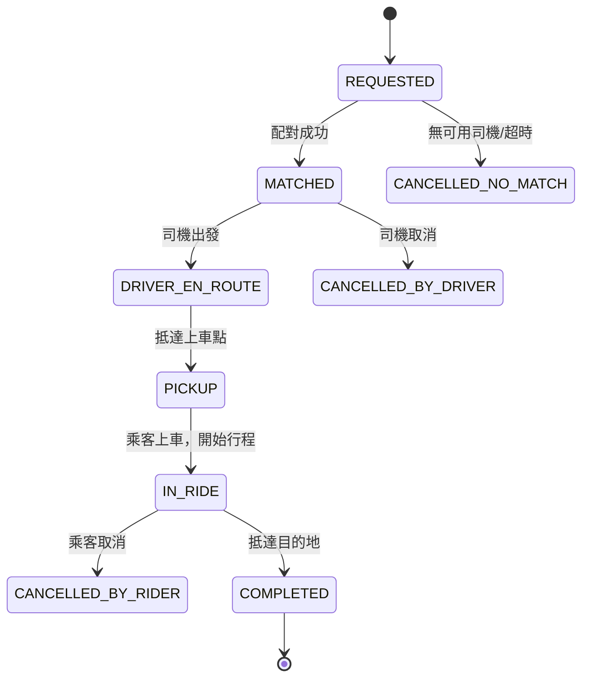

# 共乘與地理位置服務 (Ride-sharing & Location-based Services)

## 1. 這個產業最重視什麼？

共乘平台（如 Uber、Lyft、滴滴）的核心是一個**即時地理空間配對引擎**。它跟傳統 CRUD 應用程式最大的差異在於：資料是**高頻率、地理分布、時間敏感**的。以下六個面向決定了整個系統架構的走向。

### 即時位置追蹤 (Real-time Location Tracking)

數百萬名司機每 **3-5 秒**發送一次 GPS 座標。以一個中大型城市（50 萬活躍司機）為例：

```
500,000 drivers × (1 update / 4 sec) = 125,000 writes/sec（單城市）
全球 10 個主要市場 → ~1,000,000+ writes/sec
每筆 payload ≈ 100 bytes (driver_id, lat, lng, timestamp, heading, speed)
→ ~100 MB/sec 原始寫入流量
```

這些位置資料的特性：**寫入後幾秒就過時**。系統只需要保留最新位置，歷史軌跡可以非同步寫入冷儲存。這決定了我們需要 **in-memory 為主的架構**，而非傳統資料庫。

### 低延遲配對 (Low-latency Matching)

乘客發出叫車請求到配對完成，使用者期望在 **3-5 秒內**看到結果。這個流程包含：

```
乘客叫車 → 地理空間查詢附近司機 → 過濾條件 → 計算 ETA → 排序 → 派單 → 司機接受/拒絕
   |                                                                              |
   └──────────────── 整個流程 < 5 秒 ──────────────────────────────────────────────┘
```

關鍵瓶頸不是單一步驟，而是**串聯延遲的累加**。每個步驟都必須在毫秒級完成。

### 地理空間查詢效能 (Geospatial Query Performance)

「找出 3 公里內所有可用司機」是最高頻的查詢模式。在尖峰時段，一個城市可能同時有數千筆叫車請求，每筆都需要執行這個查詢。

```
暴力搜尋：遍歷所有 500,000 名司機，逐一計算 Haversine 距離
→ 500K 次三角函數運算 × 數千筆並發請求 = 不可行

地理空間索引：將搜尋空間從 O(N) 降到 O(log N) 或 O(K)（K = 結果數）
→ 查詢延遲從數秒降到 < 10 ms
```

### 高寫入吞吐量 (Write-heavy Throughput)

位置更新的讀寫比極度不平衡：

| 操作 | QPS | 特性 |
|------|-----|------|
| 位置更新 (write) | ~1,000,000/sec | 高頻、可容忍少量遺失 |
| 附近司機查詢 (read) | ~10,000/sec | 低頻但延遲敏感 |
| 行程狀態更新 (write) | ~1,000/sec | 低頻但必須強一致 |

位置更新的 write:read 比約 **100:1**。傳統 RDBMS 的 B-tree 索引在這種寫入密度下會成為瓶頸（每次寫入都要更新索引）。這就是為什麼大多數設計採用 **in-memory geospatial index**，跳過磁碟 I/O。

### 動態定價 (Surge Pricing)

即時供需計算是共乘平台的商業核心。系統需要：

1. 將城市劃分為**地理網格單元** (geographic cells)
2. 即時統計每個單元的供給（可用司機數）與需求（叫車請求數）
3. 計算倍率 (surge multiplier)，通常每 **1-2 分鐘**更新一次

```
Surge Multiplier = f(demand / supply)

範例：
  某區域過去 2 分鐘：15 筆叫車請求，3 名可用司機
  demand/supply ratio = 5.0
  → Surge 2.5x（透過 pricing curve 映射，非線性）
```

### 行程一致性 (Trip Consistency)

一筆行程**只能指派給一名司機**。在高並發場景下，多名乘客同時叫車、多個配對服務實例 (Matching Service instances) 同時運行，必須防止**雙重指派 (Double-booking)**：

```
乘客 A 叫車 ─┐
              ├─→ 都找到司機 X 是最近的 → 誰拿到？
乘客 B 叫車 ─┘

必須有機制保證：司機 X 一次只能接一筆訂單
方案：distributed lock / optimistic concurrency / single-writer per driver
```

---

## 2. 面試必提的關鍵概念

### 地理空間索引 (Geospatial Index)

這是共乘系統的**基礎設施級概念**。面試中必須能解釋至少一種索引機制的原理與 trade-off。

#### Geohash

Geohash 將二維座標 (lat, lng) 編碼為一維字串，透過交替對緯度和經度進行**二分法** (binary subdivision) 再做 Base32 編碼。

```
編碼過程（簡化）：
  lng: -122.4194 → 二分 [-180, 180] → 0/1 序列
  lat:   37.7749 → 二分 [-90, 90]   → 0/1 序列
  交錯合併 (interleave) → 二進位字串 → Base32 → "9q8yyk"

精度級別：
  長度    格子大小 (approx)       適用場景
  ────    ──────────────         ──────────
  4       ~39 km × 19.5 km      區域級別（整個城市）
  5       ~4.9 km × 4.9 km      社區級別
  6       ~1.2 km × 0.6 km      街區級別（附近司機查詢的常用精度）
  7       ~153 m × 153 m        街道級別
  8       ~38 m × 19 m          建築物級別
```

**「附近」查詢的原理：前綴匹配 (prefix matching)**

同一個 Geohash 前綴的點在地理上相鄰。查詢「附近 3km」≈ 查詢同一 Geohash-5 前綴及其 8 個鄰居的所有點。

```
┌───┬───┬───┐
│9q8│9q9│9qd│     ← Geohash-3 cells
├───┼───┼───┤
│9q2│9q3│9q6│     查詢 9q3 的「附近」= 9q3 + 周圍 8 格
├───┼───┼───┤
│9q0│9q1│9q4│
└───┴───┴───┘
```

**Geohash 邊界問題 (Boundary Problem)**：兩個地理上極近的點可能落在不同 Geohash cell 甚至不同前綴。例如一條街的兩側可能分屬不同 cell。解決方式就是**永遠查詢自身 + 8 個鄰居格子**。

#### Quadtree（四元樹）

將二維空間遞迴切分為四個象限，直到每個葉節點 (leaf node) 的點數低於閾值。

```
              ┌─────────────┐
              │ Root (全市) │
              └──────┬──────┘
         ┌───────┬───┴───┬───────┐
         NW      NE      SW      SE
        /  \    / \
      NW  NE  ...  ...     ← 遞迴細分直到點數 < 閾值
      (3)  (2)              ← 葉節點存放實際的司機位置
```

**Trade-off vs Geohash**：

| 特性 | Geohash | Quadtree |
|------|---------|----------|
| 結構 | 固定大小 cell | 自適應密度 |
| 密集區域 | 一個 cell 可能有太多點 | 自動細分，查詢更精確 |
| 稀疏區域 | 很多空 cell 浪費查詢 | 自動合併，減少無用搜尋 |
| 實作複雜度 | 低（字串前綴匹配） | 中（樹的維護與再平衡） |
| 動態更新 | 簡單（更新 key） | 需要移動節點、可能觸發分裂/合併 |
| 分散式部署 | 天然適合分片 (prefix-based sharding) | 較難分散 |

#### H3 (Uber 的六角網格)

Uber 開源的**六角形階層網格系統 (Hexagonal Hierarchical Spatial Index)**。核心優勢：六角形的所有鄰居等距，不像正方形有對角線距離較遠的問題。

```
正方形網格：            六角形網格 (H3)：
┌───┬───┬───┐            ╱╲  ╱╲  ╱╲
│   │ d │   │           ╱  ╲╱  ╲╱  ╲
├───┼───┼───┤          │    │ d  │    │
│ d │ X │ √2d         │    │ X  │    │
├───┼───┼───┤          ╲  ╱╲  ╱╲  ╱
│   │ d │   │           ╲╱  ╲╱  ╲╱
└───┴───┴───┘
到鄰居距離不一致        所有鄰居等距 ← 更適合「附近 N 公里」查詢
```

H3 有 16 個解析度級別 (resolution 0-15)。Uber 在動態定價中使用 **resolution 7**（約 5.16 km^2 / cell），在附近司機查詢中使用 **resolution 9**（約 0.105 km^2 / cell）。

#### R-tree

用於 PostGIS 等空間資料庫 (Spatial Database) 的索引結構。以最小外接矩形 (Minimum Bounding Rectangle, MBR) 組織空間物件，適合複雜幾何查詢（多邊形交集、範圍查詢），但**更新成本較高**，不適合每秒百萬次位置更新的場景。主要用於**靜態或低頻更新的地理資料**（地圖特徵、區域邊界、POI 等）。

### 位置服務架構 (Location Service Architecture)

```
  Driver App                Location Service              Consumers
  ─────────                 ────────────────              ─────────
                         ┌──────────────────┐
  [GPS: lat, lng] ──────>│  接收位置更新     │
  (每 3-5 秒)     UDP/   │                  │───> Kafka Topic: "driver-locations"
                  HTTP    │  寫入 In-memory  │         │
                         │  Geospatial Index│         ├──> Matching Service (找附近司機)
                         │  (Redis GEO /    │         ├──> Surge Pricing (供需統計)
                         │   Custom Grid)   │         ├──> Trip Tracker (乘客即時看司機位置)
                         │                  │         └──> Analytics (歷史軌跡存入 S3/HDFS)
                         └──────────────────┘
                                │
                                ▼
                    WebSocket Fan-out to Riders
                    (正在等車的乘客看到司機移動)
```

**設計重點**：

1. **位置更新不走傳統 REST**：高頻小 payload 適合 UDP 或 persistent HTTP/2 connection，減少 connection overhead
2. **In-memory index 是 source of truth（對於「目前位置」）**：不需要每次寫磁碟。Redis GEO 底層用 Sorted Set + Geohash score，`GEOADD` 和 `GEORADIUS` 都是 O(log N)
3. **Kafka 作為位置流的 backbone**：解耦生產者（Location Service）和消費者（Matching、Surge、Analytics），消費者各自消費、互不影響
4. **WebSocket fan-out**：乘客叫車後需要即時看到司機位置移動。由 Trip Tracker Service 訂閱該司機的位置更新，透過 WebSocket 推送給乘客

### 配對演算法 (Matching / Dispatch)

#### 貪心最近 (Greedy Nearest)

最簡單的方案：收到叫車請求 → 找最近的可用司機 → 派單。

```
優點：延遲低、實作簡單
缺點：全域次優。若兩筆請求幾乎同時到達，可能都搶同一個司機，
      而忽略了全域更好的配對（例如 A→X, B→Y 總距離更短）
```

#### 批次最佳化 (Batch Optimization)

累積一小段時間（如 2 秒）內的請求，一次做全域最佳配對。本質上是**二部圖匹配 (Bipartite Matching)** 問題。

```
乘客          司機             匹配 (最小化總 ETA)
  A ───────── X (ETA: 3 min)     A → Y (2 min)
    ╲       ╱                    B → X (3 min)
      ╲   ╱                     ──────────
        ╳                       Total: 5 min (vs 貪心: 3+5=8 min)
      ╱   ╲
    ╱       ╲
  B ───────── Y (ETA: 5 min)
```

常用演算法：**匈牙利演算法 (Hungarian Algorithm)**，時間複雜度 O(n^3)。對於大規模場景，可用近似算法或將問題拆分為小區域分別求解。

**ETA-based vs Distance-based**：

直線距離 (Euclidean/Haversine) 容易計算但不準確 — 河流、高速公路、單行道都會讓實際路線繞路。成熟系統用 **ETA (預估到達時間)** 作為配對依據，考慮即時路況。

### 行程狀態機 (Trip State Machine)

行程的生命週期是一個嚴謹的有限狀態機 (Finite State Machine, FSM)：



**實作重點**：

- **Event Sourcing**：每次狀態轉換 (state transition) 都記錄為不可變事件 (immutable event)。可以完整重建任何行程的歷史。
- **每個轉換都有前置條件 (guard)**：例如只有 `MATCHED` 狀態才能轉到 `DRIVER_EN_ROUTE`。防止非法狀態轉換。
- **冪等性 (Idempotency)**：網路重試可能導致同一個狀態轉換請求被發送兩次。每個 transition 帶 `event_id`，重複的 `event_id` 直接忽略。

### 動態定價 (Surge Pricing)

#### 機制

```
┌──────────────────────────────────────────────────────┐
│                 Surge Pricing Pipeline               │
│                                                      │
│  1. 地理網格劃分                                      │
│     城市 → H3 resolution-7 六角形 cells               │
│                                                      │
│  2. 供給統計 (每 cell)                                │
│     供給 = 該 cell 內「可用」狀態的司機數              │
│     （排除已載客、離線、拒絕接單中的司機）             │
│                                                      │
│  3. 需求統計 (每 cell)                                │
│     需求 = 過去 N 分鐘內該 cell 的叫車請求數           │
│     （包含未滿足的請求，以反映真實需求）               │
│                                                      │
│  4. 倍率計算                                          │
│     raw_ratio = demand / max(supply, 1)              │
│     surge = pricing_curve(raw_ratio)                 │
│     pricing_curve 通常是分段函數或 sigmoid             │
│                                                      │
│  5. 空間平滑 (Spatial Smoothing)                      │
│     避免相鄰 cell 倍率跳躍太大                        │
│     surge(cell) = α × surge(cell)                    │
│                 + (1-α) × avg(surge(neighbors))      │
│                                                      │
│  6. 更新頻率：每 1-2 分鐘                             │
└──────────────────────────────────────────────────────┘
```

**為什麼要空間平滑？** 想像一條街的兩側分屬不同 cell，一側 surge 3x，另一側 surge 1x。乘客只要走 50 公尺就能省 3 倍車費 — 這對使用者體驗很差，也會導致所有司機往低 surge 區域邊界移動。平滑確保定價梯度是連續的。

### ETA 預估 (Estimated Time of Arrival)

ETA 是配對品質的基石。不準確的 ETA 會導致配對到遠處的司機、乘客等待過久。

#### 三層架構

```
Layer 1: 路網圖 (Road Graph)
  節點 = 路口，邊 = 路段，權重 = 通行時間
  Dijkstra / A* 找最短路徑
  預處理技巧：Contraction Hierarchies (CH) 可將查詢從 ~秒級降到 ~毫秒級

Layer 2: 即時路況疊加 (Real-time Traffic Overlay)
  來源：司機 GPS 軌跡的速度資料 → 統計每條路段的即時車速
  動態調整邊的權重：weight = distance / current_speed

Layer 3: ML 修正 (Machine Learning Correction)
  歷史偏差學習：模型學到「這個路口左轉在下午 5-7 點平均多等 2 分鐘」
  輸入特徵：時間、星期、天氣、附近事件、歷史 ETA 誤差
  輸出：ETA 的校正值
```

**開源路徑引擎**：**OSRM (Open Source Routing Machine)** 基於 OpenStreetMap 資料，支援 Contraction Hierarchies，單機可處理數千 QPS 的路徑查詢。Uber 自研的路徑引擎也使用類似技術但加入了即時路況和 ML。

---

## 3. 常見架構模式

### 整體架構總覽

```
┌──────────────────────────────────────────────────────────────────┐
│                         Client Layer                             │
│   ┌──────────────┐                      ┌──────────────────┐    │
│   │  Rider App   │                      │   Driver App     │    │
│   │  (iOS/Android)│                     │  (iOS/Android)   │    │
│   └──────┬───────┘                      └────────┬─────────┘    │
│          │ REST/gRPC + WebSocket                 │ GPS stream   │
└──────────┼───────────────────────────────────────┼──────────────┘
           │                                       │
    ┌──────▼───────┐                    ┌──────────▼──────────┐
    │  API Gateway │                    │  Location Service   │
    │  (Auth, Rate │                    │  (位置接收 + 索引)   │
    │   Limiting)  │                    │                     │
    └──────┬───────┘                    │  ┌───────────────┐  │
           │                            │  │ Redis GEO /   │  │
    ┌──────┼──────┐                     │  │ In-memory Grid│  │
    │      │      │                     │  └───────────────┘  │
    ▼      ▼      ▼                     └─────────┬───────────┘
┌──────┐┌──────┐┌──────┐                          │
│Ride  ││Trip  ││User  │                    ┌─────▼─────┐
│Req.  ││Svc   ││Svc   │                    │   Kafka   │
│Svc   ││      ││      │                    │  (位置流)  │
└──┬───┘└──┬───┘└──────┘                    └─────┬─────┘
   │       │                                      │
   ▼       ▼                          ┌───────────┼───────────┐
┌──────────────┐                      ▼           ▼           ▼
│  Matching /  │               ┌──────────┐┌──────────┐┌──────────┐
│  Dispatch    │◄──── 查詢 ───>│  Surge   ││  Trip    ││Analytics │
│  Service     │  附近司機      │  Pricing ││  Tracker ││(離線分析) │
└──────┬───────┘               └──────────┘└──────────┘└──────────┘
       │                                        │
       │ 派單結果                                │ WebSocket push
       ▼                                        ▼
┌──────────────┐                         ┌──────────────┐
│ Notification │                         │  Rider sees  │
│ Service      │──── Push to Driver ───> │  driver move │
└──────────────┘                         └──────────────┘
```

### 位置服務 (Location Service) — 詳細設計

**核心職責**：接收司機位置更新、維護 in-memory 地理空間索引、回應「附近司機」查詢。

#### Redis GEO 方案

Redis GEO 底層利用 Sorted Set，以 **52-bit Geohash** 作為 score。核心命令：

```
# 司機位置更新
GEOADD drivers <lng> <lat> driver:12345
# 內部：計算 geohash(lng, lat) 作為 score，ZADD 到 sorted set

# 查詢附近 3km 的司機
GEORADIUS drivers <rider_lng> <rider_lat> 3 km WITHCOORD WITHDIST COUNT 20 ASC
# 內部：計算 rider 的 geohash，搜尋附近 geohash 範圍，過濾距離

# 效能：
# GEOADD: O(log N)，N = sorted set 大小
# GEORADIUS: O(N+log M)，N = 範圍內元素數，M = sorted set 大小
# 50 萬司機的 sorted set ≈ 50-80 MB 記憶體（可接受）
```

**分片策略 (Sharding)**：按城市或 Geohash 前綴分片。每個 Redis 實例 (instance) 負責一個城市或一組 Geohash 前綴。跨城市的查詢不存在（乘客只關心本城市的司機）。

```
Redis Cluster:
  Shard 0: city=new_york    (key: "drivers:new_york")
  Shard 1: city=san_francisco
  Shard 2: city=london
  ...
```

#### 自定義 In-memory Grid 方案

對於超大規模（如滴滴，數百萬司機同城），Redis 的單執行緒可能不夠。可以用自定義 in-memory grid：

```
City → 劃分為 N×M grid cells (e.g., 500m × 500m)
每個 cell 維護一個 HashSet<DriverID>

位置更新：
  1. 計算 driver 所在的新 cell
  2. 如果 cell 改變：從舊 cell 移除，加入新 cell
  3. O(1) 操作

附近查詢：
  1. 計算 rider 所在的 cell
  2. 擴展到周圍的 cells（根據搜尋半徑）
  3. 遍歷這些 cells 中的所有司機
  4. 過濾距離
```

**優勢**：可多執行緒並行處理不同 cell（cell 之間無 lock contention），水平擴展性更好。

### 配對服務 (Matching / Dispatch Service) — 詳細流程

```
  Rider App                Ride Request Svc          Matching Service
  ─────────                ──────────────           ─────────────────
      │                          │                         │
      │── POST /ride-request ──>│                         │
      │   {pickup, dropoff,     │                         │
      │    rider_id, ride_type} │                         │
      │                         │── Enqueue match ───────>│
      │                         │   request               │
      │                         │                         │
      │                         │                   ┌─────┴─────┐
      │                         │                   │ 1. 查詢    │
      │                         │                   │ Location   │
      │                         │                   │ Service:   │
      │                         │                   │ 附近 3km   │
      │                         │                   │ 可用司機   │
      │                         │                   ├───────────┤
      │                         │                   │ 2. 過濾:   │
      │                         │                   │ - 車型匹配 │
      │                         │                   │ - 評分門檻 │
      │                         │                   │ - 接單率   │
      │                         │                   ├───────────┤
      │                         │                   │ 3. 批次    │
      │                         │                   │ 計算 ETA  │
      │                         │                   │ (呼叫路徑  │
      │                         │                   │  引擎)     │
      │                         │                   ├───────────┤
      │                         │                   │ 4. 排序:   │
      │                         │                   │ score =    │
      │                         │                   │ w1×ETA +   │
      │                         │                   │ w2×rating +│
      │                         │                   │ w3×accept_ │
      │                         │                   │ rate       │
      │                         │                   ├───────────┤
      │                         │                   │ 5. 派單給  │
      │                         │                   │ 最佳司機   │
      │                         │                   │ (加 lock)  │
      │                         │                   └─────┬─────┘
      │                         │                         │
      │                         │      Push Notification  │
      │                         │   ◄──────────────────── │
      │                         │                         │
      │                         │           Driver App    │
      │                         │           ──────────    │
      │                         │               │         │
      │                         │  Accept/Reject│ (15s    │
      │                         │  ◄────────────│ timeout)│
      │                         │               │         │
      │              ┌──────────┴──────────┐              │
      │              │ Accept? ──> 建立Trip│              │
      │              │ Reject/Timeout?     │              │
      │              │ ──> 釋放 lock,      │              │
      │              │     派給下一位司機   │              │
      │              └──────────┬──────────┘              │
      │                         │                         │
      │◄── Trip Confirmed ─────│                         │
      │   {trip_id, driver_info,│                         │
      │    ETA, surge_multiplier}                         │
```

**派單鎖 (Dispatch Lock) 機制**：

當 Matching Service 決定派單給司機 X 時，必須先**鎖定 (lock)** 該司機，防止其他 Matching 實例同時派單給同一司機。

```
方案 1: Redis distributed lock (SET NX EX)
  SET driver:12345:lock <request_id> NX EX 20
  # NX: 只在 key 不存在時設定（原子操作）
  # EX 20: 20 秒後自動過期（防止 lock 永久持有）

方案 2: Database optimistic lock
  UPDATE drivers SET status = 'dispatched', trip_id = ?
  WHERE driver_id = ? AND status = 'available'
  # 只有一個 UPDATE 會成功（WHERE 條件保證）

方案 3: Single-writer per driver (Actor model)
  每個司機的狀態由一個 actor/goroutine 專責管理
  所有關於該司機的操作都序列化 → 無 race condition
```

### 行程服務 (Trip Service) — Event Sourcing

```
Event Store (Kafka / EventStore DB):
──────────────────────────────────────────────────────────
│ event_id │ trip_id │ type              │ timestamp     │ payload                    │
│──────────│─────────│───────────────────│───────────────│────────────────────────────│
│ evt_001  │ trip_42 │ RIDE_REQUESTED    │ 10:00:00.000  │ {rider, pickup, dropoff}   │
│ evt_002  │ trip_42 │ DRIVER_MATCHED    │ 10:00:03.200  │ {driver_id, ETA: 4min}     │
│ evt_003  │ trip_42 │ DRIVER_EN_ROUTE   │ 10:00:04.000  │ {driver_location}          │
│ evt_004  │ trip_42 │ DRIVER_ARRIVED    │ 10:03:50.000  │ {driver_location}          │
│ evt_005  │ trip_42 │ RIDE_STARTED      │ 10:04:10.000  │ {actual_pickup_location}   │
│ evt_006  │ trip_42 │ RIDE_COMPLETED    │ 10:22:30.000  │ {dropoff_loc, distance,    │
│          │         │                   │               │  fare, surge_multiplier}   │
──────────────────────────────────────────────────────────
```

**為什麼用 Event Sourcing？**

1. **完整審計軌跡 (Audit Trail)**：每筆行程的每個環節都有記錄，爭議處理（如乘客投訴繞路）有據可查
2. **時間旅行 (Temporal Query)**：可以重建任何時間點的行程狀態
3. **解耦下游消費者**：計費 (Billing)、分析 (Analytics)、司機評分 (Rating) 都從同一個事件流消費
4. **錯誤復原**：如果計費邏輯有 bug，修正後可以重跑事件流重新計算

### 地圖與路徑規劃 (Map & Routing)

| 子系統 | 職責 | 技術方案 |
|--------|------|---------|
| 地圖圖磚 (Map Tiles) | 在 App 上呈現地圖 | 向量圖磚 (vector tiles)，由 CDN 分發；Mapbox GL 或 Google Maps SDK |
| 路徑引擎 (Routing Engine) | 計算 A→B 最短路徑 + ETA | OSRM (自架) 或 Google Directions API；Contraction Hierarchies 預處理 |
| 地理編碼 (Geocoding) | 地址 ↔ 經緯度轉換 | Pelias (開源) / Google Geocoding API |
| 即時路況 (Live Traffic) | 提供路段即時速度 | 司機 GPS 資料聚合；每 5 分鐘更新路段速度權重 |

### 供需熱力圖 (Supply-Demand Heatmap)

```
即時聚合 Pipeline：

Driver Locations ──┐
                   ├──> Flink / Spark Streaming ──> 每個 geo cell 的
Ride Requests ─────┘         │                      {supply, demand, surge}
                             │
                             ▼
                    ┌─────────────────┐
                    │  Time-series DB │    (InfluxDB / TimescaleDB)
                    │  or Redis       │
                    └────────┬────────┘
                             │
                    ┌────────▼────────┐
                    │  Heatmap API    │──> Driver App 顯示「高需求區域」
                    │  (REST/gRPC)    │    引導司機前往供給不足的區域
                    └─────────────────┘
```

**聚合視窗 (Aggregation Window)**：通常用**滑動視窗 (Sliding Window)** 2-5 分鐘。太短會造成 surge 劇烈波動，太長會無法反映即時變化。

---

## 4. 技術選型偏好

| 用途 | 推薦方案 | 理由 |
|------|---------|------|
| **即時司機位置** | Redis GEO (中等規模) / Custom in-memory grid (超大規模) | 純 in-memory，O(log N) 寫入和查詢；自定義 grid 可多執行緒水平擴展 |
| **持久化地理資料** | PostgreSQL + PostGIS | 複雜空間查詢（多邊形、區域定義）、R-tree 索引、成熟生態系 |
| **位置流** | Apache Kafka | 高吞吐量 (millions msg/sec)、持久化、多消費者群組、partition by driver_id 保序 |
| **行程狀態** | PostgreSQL (寫入) + Redis (快取) | 行程資料需要 ACID 保證，不能遺失；Redis 快取熱門行程加速讀取 |
| **即時串流處理** | Apache Flink / Kafka Streams | Surge pricing 聚合、供需統計、異常偵測（司機 GPS 飄移） |
| **路徑引擎** | OSRM (自架) 或 Google Maps Directions API | OSRM: 低延遲 (~10ms)、無 API 限制、可客製化；Google: 更準確的即時路況但有成本 |
| **地圖圖磚** | Mapbox / Google Maps SDK | 成熟的移動端 SDK、向量圖磚、離線支援 |
| **通知推送** | APNs (iOS) + FCM (Android) | 派單通知必須即時到達司機，push notification 比 polling 省電省流量 |
| **即時通訊** | WebSocket (乘客端) | 乘客追蹤司機位置需要低延遲雙向通道 |
| **監控** | Prometheus + Grafana | 監控配對延遲、位置更新 QPS、Redis 記憶體使用率等 SLA 指標 |

### 容量估算範例（中等規模城市）

```
假設：30 萬活躍司機，每 4 秒更新一次位置

寫入 QPS:
  300,000 / 4 = 75,000 writes/sec

每筆 payload:
  driver_id (8B) + lat (8B) + lng (8B) + timestamp (8B) + meta (18B) ≈ 50 bytes

寫入頻寬:
  75,000 × 50B = 3.75 MB/sec（極小，不是瓶頸）

Redis 記憶體:
  300,000 drivers × ~150 bytes/entry (包含 sorted set overhead) ≈ 45 MB
  → 單個 Redis 實例綽綽有餘

Kafka 吞吐:
  75,000 msg/sec × 100B/msg = 7.5 MB/sec
  → 一個 Kafka cluster 的零頭

配對查詢 QPS:
  假設 5% 的司機在任一時刻收到配對請求
  300,000 × 5% / 60 sec ≈ 250 matches/sec
  每次配對需要 1 次 GEORADIUS + 1 次路徑查詢 + 1 次寫入
  → 配對不是吞吐量瓶頸，但延遲敏感

歷史軌跡儲存:
  75,000 writes/sec × 86,400 sec/day × 50B = ~324 GB/day
  → 壓縮後約 50-80 GB/day，寫入 S3/HDFS 作為冷儲存
```

---

## 5. 面試加分提示與常見陷阱

### 加分提示

#### 1. Geohash 邊界問題 — 必須主動提出

```
問題：兩個地理上相鄰的點可能有完全不同的 Geohash 前綴

  Cell A: geohash "9q8y"    Cell B: geohash "9q8z"
  ┌──────────┐┌──────────┐
  │          ││          │
  │       D1 ││ R1       │   D1 和 R1 只隔 50m，
  │          ││          │   但 Geohash 前綴不同
  └──────────┘└──────────┘

解法：查詢時永遠包含目標 cell + 8 個鄰居 cell
  ┌───┬───┬───┐
  │   │   │   │
  ├───┼───┼───┤
  │   │ X │   │  ← 查詢 X 及周圍 8 格
  ├───┼───┼───┤
  │   │   │   │
  └───┴───┴───┘

Redis GEORADIUS 已經內部處理了這個問題，但如果自己實作 geohash-based 索引，
這是最容易犯的錯誤。
```

#### 2. 位置資料過期 (Staleness) 處理

```
問題：司機 App 閃退、手機沒電、進隧道 → 位置停止更新
      但系統仍然認為該司機在最後回報的位置「可用」

後果：配對到「幽靈司機」(Ghost Driver) → 乘客等待 → 取消 → 體驗差

解法：
  1. TTL (Time-to-Live)：每次 GEOADD 同時設定一個 TTL key
     SET driver:12345:alive 1 EX 15  # 15 秒未更新即過期
     查詢附近司機時，檢查 :alive key 是否存在

  2. Heartbeat + 狀態機：
     超過 10 秒無更新 → 標記 "stale"（仍在索引但排序靠後）
     超過 30 秒無更新 → 標記 "offline"（從索引移除）

  3. 主動探測：
     Matching Service 派單前，先發 push notification 確認司機在線
     等待 3 秒內回應，無回應則跳過
```

#### 3. 行程指派的競爭條件 (Race Condition)

```
問題：兩個 Matching Service 實例同時找到司機 X 作為最佳人選

  Matching Instance A ──> 找到司機 X ──> 準備派單
  Matching Instance B ──> 找到司機 X ──> 準備派單
  → 如果沒有鎖，司機 X 被同時指派兩筆行程

解法對比：

  ┌─────────────────────┬─────────────┬─────────────┬─────────────┐
  │ 方案                │ 一致性保證   │ 效能影響     │ 實作複雜度   │
  ├─────────────────────┼─────────────┼─────────────┼─────────────┤
  │ Redis SET NX (分散鎖)│ 強          │ 低 (~1ms)   │ 低           │
  │ DB Optimistic Lock  │ 強          │ 中 (~5ms)   │ 低           │
  │ Actor Model (每司機)│ 強          │ 極低         │ 高           │
  │ Message Queue       │ 最終一致    │ 中           │ 中           │
  │ (per-driver queue)  │             │             │              │
  └─────────────────────┴─────────────┴─────────────┴─────────────┘

推薦：Redis SET NX 最常見，Actor Model 在超大規模（如滴滴）更適合。
```

#### 4. 進階加分 — 不一定要講但講了會加很多分

- **供給預測**：用歷史資料預測未來 30 分鐘各區域的司機供給，提前在 Driver App 推送「前往 X 區域可接到更多單」
- **共乘匹配 (Ride Pooling)**：多名乘客共享一輛車。本質是一個**帶容量限制的車輛路徑問題 (Capacitated Vehicle Routing Problem, CVRP)**，NP-hard，實務中用啟發式演算法 (Heuristic) 近似求解
- **地理圍欄 (Geofencing)**：機場、車站等特定區域有特殊規則（排隊系統、定價規則），需要判斷點是否在多邊形內 (Point-in-Polygon)
- **安全功能**：行程分享 (Trip Sharing)、異常路線偵測 (Route Anomaly Detection)、緊急按鈕，這些需要即時追蹤 + ML 異常偵測

### 常見陷阱

| 陷阱 | 為什麼是錯的 | 正確方向 |
|------|-------------|---------|
| 用傳統 RDBMS 存即時位置 | 百萬次/秒的 UPDATE 會壓垮任何 RDBMS 的 B-tree 索引和 WAL | In-memory 索引（Redis GEO / Custom Grid） |
| 只用直線距離配對 | 河流、高速公路、單行道會讓直線距離與實際 ETA 差距極大 | 用路徑引擎計算真實 ETA |
| 忽略 Geohash 邊界問題 | 近距離的司機/乘客可能因 cell 邊界而互相看不見 | 永遠查詢自身 + 8 個鄰居 cell |
| 配對無鎖機制 | 高並發下同一司機被指派多筆行程 | Distributed lock 或 Actor model |
| WebSocket 直連 Location Service | 百萬 WebSocket 連線的記憶體和 CPU 開銷無法接受 | 獨立的 Connection Gateway + 只推送相關更新 |
| Surge Pricing 無平滑 | Cell 邊界兩側價格跳躍、使用者體驗差 | Spatial smoothing (鄰居加權平均) |
| 沒有處理 GPS 飄移 | 城市峽谷 (Urban Canyon) 中 GPS 誤差可達 50-100m | Kalman Filter 平滑軌跡、地圖匹配 (Map Matching) |

---

## 6. 經典面試題

### 題目一：設計 Uber / Lyft 的核心叫車系統

**考察重點**：
- 位置服務：如何接收和索引百萬司機的即時位置
- 配對流程：從乘客發出請求到司機接受的完整流程
- 一致性：如何防止 double-booking
- 狀態管理：行程狀態機 + event sourcing
- 擴展性：如何水平擴展配對服務

**你應該覆蓋的核心架構**：Location Service → Matching Service → Trip Service → Notification。重點討論 in-memory geospatial index 的選擇（Geohash vs Quadtree vs H3）和配對鎖的實現。

<details>
<summary>點擊查看參考思路</summary>

#### 高層架構
系統以 Location Service（in-memory geospatial index）為中心，Driver App 每 3-5 秒透過 persistent connection 上報 GPS；Rider App 發出叫車請求後由 Matching Service 查詢附近可用司機、計算 ETA、排序後加鎖派單。Trip Service 以 Event Sourcing 記錄行程狀態機的每次轉換，Notification Service 負責推送派單與行程更新。

#### 核心元件
- **Location Service**：接收位置更新、維護 Redis GEO（中等規模）或自定義 in-memory grid（超大規模），提供 GEORADIUS 查詢
- **Matching / Dispatch Service**：查詢附近司機 → 過濾（車型、評分、接單率）→ 批次 ETA 計算 → 排序派單 → 加分散式鎖防止 double-booking
- **Trip Service**：管理行程 FSM（REQUESTED → MATCHED → DRIVER_EN_ROUTE → PICKUP → IN_RIDE → COMPLETED），Event Sourcing 持久化
- **Kafka**：位置流的 backbone，解耦 Location Service 與下游消費者（Matching、Surge、Analytics）
- **Notification Service**：透過 APNs/FCM 推送派單通知；WebSocket 推送司機即時位置給乘客

#### 關鍵決策與 Trade-off
| 決策點 | 選項 A | 選項 B | 建議 |
|--------|--------|--------|------|
| 地理索引 | Geohash（簡單、天然分片） | Quadtree / H3（自適應密度） | 中等規模用 Geohash + Redis GEO；超大規模用 H3 |
| 配對策略 | 貪心最近（低延遲） | 批次最佳化（全域最優） | 先貪心上線，再逐步引入 2 秒批次窗口 |
| 派單鎖 | Redis SET NX（簡單、~1ms） | Actor Model（無鎖、強序列化） | 一般規模用 Redis；滴滴級別用 Actor |
| 位置更新協定 | HTTP/2 persistent | UDP | HTTP/2 較易維運；超大規模考慮 UDP 降低 overhead |

#### 面試時要主動提到的點
- Geohash 邊界問題：查詢必須包含自身 cell + 8 個鄰居
- 幽靈司機處理：TTL 機制 + heartbeat 狀態機，避免配對到離線司機
- ETA-based 配對優於直線距離：river / highway / one-way 讓 Haversine 失真
- 行程狀態的冪等性：每個 transition 帶 event_id，重複請求直接忽略

</details>

---

### 題目二：設計「附近的人 / 附近的餐廳」功能 (Proximity Service)

**考察重點**：
- Geospatial indexing 原理（Geohash 編碼、精度、前綴匹配）
- 讀寫比分析：餐廳 POI 是讀多寫少 vs 共乘司機是寫多讀多
- 分片策略：按 Geohash 前綴分片 vs 按業務維度分片
- 快取策略：Geohash cell 粒度的結果快取

**與共乘的差異**：POI (Point of Interest) 資料更新頻率低，可以使用 PostGIS + R-tree 索引 + CDN 快取。不需要 in-memory 的即時性。

<details>
<summary>點擊查看參考思路</summary>

#### 高層架構
與共乘系統最大的差異在於讀寫比 — POI 資料是**讀多寫少**（餐廳位置幾乎不變），因此可以大量使用快取和持久化資料庫而非 in-memory index。前端查詢經 API Gateway 到 Proximity Service，該服務查詢 PostGIS 或 Elasticsearch 並將結果按 Geohash cell 粒度快取於 Redis/CDN。

#### 核心元件
- **PostGIS (PostgreSQL)**：儲存 POI 資料，R-tree 索引支援 `ST_DWithin` 範圍查詢
- **Elasticsearch**：適合需要全文搜尋 + 地理過濾的場景（如「附近的義大利餐廳」）
- **Redis 快取層**：以 Geohash-6 前綴為 key 快取該 cell 的 POI 列表，TTL 數小時
- **CDN**：靜態 POI 列表可推至邊緣節點，進一步降低延遲

#### 關鍵決策與 Trade-off
| 決策點 | 選項 A | 選項 B | 建議 |
|--------|--------|--------|------|
| 索引 | PostGIS R-tree | Elasticsearch geo_point | 純距離查詢用 PostGIS；需全文搜尋用 ES |
| 分片 | Geohash 前綴分片 | 業務維度（城市/國家） | 城市級分片較簡單且跨城查詢不存在 |
| 快取粒度 | 精確查詢快取 | Geohash cell 粒度快取 | Cell 粒度命中率高，適合 POI 場景 |
| 資料更新 | 即時同步 | 非同步（queue + 定期重建快取） | POI 變動低頻，非同步即可 |

#### 面試時要主動提到的點
- 明確區分讀寫比與共乘場景的差異，說明為何不需要 in-memory index
- Geohash 精度選擇：搜尋半徑 3km 適合 Geohash-5 或 Geohash-6
- 仍須處理 Geohash 邊界問題（查詢 9 宮格）
- 考慮排序維度：距離、評分、價格、營業時間的加權排序

</details>

---

### 題目三：設計動態定價系統 (Surge Pricing)

**考察重點**：
- 即時串流處理：如何每分鐘計算每個 geo cell 的供需比
- 地理網格選擇：為什麼六角形比正方形好
- 平滑演算法：如何避免 cell 邊界的價格跳躍
- 回饋循環 (Feedback Loop)：surge 太高 → 乘客取消 → 需求下降 → surge 應下調（系統穩定性）
- 公平性：如何避免特定區域被長期高定價

<details>
<summary>點擊查看參考思路</summary>

#### 高層架構
Surge Pricing 本質是一個即時串流聚合管線：司機位置和叫車請求分別匯入 Kafka topic，由 Flink/Kafka Streams 以滑動視窗（2-5 分鐘）統計每個 geo cell 的供給（可用司機數）與需求（叫車請求數），計算 surge multiplier 後寫入 Redis/Time-series DB，供 Ride Request Service 查價、Driver App 顯示熱力圖。

#### 核心元件
- **H3 六角形網格**：以 resolution-7（~5 km^2/cell）劃分城市，六角形所有鄰居等距，避免正方形對角線距離偏差
- **Flink / Kafka Streams**：消費位置流和請求流，滑動視窗聚合每 cell 的 supply/demand
- **Pricing Engine**：`surge = pricing_curve(demand / max(supply, 1))`，pricing curve 為 sigmoid 或分段函數，非線性映射
- **Spatial Smoothing**：`surge(cell) = α × surge(cell) + (1-α) × avg(surge(neighbors))`，消除 cell 邊界價格跳躍
- **Redis / InfluxDB**：儲存即時 surge 值，供查價 API 讀取

#### 關鍵決策與 Trade-off
| 決策點 | 選項 A | 選項 B | 建議 |
|--------|--------|--------|------|
| 網格形狀 | 正方形 | 六角形 (H3) | H3 等距特性更適合「附近」語意 |
| 聚合視窗 | 短（1 分鐘） | 長（5 分鐘） | 2 分鐘折衷：反映即時又不過度波動 |
| 更新頻率 | 即時 per-event | 微批次（每 1-2 分鐘） | 微批次即可，per-event 成本過高 |
| Pricing curve | 線性 | Sigmoid / 分段函數 | 非線性：低 ratio 不加價，高 ratio 封頂 |

#### 面試時要主動提到的點
- 空間平滑是必要的：相鄰 cell 價格跳躍會導致乘客只走 50m 就能省數倍車費
- 回饋循環 (Feedback Loop)：surge 過高 → 需求下降 → surge 應快速下調，需設計衰減機制或 cap
- 公平性考量：特定低收入區域不應長期被高 surge 覆蓋，可設上限或平滑策略
- 需排除已載客/離線/拒絕中的司機，只計算真正可用的供給

</details>

---

### 題目四：設計即時行程追蹤系統 (Real-time Trip Tracking)

**考察重點**：
- WebSocket 連線管理：百萬乘客同時追蹤各自的行程
- Fan-out 模型：每個司機的位置更新只需要推送給 1-2 個訂閱者（當前乘客 + 分享連結的人），不是廣播
- Connection Gateway：如何水平擴展 WebSocket 層
- 離線/重連處理：乘客 App 切到背景或斷網後重連，如何同步最新狀態

**關鍵數字**：

```
假設 10 萬筆進行中的行程，每筆有 1-2 個追蹤者：
  100,000 × 1.5 = 150,000 WebSocket 連線
  每 3 秒推送一次位置 → 50,000 messages/sec
  每筆 ~100 bytes → 5 MB/sec 出站流量
  → 一台 Gateway 機器可處理 ~50K 連線，3 台即可
```

<details>
<summary>點擊查看參考思路</summary>

#### 高層架構
Driver App 上報位置 → Location Service → Kafka topic → Trip Tracker Service 訂閱特定司機的位置更新 → 透過 Connection Gateway（WebSocket 層）推送給正在追蹤該行程的乘客。這是一個**窄播 (narrowcast)** 模型，每個司機的位置只推送給 1-2 個訂閱者，不是廣播。

#### 核心元件
- **Connection Gateway**：獨立的 WebSocket 伺服器叢集，負責管理長連線。水平擴展，每台處理 ~50K 連線。乘客連線時註冊 `trip_id → gateway_node` 的映射到 Redis
- **Trip Tracker Service**：消費 Kafka 位置流，根據 `trip_id → driver_id` 映射過濾出相關位置更新，查詢 Redis 找到乘客所在的 Gateway node，轉發推送
- **Redis（連線註冊表）**：`trip_id → {gateway_node, ws_connection_id}`，乘客上線/離線時更新
- **離線 / 重連同步**：乘客重連時，Gateway 從 Trip Service 拉取最新行程狀態 + 最新司機位置，一次性推送

#### 關鍵決策與 Trade-off
| 決策點 | 選項 A | 選項 B | 建議 |
|--------|--------|--------|------|
| 推送協定 | WebSocket | SSE (Server-Sent Events) | WebSocket：雙向通道，也可用於乘客發送取消等指令 |
| Fan-out 層 | Trip Tracker 直接推 | 獨立 Connection Gateway | 獨立 Gateway：解耦連線管理與業務邏輯 |
| 位置過濾 | Gateway 訂閱全部位置流 | Trip Tracker 過濾後轉發 | Trip Tracker 過濾：Gateway 只處理連線，不碰業務 |
| 連線狀態 | 存 in-memory | 存 Redis | Redis：Gateway node 重啟或擴縮時不遺失映射 |

#### 面試時要主動提到的點
- 這不是廣播問題：每個司機位置只推給 1-2 人，fan-out factor 極低
- Connection Gateway 必須與業務邏輯分離，否則無法獨立擴展
- 離線重連策略：拉取最新快照 + 差量推送，而非重送所有歷史位置
- 行程分享連結（乘客分享給親友）只是多一個 WebSocket 訂閱者，架構不變

</details>

---

### 題目五：設計共乘配對系統 (Ride Pooling / Carpooling)

**考察重點**：
- 路線相容性：如何判斷兩名乘客的路線是否可以共乘（繞路比例 < 閾值）
- 即時插入：行程進行中，新乘客可以加入（需即時重新計算路線）
- 車輛容量限制：座位數、行李空間
- 定價分攤：如何公平分配車資（按距離？按時間？按繞路比例？）
- 配對複雜度：從 1-to-1 變成 N-to-1，搜尋空間爆炸

**本質**：帶容量限制的車輛路徑問題 (CVRP)。精確解是 NP-hard，實務中用插入式啟發法 (Insertion Heuristic)：每次嘗試將新乘客插入現有行程的路線中，計算額外繞路成本，選擇成本最低的方案。

<details>
<summary>點擊查看參考思路</summary>

#### 高層架構
在標準 1-to-1 配對的基礎上，新增 Pool Matching Service：收到叫車請求後，同時評估「指派新司機」和「插入現有進行中行程」兩種方案。插入方案需計算繞路成本 (detour cost)，只有當繞路比例低於閾值（如 < 40% 額外時間）才列入候選。選擇對所有乘客總 ETA 影響最小的方案。

#### 核心元件
- **Pool Matching Service**：擴展自 Matching Service，額外維護進行中 pool 行程的路線資訊，支援「嘗試插入新乘客」的模擬計算
- **Route Planner**：即時計算多停靠點路線（A → B' → C → B → D），需高效的多點路徑查詢（呼叫 OSRM 的 trip API）
- **Detour Evaluator**：計算插入新乘客後每位既有乘客的額外等待時間，確保不超過承諾的 ETA 閾值
- **Pricing Splitter**：根據各乘客的獨乘距離 vs 實際共乘距離，按比例分攤車資

#### 關鍵決策與 Trade-off
| 決策點 | 選項 A | 選項 B | 建議 |
|--------|--------|--------|------|
| 匹配策略 | 精確求解 (CVRP) | 插入式啟發法 | 啟發法：精確解 NP-hard，實務不可行 |
| 繞路閾值 | 寬鬆（50%） | 嚴格（20%） | 30-40% 折衷：太寬體驗差，太嚴匹配率低 |
| 定價模型 | 按距離分攤 | 按獨乘價折扣 | 按獨乘價折扣（如 60%）較易理解 |
| 中途插入 | 允許行程中加人 | 只在出發前配對 | 允許中途插入：提高匹配率但增加系統複雜度 |

#### 面試時要主動提到的點
- 這是 NP-hard 問題（CVRP），面試中直接說用啟發法近似求解
- 必須保證既有乘客的 ETA 承諾不被打破，否則使用者體驗崩壞
- 車輛容量限制：座位數和行李空間是硬約束
- 搜尋空間從 O(N) 司機擴展到 O(N + M) （N 個空車 + M 個進行中 pool 行程），需限制候選範圍

</details>

---

### 題目六：設計 ETA 預估服務 (ETA Prediction Service)

**考察重點**：
- 路網建模：如何用圖 (Graph) 表示道路網路
- 最短路徑演算法：Dijkstra → A* → Contraction Hierarchies 的演進（解釋為什麼原始 Dijkstra 不夠快）
- 即時路況：如何用司機 GPS 資料計算路段速度、如何處理資料稀疏的路段
- ML 修正：歷史偏差學習、特徵工程（時間、天氣、事件）
- 服務化：如何將路徑引擎封裝為低延遲 API（預處理 vs 即時計算的 trade-off）

**關鍵延遲要求**：

```
Matching 過程中需要計算多名候選司機到乘客的 ETA
假設每次配對查詢 10 名候選司機 × 1 次路徑查詢/司機
路徑查詢必須 < 50ms（使用 Contraction Hierarchies 可達 ~5ms）
全部 ETA 計算必須在 200ms 內完成 → 平行查詢
```

<details>
<summary>點擊查看參考思路</summary>

#### 高層架構
ETA 服務分三層：底層是路網圖 (Road Graph) + Contraction Hierarchies 預處理的最短路徑引擎（OSRM）；中間層疊加即時路況權重（從司機 GPS 軌跡聚合每路段的即時車速）；最上層用 ML 模型修正系統性偏差（時間、天氣、特殊事件等特徵）。三層疊加產生最終 ETA。

#### 核心元件
- **Road Graph Store**：從 OpenStreetMap 導入的路網圖，節點 = 路口，邊 = 路段，靜態權重 = distance / speed_limit
- **Contraction Hierarchies (CH)**：離線預處理路網圖，建立捷徑邊 (shortcut edges)，將路徑查詢從 Dijkstra 的數百毫秒降到 ~5ms
- **Traffic Aggregator**：消費 Kafka 位置流，每 5 分鐘聚合每路段的平均車速，更新路網圖的邊權重
- **ML Correction Service**：輸入（時間、星期、天氣、事件、歷史偏差），輸出 ETA 校正值。通常是 gradient boosting 或 neural network
- **ETA API**：gRPC 介面，支援單點查詢和批次查詢（配對時 10 名候選平行查詢）

#### 關鍵決策與 Trade-off
| 決策點 | 選項 A | 選項 B | 建議 |
|--------|--------|--------|------|
| 路徑演算法 | Dijkstra / A* | Contraction Hierarchies | CH：查詢 ~5ms vs Dijkstra ~500ms，配對場景必需 |
| 路況來源 | 第三方 API (Google) | 自有 GPS 資料聚合 | 自有：無 API 限制、延遲低；初期可混合使用 |
| ML 修正 | 離線批次訓練 | 線上即時修正 | 離線訓練 + 線上推論：模型每日更新，推論 < 10ms |
| 稀疏路段 | 用 speed limit 預設值 | 鄰近路段外推 | 混合：有資料用即時值，無資料用歷史同時段均值 |

#### 面試時要主動提到的點
- 原始 Dijkstra 不夠快的原因：全圖搜尋，大城市路網百萬節點，延遲不可接受
- CH 的代價：預處理需數小時，路網變動（施工封路）時需部分重建
- 資料稀疏問題：凌晨或郊區路段可能無司機經過，需回退到歷史統計或 speed limit
- 批次平行查詢是配對延遲的關鍵：10 名候選串行 = 50ms，平行 = ~5ms

</details>
