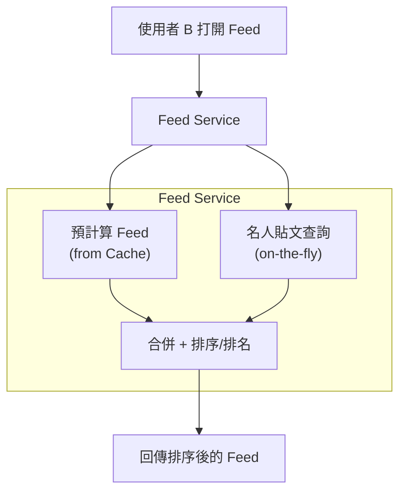

# 社群媒體與內容平台 (Social Media & Content Platforms)

---

## 1. 這個產業最重視什麼？

社群媒體平台的核心挑戰在於：**數十億使用者同時產生與消費海量內容，且對延遲極度敏感**。以下是設計時必須掌握的產業特性：

### 高可用性 > 一致性 (Availability over Consistency)

社群平台幾乎毫無例外地選擇 AP（可用性 + 分區容錯性，CAP 定理中的取捨）。原因很直觀：

- 按讚數少顯示 3 個？使用者不會發現。
- 動態消息 (News Feed) 掛了 30 秒？上百萬人開始在 Twitter/X 上抱怨。

**設計時的心法**：先確保系統能回應（即使資料稍舊），再逐步收斂到正確值。這就是「最終一致性 (Eventual Consistency)」在社群平台被大量採用的原因。

### 讀寫比極端不對稱 (Extreme Read-Write Asymmetry)

典型的社群平台讀寫比可以達到 **1000:1** 甚至更高：

| 動作 | 頻率 | 說明 |
|------|------|------|
| 瀏覽動態 | 極高 | 使用者每次開啟 App 就觸發 |
| 按讚 / 反應 | 中等 | 瀏覽的 1-5% |
| 留言 | 低 | 瀏覽的 0.1-1% |
| 發文 | 極低 | 多數使用者是「潛水者」 |

**關鍵結論**：整個架構都應該為讀取最佳化——預計算 (Pre-compute)、快取 (Cache)、反正規化 (Denormalization) 是常態，不是例外。

### 扇出問題 (Fan-out Problem)

一位擁有 5000 萬粉絲的名人發了一則貼文，系統需要讓這 5000 萬人在打開 App 時看到這則貼文。這就是所謂的「扇出」——一次寫入被放大成數千萬次讀取或寫入。

這是社群平台最具代表性的技術挑戰，後面會深入討論。

### 即時性 (Real-time Requirements)

使用者期望的回應時間：

- **通知 (Notification)**：某人按讚你的貼文 → 幾秒內收到推播
- **動態更新 (Live Feed)**：新貼文出現不需要手動重新整理
- **熱門話題 (Trending Topics)**：即時反映正在發生的事件
- **線上狀態 (Presence)**：朋友是否在線上

這些需求意味著系統需要大量使用 WebSocket、伺服器推送事件 (Server-Sent Events, SSE)、以及串流處理 (Stream Processing)。

### 全球規模 (Global Scale)

主流社群平台的使用者遍布全球：

- **多區域部署 (Multi-region Deployment)**：美洲、歐洲、亞洲至少各一個資料中心
- **內容分發網路 (CDN, Content Delivery Network)**：圖片和影片必須從最近的邊緣節點 (Edge Node) 提供
- **邊緣快取 (Edge Caching)**：熱門內容快取在使用者附近
- **資料主權 (Data Sovereignty)**：GDPR 等法規要求某些資料留在特定地區

### 內容審核 (Content Moderation)

這是產品層面和技術層面都極具挑戰的問題：

- **非同步管線 (Async Pipeline)**：內容發布後立即可見，但同時進入審核佇列
- **多層審核**：自動化 ML 模型 → 規則引擎 → 人工審核
- **處理量巨大**：每天數十億則內容需要掃描
- **誤判成本高**：誤刪合法內容或漏放違規內容都有嚴重後果

---

## 2. 面試必提的關鍵概念

### Fan-out on Write vs Fan-out on Read

這是社群平台系統設計面試中**最高頻**的概念，務必滾瓜爛熟。

#### Fan-out on Write（推模型，Push Model）

貼文發布的瞬間，系統主動將貼文寫入每個粉絲的動態消息快取中。

```
使用者 A 發文
    │
    ▼
Fan-out Service 查詢 A 的粉絲列表
    │
    ├──▶ 寫入粉絲 B 的 Feed Cache
    ├──▶ 寫入粉絲 C 的 Feed Cache
    ├──▶ 寫入粉絲 D 的 Feed Cache
    └──▶ ... (所有粉絲)
```

| 優點 | 缺點 |
|------|------|
| 讀取極快（Feed 已預先組裝好） | 寫入放大嚴重（名人問題） |
| 讀取邏輯簡單 | 對不活躍使用者做了無用功 |
| 延遲可預測 | 儲存成本高 |

#### Fan-out on Read（拉模型，Pull Model）

使用者打開 App 時，系統即時去查詢其所有關注者的最新貼文並合併排序。

```
使用者 B 打開 Feed
    │
    ▼
Feed Service 查詢 B 的關注列表
    │
    ├──▶ 查詢使用者 A 的最新貼文
    ├──▶ 查詢使用者 C 的最新貼文
    ├──▶ 查詢使用者 D 的最新貼文
    └──▶ ... (所有關注者)
    │
    ▼
合併排序 (Merge Sort) → 回傳 Feed
```

| 優點 | 缺點 |
|------|------|
| 寫入簡單快速 | 讀取慢（需即時聚合） |
| 不浪費資源在非活躍使用者上 | 讀取延遲不穩定 |
| 儲存成本低 | 關注者多時查詢爆炸 |

#### 混合策略 (Hybrid Approach) — 面試最佳答案

實務上，大型平台（如 Twitter/X、Instagram）採用混合策略：

- **一般使用者**（粉絲數 < 閾值，例如 10,000）：Fan-out on Write
- **名人/高粉絲使用者**（粉絲數 > 閾值）：Fan-out on Read
- **讀取時**：從預計算的 Feed Cache 取得一般使用者的貼文，再即時合併名人的最新貼文



> **面試加分**：主動提出閾值如何決定（根據粉絲數與發文頻率的乘積）、如何動態調整。

### 動態消息排序 (Feed Ranking)

早期的社群平台使用**時間序排列 (Chronological Order)**，但現代平台幾乎都使用**演算法排名 (Algorithmic Ranking)**。

#### 排名管線架構 (Ranking Pipeline)

```
候選貼文 (Candidates)
    │
    ▼
第一階段：粗篩 (Candidate Generation)
    │  - 從 Fan-out 結果 + 關注者最新貼文中取 ~1000 篇
    │
    ▼
第二階段：粗排序 (Light Ranker)
    │  - 簡單特徵（發文時間、互動率）→ 縮減到 ~200 篇
    │
    ▼
第三階段：精排序 (Heavy Ranker)
    │  - ML 模型預測使用者互動機率
    │  - 特徵：使用者偏好、貼文特性、社交關係強度
    │
    ▼
第四階段：後處理 (Post-processing)
    │  - 去重 (Deduplication)
    │  - 多樣性控制（避免同一類型連續出現）
    │  - 廣告插入 (Ad Insertion)
    │
    ▼
最終 Feed（取前 20-50 篇回傳）
```

面試中不需要深入 ML 模型細節，但要能說明：

- 排名是**多階段**的（從粗到細）
- 每個階段的**延遲預算**不同（粗篩 < 10ms，精排序 < 50ms）
- 排名結果可以被**快取**一段時間

### 社交圖譜儲存 (Social Graph Storage)

社交圖譜是「誰關注誰」、「誰是誰的朋友」的關係網路。儲存方式的選擇直接影響查詢效能。

#### 方案比較

| 方案 | 適用場景 | 優點 | 缺點 |
|------|----------|------|------|
| 關聯式資料庫 (RDBMS) 鄰接表 | 中小規模、簡單查詢 | 成熟穩定、ACID 保證 | 多層關係查詢慢 (JOIN 爆炸) |
| 圖資料庫 (Graph DB, 如 Neo4j, Amazon Neptune) | 複雜關係查詢 | 朋友的朋友查詢快 | 水平擴展較困難 |
| 鍵值存儲 (KV Store) + 鄰接表 | 超大規模、簡單查詢 | 水平擴展容易 | 複雜圖查詢需應用層實作 |

#### 典型 Schema（鄰接表方式）

```
followers 表：
┌──────────────┬──────────────┬─────────────────┐
│ follower_id  │ followee_id  │ created_at      │
├──────────────┼──────────────┼─────────────────┤
│ user_123     │ user_456     │ 2025-03-01      │
│ user_123     │ user_789     │ 2025-03-02      │
└──────────────┴──────────────┴─────────────────┘

查詢「我的關注者」：SELECT * FROM followers WHERE followee_id = ?
查詢「我關注的人」：SELECT * FROM followers WHERE follower_id = ?
查詢「共同好友」：需要 JOIN 或應用層計算
```

> **面試提示**：提到 Facebook 使用了自研的 TAO（The Associations and Objects）系統來處理超大規模社交圖譜，它本質上是在 MySQL 之上建立了一層圖語義的快取層。

### 計數器設計 (Counter Design)

按讚數、觀看次數、分享數——看似簡單的計數，在每秒數百萬次更新的規模下變成了極具挑戰的問題。

#### 直接更新的問題

```
UPDATE posts SET like_count = like_count + 1 WHERE id = ?
```

在高並發下，這條 SQL 會造成：
- **行鎖競爭 (Row Lock Contention)**：所有寫入排隊等同一行
- **熱點問題 (Hot Spot)**：名人貼文的那一行成為瓶頸

#### 解決方案層級

| 層級 | 方案 | 精確度 | 適用場景 |
|------|------|--------|----------|
| L1 | Redis INCR | 精確（單機） | 中等規模 |
| L2 | 分片計數器 (Sharded Counter) | 精確 | 高並發 |
| L3 | 近似計數 (Approximate Counting, 如 HyperLogLog) | 近似 | 觀看次數等容忍誤差的場景 |
| L4 | 非同步聚合 (Async Aggregation) | 最終精確 | 超大規模 |

#### 分片計數器詳解

```
一則貼文的按讚計數器被分成 N 個分片 (例如 N=100)

寫入時：
  隨機選擇 shard_id = hash(request_id) % N
  INCR post:{post_id}:likes:shard:{shard_id}

讀取時：
  方案 A：SUM 所有分片（慢但精確）
  方案 B：定期聚合寫入彙總欄位（快但有延遲）
```

> **面試要展現的思維**：先問清楚「這個計數需要多精確？」——觀看次數可以用 HyperLogLog 近似，但訂單金額必須精確。

### 通知系統 (Notification System)

通知系統看似簡單，但在社群平台的規模下需要處理：優先級排序、多通道 (Multi-channel)、頻率控制、去重、使用者偏好。

#### 核心設計要點

- **推 vs 拉 (Push vs Pull)**：
  - 推 (Push)：伺服器主動透過 APNs/FCM 推播 → 即時但成本高
  - 拉 (Pull)：客戶端定期輪詢 → 簡單但有延遲
  - 實務上兩者結合：重要通知用 Push，批量通知用 Pull（下次開 App 時顯示）

- **優先級佇列 (Priority Queue)**：
  - P0：安全警告（帳號被盜）
  - P1：直接互動（有人回覆你）
  - P2：間接互動（有人按讚你的貼文）
  - P3：系統推薦（你可能認識的人）

- **去重 (Deduplication)**：100 人按讚同一則貼文 → 不該發 100 則通知，而是聚合成「小明和其他 99 人按讚了你的貼文」

- **頻率限制 (Rate Limiting)**：每個使用者每小時最多 N 則推播，避免騷擾

### 內容分發 (Content Delivery)

社群平台中 80%+ 的流量是媒體內容（圖片、影片、限時動態），因此內容分發管線是核心基礎設施。

- **CDN 分層快取**：
  - L1：邊緣節點 (Edge PoP) — 離使用者最近
  - L2：區域快取 (Regional Cache) — 涵蓋多個城市
  - Origin：原始儲存 (Object Storage, 如 S3)

- **影片轉碼管線 (Video Transcoding Pipeline)**：
  - 上傳原始影片 → 產生多種解析度 (360p, 720p, 1080p, 4K)
  - 自適應串流 (Adaptive Bitrate Streaming, 如 HLS/DASH)
  - 縮圖生成 (Thumbnail Generation)

- **圖片處理**：
  - 上傳時產生多種尺寸（縮圖、中圖、原圖）
  - 格式轉換（WebP、AVIF 等更高效格式）
  - 去除 EXIF 隱私資訊

---

## 3. 常見架構模式

### 動態消息系統 (News Feed System)

這是社群平台最核心的系統，面試中出現機率最高。

#### 整體架構

```
┌─────────────────────────────────────────────────────────────────────┐
│                         用戶端 (Client)                              │
│                    App / Web Browser                                │
└──────────────┬──────────────────────────────────┬───────────────────┘
               │ 發文 (POST)                       │ 讀取 Feed (GET)
               ▼                                   ▼
┌──────────────────────────┐         ┌──────────────────────────────┐
│     Post Service         │         │       Feed Service           │
│  ┌────────────────────┐  │         │  ┌────────────────────────┐  │
│  │ 驗證 + 儲存貼文     │  │         │  │ 1. 從 Feed Cache 取得   │  │
│  │ 發送事件到 MQ       │  │         │  │    預計算的貼文 ID 列表  │  │
│  └────────────────────┘  │         │  │ 2. 合併名人貼文          │  │
└──────────┬───────────────┘         │  │ 3. 排名 (Ranking)        │  │
           │                         │  │ 4. 組裝完整貼文          │  │
           ▼                         │  └────────────────────────┘  │
┌──────────────────────────┐         └──────────────┬───────────────┘
│     Message Queue        │                        │
│     (Kafka)              │                        │
└──────────┬───────────────┘                        │
           │                                        │
           ▼                                        ▼
┌──────────────────────────┐         ┌──────────────────────────────┐
│   Fan-out Service        │         │       Feed Cache             │
│  ┌────────────────────┐  │         │       (Redis Sorted Set)     │
│  │ 查詢粉絲列表        │  │         │                              │
│  │ 判斷名人 or 一般人   │──────────▶│  user:123:feed = {           │
│  │ 寫入各粉絲 Feed     │  │         │    post_id_A: timestamp_A,  │
│  └────────────────────┘  │         │    post_id_B: timestamp_B,  │
└──────────────────────────┘         │    ...                      │
                                     │  }                          │
           同時觸發：                  └──────────────────────────────┘
           ▼                                        │
┌──────────────────────────┐                        ▼
│   Notification Service   │         ┌──────────────────────────────┐
│   (通知相關粉絲)          │         │      Ranking Service         │
└──────────────────────────┘         │  (ML 模型排名)                │
                                     └──────────────────────────────┘
                                                    │
                                                    ▼
                                     ┌──────────────────────────────┐
                                     │      Post Storage            │
                                     │  (Cassandra / DynamoDB)      │
                                     │  + User Cache (Redis)        │
                                     │  + Media CDN                 │
                                     └──────────────────────────────┘
```

#### 資料流說明

**寫入路徑 (Write Path)**：
1. 使用者發文 → Post Service 驗證內容並存入 Post Storage
2. 發送 `PostCreated` 事件到 Kafka
3. Fan-out Service 消費事件，查詢發文者的粉絲列表
4. 對於一般使用者：將 `post_id` 寫入每個粉絲的 Feed Cache（Redis Sorted Set，score = timestamp）
5. 對於名人：跳過 fan-out，僅標記為「名人貼文」
6. 同時觸發 Notification Service

**讀取路徑 (Read Path)**：
1. 使用者請求 Feed → Feed Service 從 Redis 取得預計算的貼文 ID 列表
2. 合併名人的最新貼文（即時查詢）
3. 送入 Ranking Service 進行演算法排名
4. 根據排名後的 ID 列表，批次查詢 Post Storage 取得完整貼文內容
5. 組裝使用者資訊（來自 User Cache）+ 媒體 URL（來自 CDN）
6. 回傳給客戶端

### 通知系統 (Notification System)

```
┌────────────────────────────────────────────────────────────────────┐
│                    事件生產者 (Event Producers)                      │
│                                                                    │
│  ┌──────────┐  ┌──────────┐  ┌──────────┐  ┌───────────────────┐  │
│  │ 按讚事件  │  │ 留言事件  │  │ 關注事件  │  │ 系統/推薦事件     │  │
│  └─────┬────┘  └────┬─────┘  └────┬─────┘  └────────┬──────────┘  │
└────────┼────────────┼─────────────┼─────────────────┼──────────────┘
         │            │             │                 │
         ▼            ▼             ▼                 ▼
┌────────────────────────────────────────────────────────────────────┐
│                     Message Queue (Kafka)                          │
│              topic: notifications.raw                              │
└──────────────────────────────┬─────────────────────────────────────┘
                               │
                               ▼
┌────────────────────────────────────────────────────────────────────┐
│                  Notification Service                              │
│                                                                    │
│  ┌─────────────────┐  ┌──────────────────┐  ┌──────────────────┐  │
│  │ 去重 + 聚合      │  │ 使用者偏好查詢    │  │ 頻率限制檢查     │  │
│  │ (Dedup/Agg)     │  │ (Preference)     │  │ (Rate Limit)     │  │
│  └────────┬────────┘  └────────┬─────────┘  └────────┬─────────┘  │
│           └────────────────────┼──────────────────────┘            │
│                                ▼                                   │
│                    ┌──────────────────────┐                        │
│                    │  優先級佇列分配       │                        │
│                    │  (Priority Router)   │                        │
│                    └──────────┬───────────┘                        │
└──────────────────────────────┼─────────────────────────────────────┘
                               │
              ┌────────────────┼────────────────┐
              ▼                ▼                ▼
   ┌──────────────┐  ┌──────────────┐  ┌──────────────┐
   │  Push 通道    │  │  Email 通道   │  │  SMS 通道    │
   │  (APNs/FCM)  │  │  (SES/自建)   │  │  (Twilio)    │
   └──────────────┘  └──────────────┘  └──────────────┘
```

#### 聚合邏輯範例

```
原始事件流 (5 分鐘內)：
  user_A liked post_X
  user_B liked post_X
  user_C liked post_X
  ...
  user_Z liked post_X

聚合後 (一則通知)：
  "user_A、user_B 和其他 24 人按讚了你的貼文"

實作方式：
  - 在 Redis 中維護 pending_notifications:{user_id}:{post_id}:likes
  - 使用 TTL 窗口 (例如 5 分鐘) 聚合
  - 窗口結束時合併發送
```

### 媒體上傳管線 (Media Upload Pipeline)

```
┌──────┐    ┌──────────────┐    ┌───────────────┐    ┌────────────┐
│Client│───▶│Upload Service│───▶│ Object Storage│───▶│ Transcode  │
│      │    │              │    │ (S3/GCS)      │    │ Worker Pool│
└──────┘    └──────────────┘    └───────────────┘    └─────┬──────┘
                                                           │
   ┌───────────────────────────────────────────────────────┘
   │
   │  產出多種格式/解析度：
   ▼
┌──────────────────────────────────────────────────────────────────┐
│  Transcoded Storage                                              │
│  ┌──────────────┐ ┌──────────────┐ ┌──────────────┐             │
│  │ 360p / WebP  │ │ 720p / WebP  │ │ 1080p / WebP │  ...        │
│  └──────────────┘ └──────────────┘ └──────────────┘             │
└──────────────────────────────┬───────────────────────────────────┘
                               │
                               ▼
                        ┌──────────────┐
                        │     CDN      │
                        │ (CloudFront/ │
                        │  Akamai)     │
                        └──────────────┘
```

**關鍵設計點**：

1. **上傳使用 Pre-signed URL**：客戶端直接上傳到 Object Storage，不經過應用伺服器，避免成為瓶頸
2. **非同步轉碼**：上傳完成後發送事件到 Message Queue，Transcode Workers 非同步處理
3. **進度追蹤**：使用 WebSocket 或輪詢通知客戶端轉碼進度
4. **斷點續傳 (Resumable Upload)**：大檔案使用分塊上傳 (Multipart Upload)

### 即時功能 (Real-time Features)

```
┌────────────┐         ┌───────────────────────────────┐
│  Client A  │◀═══════▶│                               │
├────────────┤  WS     │     WebSocket Gateway          │
│  Client B  │◀═══════▶│     (Cluster of WS Servers)   │
├────────────┤  WS     │                               │
│  Client C  │◀═══════▶│  連線管理 + 心跳 + 認證        │
└────────────┘         └──────────────┬────────────────┘
                                      │
                                      │ Pub/Sub
                                      ▼
                       ┌──────────────────────────────┐
                       │    Redis Pub/Sub 或 Kafka     │
                       │    (訊息路由層)                │
                       └──────────────┬───────────────┘
                                      │
                    ┌─────────────────┼─────────────────┐
                    ▼                 ▼                  ▼
           ┌──────────────┐ ┌──────────────┐  ┌──────────────────┐
           │ Feed 更新     │ │ 在線狀態      │  │ 即時通知          │
           │ 推送新貼文    │ │ (Presence)    │  │ 按讚/留言即時顯示  │
           └──────────────┘ └──────────────┘  └──────────────────┘
```

**Presence System（在線狀態系統）設計要點**：

- 使用者連線時更新 `last_active` 時間戳到 Redis
- 心跳機制 (Heartbeat)：每 30 秒客戶端送一次心跳
- 超過心跳閾值（例如 90 秒無心跳）標記為離線
- 查詢好友是否在線：批次查詢 Redis 中的 `last_active`
- 注意：不需要對所有人廣播狀態變更，只需在查詢時判斷

---

## 4. 技術選型偏好

### 資料庫 (Database)

| 用途 | 推薦技術 | 原因 |
|------|----------|------|
| Feed 儲存 | Cassandra / DynamoDB | 寫入密集、水平擴展、時間序列查詢友好 |
| 使用者資料 | PostgreSQL / MySQL | 結構化資料、ACID 事務、關聯查詢 |
| 社交圖譜 | PostgreSQL + 應用層快取 / TAO-like | 鄰接表 + 大量快取 |
| 計數器 | Redis | 原子遞增 (INCR)、極低延遲 |
| 搜尋/探索 | Elasticsearch | 全文搜尋、話題搜尋、使用者搜尋 |
| 媒體中繼資料 | DynamoDB / Cassandra | 高吞吐、簡單查詢模式 |

#### 為什麼 Feed 用 Cassandra / DynamoDB？

```
Feed 的存取模式：
  - 寫入：INSERT post_id INTO feed WHERE user_id = X  (高頻)
  - 讀取：SELECT * FROM feed WHERE user_id = X ORDER BY timestamp DESC LIMIT 50
  - 刪除：過期資料定期清理

完美匹配 Cassandra 的優勢：
  ✓ Partition Key = user_id → 同一使用者的 Feed 在同一節點
  ✓ Clustering Key = timestamp → 天然按時間排序
  ✓ 寫入最佳化（LSM-Tree）
  ✓ 線性水平擴展
```

### 快取 (Cache)

社群平台是**快取密集型**系統，幾乎每一層都有快取：

| 快取層 | 技術 | 內容 | TTL |
|--------|------|------|-----|
| Feed Cache | Redis (Sorted Set) | 使用者的動態消息 ID 列表 | 7 天 |
| User Cache | Redis / Memcached | 使用者基本資訊（頭貼、名稱） | 1 小時 |
| Post Cache | Memcached | 貼文內容 | 24 小時 |
| Relationship Cache | Redis (Set) | 關注/被關注列表 | 1 小時 |
| Counter Cache | Redis | 按讚數、留言數 | 即時（Redis 即為主要儲存） |
| Session Cache | Redis | 使用者登入狀態 | 30 天 |

**Memcached vs Redis 的選擇**：

| 場景 | 選擇 | 原因 |
|------|------|------|
| 簡單 K-V 快取（貼文、使用者資料） | Memcached | 多執行緒、記憶體效率高、簡單 |
| 需要資料結構（Sorted Set、Set） | Redis | Feed 排序、關係集合 |
| 需要持久化 | Redis | 計數器不想丟失 |
| 需要 Pub/Sub | Redis | 即時功能 |

### 訊息佇列 (Message Queue)

Kafka 是社群平台的核心基礎設施，原因：

```
使用者按讚一則貼文 → 一個事件，多個消費者：

                         ┌──▶ Feed Service (更新動態排名)
                         │
User Action ──▶ Kafka ───┼──▶ Notification Service (發送通知)
                         │
                         ├──▶ Analytics Service (更新指標)
                         │
                         ├──▶ Recommendation Service (更新推薦模型)
                         │
                         ├──▶ Counter Service (更新計數)
                         │
                         └──▶ Moderation Service (內容審核)
```

| 場景 | 技術 | 原因 |
|------|------|------|
| 使用者事件串流 | Kafka | 高吞吐、持久化、多消費者群組 |
| 通知投遞 | RabbitMQ / SQS | 需要優先級佇列、延遲投遞 |
| 即時通訊 | Redis Pub/Sub | 低延遲、臨時性 |
| 任務排程 | SQS / Celery | 轉碼任務、定期清理 |

---

## 5. 面試加分提示與常見陷阱

### 名人/熱門使用者問題 (Celebrity/Hot User Problem)

**問題**：一位擁有 5000 萬粉絲的名人發了一則貼文，如果用 Fan-out on Write：
- 需要寫入 5000 萬個 Feed Cache → 延遲巨大
- Fan-out Service 瞬間負載暴增
- 大部分粉絲可能根本不會在短時間內開啟 App

**解決方案（面試時按層次說明）**：

1. **混合 Fan-out**（如前所述）：名人貼文不做 Fan-out on Write，讀取時即時合併
2. **名人識別**：維護一份「高粉絲使用者」清單，根據粉絲數 + 發文頻率動態調整閾值
3. **延遲 Fan-out**：即使對一般使用者，Fan-out 也不必即時完成。可以分批進行，優先處理「活躍粉絲」
4. **活躍度分層**：
   - 最近 24 小時有上線的粉絲 → 立即 Fan-out
   - 最近 7 天內有上線的粉絲 → 延遲 Fan-out
   - 超過 7 天未上線的粉絲 → 不做 Fan-out，等他回來時用 Pull 模式

### 快取雪崩 / 驚群效應 (Cache Stampede on Viral Content)

**問題**：一則病毒式傳播的貼文，其快取突然過期。瞬間上萬個請求同時打到資料庫（因為快取未命中），導致資料庫崩潰。

**解決方案**：

| 方案 | 說明 | 適用場景 |
|------|------|----------|
| **互斥鎖 (Mutex Lock)** | 快取未命中時，只有一個請求去查 DB，其他等待 | 通用 |
| **提前更新 (Early Refresh)** | 在 TTL 到期前主動更新快取 | 可預測的熱門內容 |
| **隨機 TTL (Jittered TTL)** | TTL = base + random(0, delta)，避免同時過期 | 大量快取同時設定 |
| **永不過期 + 背景更新** | 快取不設 TTL，由背景任務定期更新 | 極度熱門的內容 |
| **請求合併 (Request Coalescing)** | 相同的快取查詢合併為一次 DB 查詢 | CDN / 代理層 |

```
互斥鎖方案的虛擬碼：

def get_post(post_id):
    value = cache.get(post_id)
    if value is not None:
        return value

    # 嘗試取得鎖
    if cache.set(f"lock:{post_id}", "1", nx=True, ex=5):
        # 取得鎖成功 → 查詢 DB 並更新快取
        value = db.query(post_id)
        cache.set(post_id, value, ex=3600)
        cache.delete(f"lock:{post_id}")
        return value
    else:
        # 未取得鎖 → 短暫等待後重試
        sleep(0.05)
        return get_post(post_id)  # 遞迴重試
```

### 按讚數一致性問題 (Like Count Consistency)

**問題**：使用者按讚後重新整理頁面，按讚數沒有變化（因為讀取的是舊快取）。使用者以為按讚沒成功，又按了一次。

**解決方案（Read-Your-Writes Consistency）**：

1. **客戶端樂觀更新 (Optimistic UI)**：按讚的瞬間，客戶端本地先 +1 顯示，不等伺服器確認
2. **寫後讀一致性 (Read-after-Write Consistency)**：按讚後的短時間內，強制從主資料庫讀取（而非快取或副本）
3. **Session-Level 快取覆寫**：將使用者的操作記錄在 Session 中，讀取時合併 Session 記錄和快取值

```
面試中的思路展示：

"按讚數不需要全域強一致，但需要對操作者本人保證 Read-Your-Writes。
我的做法是：
  1. 按讚 API 回傳更新後的計數
  2. 客戶端收到後立即更新 UI
  3. 同時在 Redis 中更新計數器
  4. 背景非同步寫入持久化儲存
  5. 其他使用者看到的計數可能有幾秒延遲，這是可接受的"
```

### 其他常見陷阱

| 陷阱 | 說明 | 正確做法 |
|------|------|----------|
| 只討論 Fan-out on Write | 忽略了名人問題 | 主動提出混合方案 |
| Feed 排序只提時間序 | 現代平台都用演算法排名 | 提及 ML ranking pipeline |
| 忽略刪除/編輯的影響 | 刪除貼文需要從所有粉絲 Feed 中移除 | 軟刪除 (Soft Delete) + 讀取時過濾 |
| 低估媒體處理的複雜度 | 圖片/影片處理是獨立的龐大系統 | 至少提到轉碼管線和 CDN |
| 沒有考慮隱私設定 | 貼文可能設為「僅朋友可見」 | Feed 組裝時檢查權限 |
| 把所有資料放同一個 DB | 不同存取模式需要不同儲存方案 | 分層儲存策略 |

---

## 6. 經典面試題

### 題目一：設計 Twitter / X 的動態消息 (Design Twitter News Feed)

**考察重點**：Fan-out 策略、Feed 排名、快取設計、名人問題處理

**面試關鍵路徑**：
1. 釐清需求：關注模型（單向 vs 雙向）、Feed 類型（時間序 vs 演算法排名）、規模（DAU、平均關注數）
2. 高層設計：Post Service → Fan-out Service → Feed Cache → Feed Service
3. 深入 Fan-out 策略：推模型 vs 拉模型 → 引出混合方案
4. 討論名人問題的具體解法
5. Feed Cache 的資料結構（Redis Sorted Set）
6. 擴展：排名管線、即時更新、刪除貼文的處理

<details>
<summary>點擊查看參考思路</summary>

#### 高層架構
系統以 Post Service 接收發文、Fan-out Service 將貼文分發至粉絲的 Feed Cache（Redis Sorted Set），並由 Feed Service 在讀取時合併預計算結果與名人即時查詢，最終經 Ranking Service 排序後回傳。寫入路徑透過 Kafka 解耦，讀取路徑以快取為主保證低延遲。

#### 核心元件
- **Post Service**：驗證、儲存貼文，發送 `PostCreated` 事件至 Kafka
- **Fan-out Service**：消費事件，依粉絲數決定推/拉策略，寫入粉絲 Feed Cache
- **Feed Cache (Redis Sorted Set)**：以 `user:{id}:feed` 為 key，score 為 timestamp，存放貼文 ID 列表
- **Feed Service**：讀取 Feed Cache + 即時合併名人貼文 + 呼叫 Ranking Service
- **Ranking Service**：多階段排名管線（粗篩 → 粗排 → 精排 → 後處理）

#### 關鍵決策與 Trade-off

| 決策點 | 選項 A | 選項 B | 建議 |
|--------|--------|--------|------|
| Fan-out 策略 | Push（寫放大） | Pull（讀延遲高） | 混合：一般使用者 Push、名人 Pull |
| 名人閾值 | 靜態（如 10K 粉絲） | 動態（粉絲數 × 發文頻率） | 動態調整，避免邊界案例 |
| Feed 排序 | 時間序 | ML 演算法排名 | 演算法排名，但保留時間序作為 fallback |
| 貼文刪除 | 即時從所有 Feed 移除 | 軟刪除 + 讀取時過濾 | 軟刪除，避免反向 Fan-out 成本 |

#### 面試時要主動提到的點
- 混合 Fan-out 的閾值如何動態決定（粉絲數 × 發文頻率的乘積）
- Feed Cache 設定 TTL（如 7 天），超過後回退到 Pull 模式重建
- 刪除貼文用軟刪除 (Soft Delete)，讀取時過濾，避免反向 Fan-out
- 活躍度分層 Fan-out：24h 內活躍粉絲立即推、7 天內延遲推、超過 7 天不推

</details>

---

### 題目二：設計 Instagram (Design Instagram)

**考察重點**：媒體上傳/儲存管線、Feed 系統、探索頁面 (Explore Page)

**面試關鍵路徑**：
1. 釐清需求：圖片 vs 影片、限時動態 (Stories)、Reels 短影片
2. 媒體上傳管線：Pre-signed URL → Object Storage → 轉碼 → CDN
3. Feed 系統（同上，但更強調圖片載入最佳化）
4. 探索頁面：候選生成 → 排名 → 個人化推薦
5. 限時動態：TTL = 24 小時、環形 UI 的資料結構
6. 擴展：圖片去重 (Perceptual Hashing)、NSFW 檢測管線

<details>
<summary>點擊查看參考思路</summary>

#### 高層架構
Instagram 的核心差異在於「媒體優先」——所有內容都以圖片/影片為載體。上傳路徑使用 Pre-signed URL 讓客戶端直傳 Object Storage，再透過非同步轉碼管線產生多尺寸版本並推送至 CDN。Feed 系統與 Twitter 類似採用混合 Fan-out，但更強調圖片懶載入與漸進式解碼以優化感知延遲。

#### 核心元件
- **Media Upload Service**：產生 Pre-signed URL，接收上傳完成回呼，觸發轉碼
- **Transcoding Pipeline**：產生多種尺寸（縮圖 150px、中圖 640px、原圖 1080px）+ 格式轉換（WebP/AVIF）
- **CDN 分層快取**：Edge PoP → Regional Cache → Origin (S3)
- **Feed Service**：混合 Fan-out + Ranking，回傳媒體 URL 使用 CDN 域名
- **Explore Service**：基於協同過濾 (Collaborative Filtering) + 內容特徵的候選生成與排名
- **Stories Service**：TTL = 24 小時，使用 Ring Buffer 或 Redis ZSET + TTL 管理

#### 關鍵決策與 Trade-off

| 決策點 | 選項 A | 選項 B | 建議 |
|--------|--------|--------|------|
| 上傳方式 | 經由應用伺服器 | Pre-signed URL 直傳 | 直傳，避免應用層瓶頸 |
| 圖片格式 | 統一 JPEG | 按裝置能力回傳 WebP/AVIF | 動態格式協商（Accept header） |
| 探索頁排名 | 全域熱門 | 個人化推薦 | 個人化為主，熱門為冷啟動 fallback |
| Stories 儲存 | 資料庫 + TTL | Object Storage + 中繼資料 TTL | 中繼資料設 TTL，過期後媒體延遲清理 |

#### 面試時要主動提到的點
- Pre-signed URL 避免應用伺服器成為媒體上傳瓶頸
- 漸進式圖片載入 (Progressive JPEG / BlurHash placeholder) 優化使用者感知延遲
- 圖片去重使用感知雜湊 (Perceptual Hashing, pHash)，節省儲存與 CDN 成本
- Stories 的環形 UI 只需載入前 N 個使用者的第一張，其餘懶載入

</details>

---

### 題目三：設計通知系統 (Design a Notification System)

**考察重點**：多通道投遞、優先級管理、去重聚合、頻率控制

**面試關鍵路徑**：
1. 釐清需求：支援哪些通道（Push、Email、SMS、In-App）、延遲要求、每日通知量
2. 高層設計：事件生產者 → Kafka → Notification Service → Channel Router
3. 去重與聚合邏輯（時間窗口聚合）
4. 優先級佇列設計（安全 > 互動 > 推薦）
5. 使用者偏好與退訂機制
6. 擴展：頻率限制演算法 (Token Bucket)、模板管理系統、A/B 測試投遞策略

<details>
<summary>點擊查看參考思路</summary>

#### 高層架構
各服務（按讚、留言、關注等）將原始事件發送至 Kafka，Notification Service 消費後依序進行去重聚合、使用者偏好過濾、頻率限制，再按優先級分配至對應通道（Push/Email/SMS/In-App）的投遞佇列。投遞結果回寫至通知資料庫供 In-App 查詢。

#### 核心元件
- **Event Ingestion (Kafka)**：統一收集所有觸發通知的事件，按 topic 分類
- **Dedup & Aggregation Service**：Redis 時間窗口聚合（如 5 分鐘內同貼文按讚合併為一則）
- **Preference Service**：查詢使用者通知偏好（哪些類型、哪些通道）
- **Rate Limiter**：Token Bucket 演算法，每使用者每小時上限 N 則推播
- **Priority Router**：P0（安全）→ P1（直接互動）→ P2（間接互動）→ P3（推薦），分別進入不同優先級佇列
- **Channel Adapters**：APNs/FCM（Push）、SES（Email）、Twilio（SMS）的統一抽象層

#### 關鍵決策與 Trade-off

| 決策點 | 選項 A | 選項 B | 建議 |
|--------|--------|--------|------|
| 聚合方式 | 固定時間窗口 | 滑動窗口 | 固定窗口實作簡單，對通知場景足夠 |
| 佇列選型 | 單一 Kafka topic + 消費者端優先級 | 多條獨立佇列按優先級 | 多條佇列，P0 獨立確保不被低優先級阻塞 |
| 投遞失敗處理 | 丟棄 | 指數退避重試 | 重試 + Dead Letter Queue，P0 通知需告警 |
| 通知儲存 | 只存最近 N 天 | 全量保留 | TTL 90 天，冷資料歸檔至低成本儲存 |

#### 面試時要主動提到的點
- 去重的 key 設計：`{user_id}:{event_type}:{target_id}:{time_window}` 防止重複通知
- 頻率限制用 Token Bucket（每使用者獨立桶），P0 安全通知繞過限制
- 第三方通道（APNs/FCM）本身有速率限制，需要在 adapter 層做流控
- A/B 測試通知策略：投遞時間、文案模板、頻率上限都可實驗

</details>

---

### 題目四：設計 YouTube / TikTok 的影片串流平台 (Design Video Streaming)

**考察重點**：影片上傳轉碼管線、自適應串流、推薦系統、CDN 策略

**面試關鍵路徑**：
1. 釐清需求：影片長度/大小、解析度支援、全球使用者分佈
2. 上傳流程：分塊上傳 → DAG-based 轉碼工作流程 → 多解析度產出
3. 播放流程：自適應串流 (HLS/DASH)、CDN 就近分發
4. 推薦系統：觀看歷史 + 互動行為 → 候選生成 → 排名
5. 觀看計數：近似計數 (HyperLogLog) vs 精確計數，防刷機制
6. 擴展：預載策略、離線下載、版權偵測 (Content ID)

<details>
<summary>點擊查看參考思路</summary>

#### 高層架構
上傳路徑：客戶端分塊上傳 (Multipart Upload) 至 Object Storage，完成後觸發 DAG-based 轉碼工作流程，產生多解析度 (360p~4K) + 多編碼格式，並生成 HLS/DASH manifest 推送至 CDN。播放路徑：客戶端請求 manifest 後依頻寬自適應切換解析度，影片片段從最近的 CDN Edge PoP 取得。

#### 核心元件
- **Upload Service**：分塊上傳管理 + 斷點續傳，完成後發事件到 Kafka
- **Transcoding Pipeline (DAG Workflow)**：使用 DAG 排程器（如 Temporal/Airflow），拆分為視訊轉碼、音訊轉碼、縮圖生成、字幕提取等並行任務
- **Object Storage (S3/GCS)**：原始影片 + 轉碼後多版本儲存
- **CDN 多層快取**：Edge PoP → Mid-tier Cache → Origin，熱門影片預熱至 Edge
- **Recommendation Service**：雙塔模型候選生成 → 精排 → 多樣性控制
- **View Counter**：寫入 Kafka → 批次聚合至資料庫，即時展示用 Redis 近似計數

#### 關鍵決策與 Trade-off

| 決策點 | 選項 A | 選項 B | 建議 |
|--------|--------|--------|------|
| 轉碼時機 | 上傳後全量轉碼所有解析度 | 按需轉碼（首次請求時） | 熱門影片預轉碼、長尾按需轉碼 |
| 串流協議 | HLS (Apple 生態) | DASH (開放標準) | 兩者都支援，或用 CMAF 統一 |
| 觀看計數 | 精確計數（每次寫 DB） | HyperLogLog 近似 | 近似展示 + 背景精確對帳 |
| CDN 預熱 | 全量推送 | 按熱度選擇性推送 | 選擇性推送，避免 CDN 儲存浪費 |

#### 面試時要主動提到的點
- DAG-based 轉碼允許並行處理（視訊/音訊/縮圖獨立），失敗可單獨重試
- 自適應串流 (ABR) 的原理：manifest 列出各解析度片段 URL，客戶端依頻寬選擇
- 觀看計數防刷：同 IP/裝置短時間重複觀看去重，配合行為分析模型識別 bot
- 長尾影片佔儲存 80% 但流量僅 20%，可遷移至低成本儲存層 (S3 Glacier)

</details>

---

### 題目五：設計即時聊天系統 (Design a Chat System like WhatsApp/Messenger)

**考察重點**：WebSocket 連線管理、訊息投遞保證、群組聊天擴展、端對端加密

**面試關鍵路徑**：
1. 釐清需求：一對一 vs 群組、最大群組人數、訊息類型（文字/圖片/影片）、端對端加密
2. 連線層：WebSocket Gateway 叢集 + 連線路由表
3. 訊息投遞保證：送達回執 (Delivery Receipt)、已讀回執 (Read Receipt)
4. 離線訊息：訊息先存入持久化儲存，上線後批次同步
5. 群組聊天：小群組（< 100 人）用 Fan-out on Write；大群組用頻道模型 (Channel Model)
6. 擴展：訊息搜尋 (Elasticsearch)、訊息撤回、多裝置同步

<details>
<summary>點擊查看參考思路</summary>

#### 高層架構
客戶端透過 WebSocket Gateway 維持長連線，Gateway 叢集後方由 Redis Pub/Sub 或 Kafka 做訊息路由。發送訊息時先寫入 Message Storage（Cassandra/HBase），再透過連線路由表找到接收者所在的 Gateway 節點推送。離線使用者的訊息暫存於持久化佇列，上線後批次同步。

#### 核心元件
- **WebSocket Gateway Cluster**：管理長連線，維護 `user_id → gateway_node + connection_id` 路由表（存於 Redis）
- **Chat Service**：處理發送邏輯——驗證、儲存、路由、回執
- **Message Storage (Cassandra)**：Partition Key = `conversation_id`，Clustering Key = `message_id`（時間排序）
- **Presence Service**：心跳機制追蹤在線狀態，Redis 中存 `last_active` 時間戳
- **Sync Service**：離線訊息同步，基於每個 conversation 的 `last_read_message_id` 做增量拉取
- **Group Service**：維護群組成員列表，小群組 Fan-out on Write，大群組 (>100人) 用頻道模型

#### 關鍵決策與 Trade-off

| 決策點 | 選項 A | 選項 B | 建議 |
|--------|--------|--------|------|
| 連線路由 | 集中式路由表 (Redis) | 一致性雜湊直連 | Redis 路由表較靈活，支援多裝置 |
| 訊息排序 | 伺服器端全域排序 | 每個 conversation 獨立排序 | 每 conversation 獨立排序，降低協調成本 |
| 離線同步 | Push-based（上線推送） | Pull-based（客戶端主動拉） | Pull-based + cursor，客戶端控制節奏 |
| 群組消息 | Fan-out on Write | 頻道模型（讀取時拉取） | 小群組推、大群組拉，閾值約 100 人 |

#### 面試時要主動提到的點
- 訊息 ID 生成：Snowflake-like 全域唯一 + 時間排序，避免依賴資料庫自增
- 投遞語義：至少一次投遞 (At-least-once) + 客戶端冪等去重（靠 message_id）
- 多裝置同步：每個裝置維護獨立的 `sync_cursor`，拉取 cursor 之後的所有訊息
- 端對端加密 (E2EE)：Signal Protocol，伺服器僅儲存密文，金鑰交換透過預置金鑰包 (Pre-key Bundle)

</details>

---

### 題目六：設計社群媒體搜尋功能 (Design Social Media Search)

**考察重點**：全文搜尋索引、即時索引更新、搜尋排名、Typeahead 自動補全

**面試關鍵路徑**：
1. 釐清需求：搜尋對象（使用者、貼文、標籤）、即時性要求、排名因素
2. 索引管線：貼文發布 → Kafka → Indexing Service → Elasticsearch
3. 搜尋 API：查詢解析 → 倒排索引查詢 → 排名 → 回傳
4. Typeahead：Trie 結構 / Prefix 查詢、熱門搜尋快取
5. 熱門話題 (Trending)：滑動視窗計數 (Sliding Window Counter) + 突發檢測 (Burst Detection)
6. 擴展：多語言支援、拼寫糾錯 (Fuzzy Matching)、安全搜尋過濾

<details>
<summary>點擊查看參考思路</summary>

#### 高層架構
貼文/使用者資料變更透過 Kafka 觸發 Indexing Service 寫入 Elasticsearch（近即時索引，延遲 < 數秒）。搜尋請求經 Query Service 做查詢解析（分詞、同義詞擴展、拼寫糾錯），再查詢 Elasticsearch 倒排索引，結果經排名後回傳。Typeahead 獨立服務，基於 Trie + 熱門查詢快取提供前綴補全。

#### 核心元件
- **Indexing Service**：消費 Kafka 事件，將貼文/使用者/標籤寫入 Elasticsearch，支援增量更新與刪除
- **Elasticsearch Cluster**：按搜尋對象分 index（posts、users、hashtags），各自獨立分片與副本策略
- **Query Service**：查詢解析（分詞、同義詞擴展）→ Elasticsearch 查詢 → 二次排名（加入社交訊號）
- **Typeahead Service**：Trie 結構存前綴，Redis 快取熱門查詢 Top-K，回應延遲目標 < 50ms
- **Trending Service**：滑動窗口計數器（如 1 分鐘粒度 × 60 個桶），突發檢測演算法識別短時間暴增的話題

#### 關鍵決策與 Trade-off

| 決策點 | 選項 A | 選項 B | 建議 |
|--------|--------|--------|------|
| 索引延遲 | 批次索引（分鐘級） | 近即時索引（秒級） | 近即時，社群搜尋對時效性要求高 |
| 搜尋排名 | 純文字相關性 (BM25) | BM25 + 社交訊號（互動數、關係） | 混合排名，社交訊號權重高 |
| Typeahead 儲存 | 純 Trie（記憶體） | Trie + Redis 快取 | Redis 快取 Top-K 結果，Trie 做 fallback |
| 多語言 | 統一分詞器 | 每語言獨立分詞器 + 語言偵測 | 獨立分詞器，中日韓需 ICU/jieba 等專用工具 |

#### 面試時要主動提到的點
- 近即時索引透過 Kafka Consumer → Elasticsearch Bulk API，控制在秒級延遲
- 搜尋排名混合文字相關性 (BM25) 與社交訊號（發文者粉絲數、互動率、與搜尋者的社交距離）
- Trending 用滑動窗口 + 突發檢測：計算當前計數相對歷史基線的偏差倍數，超過閾值即為 trending
- 安全搜尋過濾在索引階段標記（ML 分類器），查詢時按使用者設定過濾

</details>
