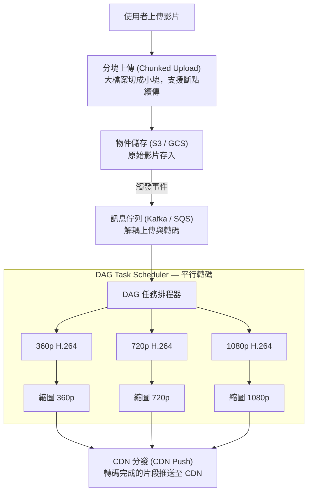

# 影音串流平台 (Video Streaming) — 系統設計深度指南

---

## 1. 這個產業最重視什麼？

影音串流是現代網際網路中**流量最大的應用類別**——根據產業報告，影音流量佔全球網際網路流量超過 65%。這代表在系統設計面試中，你必須展示對**大規模資料傳輸**與**使用者體驗**之間平衡的深刻理解。

### 高吞吐量與頻寬效率 (High Throughput & Bandwidth Efficiency)

影片資料量極為龐大。一個 1080p 串流大約需要 **~5 Mbps**，4K 則需要 **~25 Mbps**。當平台同時有數百萬名觀眾在線時，聚合頻寬需求輕易達到 **Tbps 等級**。系統必須在每一層都進行頻寬最佳化：

- **編碼壓縮**：原始影片 (raw video) 經過編碼器壓縮後，資料量可降低 1000 倍以上
- **多解析度輸出**：不是每個使用者都需要 4K，提供 360p/480p/720p/1080p/4K 多種版本可大幅降低整體頻寬消耗
- **分段傳輸**：只傳送使用者實際觀看的片段，而非整部影片

### 低延遲播放體驗 (Low Latency Playback)

緩衝 (buffering) 是使用者體驗的頭號殺手。研究顯示，**每增加 1 秒的緩衝時間，就有約 6% 的觀眾離開**。關鍵技術包括：

- **自適應位元率串流 (Adaptive Bitrate Streaming, ABR)**：播放器根據即時網路狀況自動切換畫質
- **預先載入 (Prefetching)**：在使用者觀看當前片段時，提前下載後續片段
- **邊緣快取 (Edge Caching)**：讓內容盡可能靠近使用者

### 全球分發 (Global Distribution)

內容傳遞網路 (Content Delivery Network, CDN) 在影音串流中扮演**絕對核心**的角色。如果使用者在台北，而原始伺服器在美國西岸，光是網路往返延遲就可能超過 150ms。CDN 確保：

- 熱門內容快取在全球數百個接入點 (Point of Presence, PoP)
- 使用者從地理上最近的節點取得影片片段
- 原始伺服器 (Origin Server) 的負載大幅降低

### 儲存成本最佳化 (Storage Cost Optimization)

一部 1 小時的原始 4K 影片可能佔用 **數百 GB** 的儲存空間。平台上可能有數億部影片，儲存成本是營運的重大開支：

- **轉碼 (Transcoding)** 產生多種解析度與編碼格式的版本，需要更多儲存但能降低頻寬成本
- **冷熱分層 (Tiered Storage)**：熱門影片放在高速儲存，冷門影片移至低成本歸檔儲存 (如 S3 Glacier)
- **去重 (Deduplication)**：偵測並消除重複上傳的內容

### 可用性 (Availability)

影音串流服務必須**始終可用**。核心原則是**優雅降級 (Graceful Degradation)**——低畫質永遠好過完全無法觀看：

- 當 CDN 邊緣節點故障時，自動回退 (fallback) 到次近的節點
- 當頻寬不足時，自動降低畫質而非停止播放
- 當轉碼服務過載時，優先保證播放端正常運作，上傳可以延遲處理

---

## 2. 面試必提的關鍵概念

### 影片上傳與轉碼管線 (Transcoding Pipeline)

這是影音串流系統中**最常被問到的元件**。完整的管線流程如下：



**DAG (有向無環圖, Directed Acyclic Graph) 排程**的重點：

- 每部影片的處理可拆解成多個**有依賴關係**的任務
- 例如：「產生縮圖」依賴於「轉碼完成」，「更新搜尋索引」依賴於「中繼資料擷取完成」
- DAG 排程器可以最大化平行度，同時保證任務執行順序正確
- 面試中提及 DAG 排程會顯示你對複雜工作流程管理的理解深度

### 自適應位元率串流 (Adaptive Bitrate Streaming, ABR)

ABR 是影音串流最核心的播放端技術。兩大主流協定：

| 特性 | HLS (HTTP Live Streaming) | DASH (Dynamic Adaptive Streaming over HTTP) |
|------|---------------------------|---------------------------------------------|
| 開發者 | Apple | MPEG 聯盟 (開放標準) |
| 片段格式 | .ts (MPEG-TS) 或 .fmp4 | .m4s (fMP4) |
| 清單檔 | .m3u8 | .mpd (XML) |
| 瀏覽器支援 | Safari 原生；其他透過 hls.js | 需 dash.js 或 Shaka Player |
| DRM 整合 | FairPlay (Apple 生態) | Widevine, PlayReady |
| 延遲 | 標準 ~20-30s；LL-HLS ~2-5s | 標準 ~10-20s；LL-DASH ~2-5s |

**清單檔 (Manifest File) 運作原理**：

```
#EXTM3U
#EXT-X-STREAM-INF:BANDWIDTH=800000,RESOLUTION=640x360
360p/playlist.m3u8
#EXT-X-STREAM-INF:BANDWIDTH=2400000,RESOLUTION=1280x720
720p/playlist.m3u8
#EXT-X-STREAM-INF:BANDWIDTH=5000000,RESOLUTION=1920x1080
1080p/playlist.m3u8
```

播放器的流程：
1. 向伺服器請求主清單檔 (Master Manifest)
2. 主清單檔列出所有可用的畫質等級與對應的子清單
3. 播放器根據當前網路頻寬選擇合適的畫質
4. 從子清單取得影片片段的 URL，逐段下載播放
5. **持續監測**下載速度，若頻寬變化則動態切換畫質

### 影片分段 (Chunking / Segmentation)

為什麼要把影片切成 **2-10 秒**的小片段？

- **啟用 ABR 切換**：畫質只能在片段邊界切換，片段越短切換越即時
- **支援快轉定位 (Seeking)**：使用者跳轉時只需下載目標位置的片段，而非整部影片
- **平行下載**：播放器可同時從多個 CDN 節點下載不同片段
- **快取效率**：CDN 以片段為單位快取，熱門片段的快取命中率極高
- **錯誤恢復**：某個片段下載失敗只影響幾秒，可快速重試

**片段長度的權衡**：
- 太短 (< 2s)：HTTP 請求過多，增加伺服器負擔；編碼效率降低 (每個片段需獨立的 keyframe)
- 太長 (> 10s)：ABR 反應遲鈍；使用者快轉時需下載大量不需要的資料
- 業界常見值：**HLS 預設 6 秒，DASH 常用 2-4 秒**

### CDN 策略

| 策略 | Push CDN | Pull CDN |
|------|----------|----------|
| 運作方式 | 內容產生後主動推送到 CDN 邊緣 | 使用者首次請求時從 Origin 拉取並快取 |
| 適用場景 | 熱門內容、預期高流量 | 長尾內容、無法預測流量 |
| 優點 | 首次請求即命中快取 | 儲存成本低，只快取被請求的內容 |
| 缺點 | 儲存成本高，需推送到所有 PoP | 首次請求延遲高 (cold start) |

**Origin Shield (源站保護層)**：

```
使用者 → 邊緣 PoP (Edge) → Origin Shield → Origin Server
```

Origin Shield 是 CDN 架構中的**中間快取層**，位於邊緣節點與源站之間。當多個邊緣節點都沒有快取某個片段時，它們都會向 Origin Shield 請求，而非直接打到源站。這樣可以：

- 大幅降低源站負載（多個邊緣節點的請求被合併為一次源站請求）
- 提高快取命中率
- 防止流量尖峰壓垮源站 (thunder herd problem)

**快取命中率最佳化 (Cache Hit Ratio)**：

目標是 **> 95%**。策略包括：
- 一致性雜湊 (Consistent Hashing) 確保相同內容總是路由到相同的快取節點
- 預熱快取 (Cache Warming)：新發布的熱門內容提前推送
- 合理的 TTL (Time to Live) 設定
- 監控各 PoP 的命中率，識別並解決冷點

### 影片編碼 (Video Codec)

| 編碼器 | 壓縮效率 (相對 H.264) | 解碼成本 | 授權費 | 採用狀況 |
|--------|----------------------|---------|--------|---------|
| H.264/AVC | 基準 (1x) | 低 | 有 (MPEG LA) | 最廣泛，幾乎所有裝置支援 |
| H.265/HEVC | ~50% 更好 | 中 | 有 (複雜) | 4K 內容常用，授權問題限制普及 |
| VP9 | ~30-50% 更好 | 中 | 免費 (Google) | YouTube 大量使用 |
| AV1 | ~30% 更好 (vs HEVC) | 高 | 免費 (AOM 聯盟) | Netflix/YouTube 逐步採用，編碼極慢 |

**面試中的關鍵權衡**：
- 更先進的編碼器 = 更好的壓縮 = 更低的頻寬/儲存成本，**但**轉碼時間更長、解碼需要更多 CPU/GPU
- 平台通常會針對同一部影片產生**多種編碼格式**，根據客戶端裝置能力選擇
- **Per-title encoding (逐片編碼最佳化)**：Netflix 的策略——根據每部影片的內容複雜度動態調整位元率階梯 (bitrate ladder)，而非使用統一設定

### 縮圖與預覽 (Thumbnail / Preview)

- **靜態縮圖**：在上傳轉碼時自動擷取關鍵幀 (keyframe) 作為封面
- **時間軸縮圖 (Timeline Thumbnails)**：每隔固定時間擷取一張，合併成**精靈圖 (Sprite Sheet)**，使用者滑鼠懸停在進度條上時顯示對應畫面
- **動態預覽 (Animated Preview)**：滑鼠懸停時播放無聲短片段，通常為低解析度 GIF 或短 MP4
- 這些素材在轉碼管線中**同步產生**，屬於 DAG 中的子任務

### DRM (數位版權管理, Digital Rights Management)

內容保護是付費平台的**必要功能**。三大 DRM 系統：

| 系統 | 廠商 | 平台覆蓋 |
|------|------|---------|
| Widevine | Google | Chrome, Android, Chromecast, Smart TV |
| FairPlay | Apple | Safari, iOS, Apple TV |
| PlayReady | Microsoft | Edge, Windows, Xbox |

**運作流程**：
1. 影片在轉碼時使用**加密金鑰 (Encryption Key)** 加密
2. 金鑰存放在**授權伺服器 (License Server)**
3. 播放器向授權伺服器請求金鑰（需驗證使用者身份與訂閱狀態）
4. 取得金鑰後在**受保護的環境 (TEE, Trusted Execution Environment)** 中解密播放
5. 金鑰通常有**有效期限**，過期需重新請求

面試中通常不需深入 DRM 實作細節，但要能說明加密與授權的基本流程，以及為何需要支援多個 DRM 系統（因為沒有單一系統能覆蓋所有平台）。

---

## 3. 常見架構模式

### 上傳與轉碼服務 (Upload & Transcoding Service)

```
┌───────────┐
│  客戶端     │
│  (Client)  │
└─────┬─────┘
      │ ① 請求上傳 URL (Presigned URL)
      ▼
┌───────────┐        ┌──────────────────┐
│  API 閘道  │───────→│  上傳服務          │
│  (API GW)  │        │  (Upload Service) │
└───────────┘        └────────┬─────────┘
                              │ ② 回傳 Presigned URL
      ┌───────────────────────┘
      │
      ▼
┌───────────┐  ③ 直接上傳 (分塊)
│  客戶端     │─────────────────────────→ ┌──────────────┐
└───────────┘                            │  物件儲存      │
                                         │  (S3 / GCS)   │
                                         └──────┬───────┘
                                                │ ④ S3 Event
                                                ▼
                                         ┌──────────────┐
                                         │  訊息佇列      │
                                         │  (Kafka/SQS)  │
                                         └──────┬───────┘
                                                │
                                                ▼
                                    ┌────────────────────────┐
                                    │  轉碼排程器               │
                                    │  (Transcoding Scheduler) │
                                    └──────────┬─────────────┘
                                               │
                        ┌──────────────────────┼──────────────────────┐
                        ▼                      ▼                      ▼
                 ┌────────────┐        ┌────────────┐        ┌────────────┐
                 │ Worker 360p │        │ Worker 720p │        │ Worker 1080p│
                 │ (FFmpeg)    │        │ (FFmpeg)    │        │ (FFmpeg)    │
                 └──────┬─────┘        └──────┬─────┘        └──────┬─────┘
                        │                     │                      │
                        ▼                     ▼                      ▼
                 ┌──────────────────────────────────────────────────────┐
                 │              轉碼後物件儲存 (Output Bucket)            │
                 └───────────────────────┬──────────────────────────────┘
                                         │ ⑤ 推送至 CDN / 更新中繼資料
                                         ▼
                               ┌──────────────────┐
                               │  CDN + 中繼資料 DB  │
                               └──────────────────┘
```

**關鍵設計要點**：

- **Presigned URL**：客戶端直接上傳至物件儲存，繞過 API 伺服器，避免成為瓶頸
- **分塊上傳 (Multipart Upload)**：支援斷點續傳 (resume)，大檔案必備
- **訊息佇列解耦**：上傳與轉碼完全解耦，轉碼速度不影響上傳體驗
- **平行轉碼**：不同解析度/編碼格式可同時進行，大幅縮短處理時間
- **Spot/Preemptible Instances**：轉碼是 CPU/GPU 密集型且容錯性高的工作，非常適合使用競價型實例 (spot instances)，可節省 60-80% 運算成本
- **冪等性 (Idempotency)**：轉碼任務可能因 spot instance 回收而中斷，必須支援安全重試

### 串流服務 (Streaming Service)

```
┌───────────┐  ① 請求影片頁面
│  客戶端     │──────────────────→ ┌──────────────┐
│  (Player)  │                    │  API 伺服器    │  → 查詢中繼資料 DB
└─────┬─────┘  ② 回傳 Manifest   │  (Metadata)   │    (標題、描述、
      │        URL               └──────────────┘     可用畫質等)
      │
      │ ③ 請求 Master Manifest (.m3u8 / .mpd)
      ▼
┌─────────────┐
│  CDN Edge    │  ← 清單檔通常也快取在 CDN
└─────┬───────┘
      │ ④ 回傳畫質選項列表
      ▼
┌───────────┐  ⑤ 根據頻寬選擇畫質
│  客戶端     │     請求子清單
│  (ABR      │──→ CDN Edge ──→ 回傳片段 URL 列表
│   Logic)   │
└─────┬─────┘
      │ ⑥ 逐段請求影片片段 (.ts / .m4s)
      ▼
┌─────────────┐     Cache Miss     ┌────────────────┐     Cache Miss    ┌──────────┐
│  CDN Edge    │──────────────────→│  Origin Shield  │─────────────────→│  Origin   │
│  (PoP)       │                   │  (中間快取層)     │                  │  (S3)     │
└─────────────┘  ← 快取命中直接回傳  └────────────────┘                   └──────────┘
```

**播放端關鍵機制**：

- **緩衝策略 (Buffer Strategy)**：播放器通常維持 ~30 秒的前向緩衝 (forward buffer)
- **位元率估算 (Bandwidth Estimation)**：基於最近 N 個片段的下載速度計算；常見演算法有 BOLA (buffer-based)、MPC (model predictive control)
- **起始畫質 (Start Quality)**：首次載入時選擇中低畫質以快速開始播放，再逐步提升

### 推薦系統 (Recommendation System)

雖然推薦系統不是串流架構的「核心」，但面試官經常追問。基本架構：

```
┌──────────────────────────────────────────────────────────────┐
│                      離線管線 (Offline Pipeline)               │
│                                                              │
│  觀看歷史 ─→ 特徵工程 ─→ 模型訓練 ─→ 候選生成 ─→ 排序模型      │
│  (Watch       (Feature    (Model      (Candidate   (Ranking  │
│   History)     Eng.)       Training)   Generation)  Model)   │
└──────────────────────────────┬───────────────────────────────┘
                               │ 模型產出物
                               ▼
┌──────────────────────────────────────────────────────────────┐
│                      線上服務 (Online Serving)                 │
│                                                              │
│  使用者請求 ─→ 召回 (Recall) ─→ 粗排 ─→ 精排 ─→ 重排 ─→ 結果  │
│               候選池: ~10K     ~1K     ~100    考慮多樣性     │
└──────────────────────────────────────────────────────────────┘
```

面試中提及以下要點即可：
- **協同過濾 (Collaborative Filtering)**：「看過 A 的人也看了 B」
- **內容特徵 (Content-based)**：基於影片標籤、類別、描述的相似度
- **即時訊號**：當前觀看進度、跳過行為等即時調整推薦

### 直播串流 (Live Streaming)

直播與點播 (Video on Demand, VOD) 的關鍵差異在於**延遲預算 (Latency Budget)**。

```
┌──────────┐  RTMP/SRT   ┌──────────┐  內部傳輸   ┌───────────┐
│  直播主    │────────────→│  接收伺服器 │──────────→│  即時轉碼器  │
│  (Streamer)│            │  (Ingest  │           │(Transcoder)│
└──────────┘             │   Server) │           └─────┬─────┘
                          └──────────┘                  │
                                                        │ HLS/DASH 片段
                                                        ▼
                                                 ┌────────────┐
                                                 │  CDN 分發    │
                                                 └──────┬─────┘
                                                        │
                                                        ▼
                                                 ┌────────────┐
                                                 │  觀眾 (多人)  │
                                                 └────────────┘
```

**延遲預算分解**：

| 階段 | 傳統 HLS | 低延遲 HLS (LL-HLS) |
|------|---------|-------------------|
| 編碼 (Encoding) | ~1-2s | ~0.5-1s |
| 接收傳輸 (Ingest) | ~1s | ~0.5s |
| 轉碼 (Transcoding) | ~2-4s | ~0.5-1s (部分片段) |
| CDN 分發 | ~2-3s | ~1s |
| 播放器緩衝 | ~6-10s (3 個片段) | ~1-2s (部分片段) |
| **總計** | **~15-30s** | **~3-5s** |

**降低直播延遲的關鍵技術**：

- **CMAF (Common Media Application Format)**：允許在片段完成前就開始傳輸（chunked transfer encoding 的應用）
- **部分片段 (Partial Segments)**：LL-HLS 的核心——不等整個 6 秒片段完成，每 200ms 產生一個部分片段
- **預載提示 (Preload Hints)**：伺服器告知播放器下一個部分片段的 URL，播放器可提前發出請求
- **WebRTC**：若需要 < 1 秒的超低延遲（如即時互動），可考慮 WebRTC，但犧牲了規模化能力

---

## 4. 技術選型偏好 (Technology Choices)

### 儲存層 (Storage)

| 用途 | 推薦方案 | 理由 |
|------|---------|------|
| 原始影片 & 轉碼後片段 | S3 / GCS (物件儲存) | 無限擴展、按量付費、與 CDN 天然整合 |
| 原始影片長期歸檔 | S3 Glacier / GCS Archive | 成本僅為標準儲存的 1/10 |
| 縮圖與精靈圖 | S3 + CDN | 小檔案、高讀取頻率 |

物件儲存 (Object Storage) 是影音串流的**基石**。面試中務必說明：
- 物件儲存天然適合大型不可變檔案 (immutable blobs)
- 支援 multipart upload 與 presigned URL
- 11 個 9 的持久性 (99.999999999% durability)

### 資料庫層 (Database)

| 資料類型 | 推薦方案 | 理由 |
|---------|---------|------|
| 影片中繼資料 (標題、描述、上傳者) | PostgreSQL / MySQL | 關聯式資料、需要 ACID 交易 |
| 使用者資訊、訂閱狀態 | PostgreSQL / MySQL | 強一致性需求 |
| 觀看記錄、按讚/收藏 | Cassandra / DynamoDB | 極高寫入量、可接受最終一致性 |
| 搜尋索引 | Elasticsearch | 全文搜尋、模糊搜尋 |
| 即時計數 (觀看次數) | Redis | 記憶體內計數器、極低延遲 |
| 推薦特徵 | Redis / Feature Store | 線上推論需要毫秒級讀取 |

### CDN

| 服務 | 特點 |
|------|------|
| CloudFront (AWS) | 與 S3 深度整合、全球 400+ PoP |
| Akamai | 最老牌、PoP 數量最多 (~4000)、企業級 |
| Fastly | 邊緣運算 (Edge Compute) 強大、即時清除快取 |
| Cloudflare | 性價比高、自建骨幹網路 |

**PoP (Point of Presence, 接入點)** 的概念：
- 每個 PoP 是一個部署在特定地理位置的快取叢集
- 使用者透過 DNS 或 Anycast 被導向最近的 PoP
- PoP 越多 = 使用者到 CDN 的距離越短 = 延遲越低
- 大型平台（如 Netflix）甚至會在 ISP 機房內部署自有快取伺服器 (Open Connect Appliances)

### 訊息佇列 (Message Queue)

| 場景 | 推薦方案 | 理由 |
|------|---------|------|
| 上傳事件串流 | Kafka | 高吞吐量、持久化、支援回放 (replay) |
| 轉碼任務排程 | SQS / RabbitMQ | 簡單的工作佇列 (work queue)、可見性逾時 (visibility timeout) 確保任務不遺失 |
| 即時通知 (轉碼完成) | SNS / Kafka | 發布-訂閱 (pub-sub) 模式 |

**為何上傳事件用 Kafka 而轉碼排程用 SQS？**
- Kafka 適合事件串流：需要保留歷史、多個消費者可獨立讀取
- SQS 適合工作佇列：一個任務只需被一個 worker 處理一次、內建重試與死信佇列 (Dead Letter Queue)

### 轉碼 (Transcoding)

- **FFmpeg**：業界標準的開源多媒體處理框架，幾乎所有串流平台都在使用
- **硬體加速**：GPU 實例 (如 NVIDIA T4/A10G) 可將轉碼速度提升 5-10 倍
- **Spot Instances**：轉碼具有容錯性（可重試），非常適合使用 spot instances，成本降低 60-80%
- **容器化**：每個轉碼任務作為一個容器 (container) 執行，方便資源隔離與彈性伸縮
- **大型平台自研**：Netflix (Cosmos)、YouTube 都有自研的轉碼框架，針對其規模做了深度最佳化

---

## 5. 面試加分提示與常見陷阱

### 加分提示

**展示成本意識 (Cost Awareness)**

面試官非常看重資深工程師的成本意識。你可以主動提及：
- 「轉碼使用 spot instances 可節省 ~70% 運算成本」
- 「冷門影片移至 S3 Glacier 後每 GB 每月僅需 ~$0.004」
- 「CDN 的頻寬成本是影音平台最大開支之一，提高快取命中率直接影響底線」
- 「Per-title encoding 可在相同畫質下降低 20-30% 位元率，直接節省頻寬費」

**提出漸進式設計 (Progressive Design)**

不要一開始就拋出最終架構。展示你的**思考過程**：
1. 先從簡單架構開始（單一轉碼器、單一 CDN 供應商）
2. 隨著規模增長加入佇列、平行轉碼
3. 再加入 multi-CDN 策略、邊緣運算
4. 最後討論全球部署、多區域架構

**量化估算 (Back-of-the-Envelope Estimation)**

面試官喜歡看到數字：
- 假設 DAU = 100M，平均每人觀看 30 分鐘
- 總觀看時長 = 100M x 30 min = 3B 分鐘/天
- 若平均位元率 5 Mbps → 每日頻寬 = 5 Mbps x 3B x 60s = ~1.1 EB/天
- 每日新上傳 10 萬部影片，平均 10 分鐘 → 原始儲存 ~500 TB/天
- 轉碼為 5 種解析度 → 額外 ~250 TB/天（壓縮後）

**提及可觀測性 (Observability)**

展示你在生產環境中的實戰經驗：
- **播放品質指標**：起始時間 (Time to First Frame)、重新緩衝率 (Rebuffer Rate)、位元率切換頻率
- **轉碼管線健康度**：佇列深度、處理延遲、失敗率
- **CDN 效能**：快取命中率、各 PoP 回應時間、Origin 回源率

### 常見陷阱

**陷阱一：忽略上傳環節的複雜度**

很多候選人把重心完全放在播放端，卻忽略了上傳同樣充滿挑戰：
- 大檔案上傳需要分塊與斷點續傳
- 需要病毒掃描、內容審核 (content moderation)
- 上傳完成率 (upload completion rate) 是重要指標
- 需要處理重複上傳 (deduplication)

**陷阱二：把 CDN 當成萬能藥**

CDN 不是設好就完事：
- 快取失效策略 (cache invalidation) 需要仔細設計
- 不同地區的 CDN 表現差異很大，可能需要 multi-CDN 策略
- 長尾內容 (冷門影片) 的快取命中率很低，需要不同策略
- CDN 回源 (origin fetch) 的成本與延遲不容忽視

**陷阱三：忽略邊界情況 (Edge Cases)**

面試官會故意追問的場景：
- 影片上傳到一半網路斷線怎麼辦？ → 分塊上傳 + 斷點續傳
- 轉碼任務失敗怎麼辦？ → 冪等重試 + 死信佇列 + 告警
- CDN 某個區域故障怎麼辦？ → Multi-CDN failover + 健康檢查
- 突發流量（某個影片爆紅）怎麼辦？ → CDN 應對 + 自動擴展轉碼 worker + 限流 (rate limiting) 上傳端

**陷阱四：混淆點播 (VOD) 與直播 (Live) 架構**

兩者有根本性差異：
- 點播可以預先轉碼所有格式；直播必須即時轉碼
- 點播可以在 CDN 充分快取；直播的快取價值有限（內容不斷變化）
- 點播的延遲不敏感；直播的延遲是核心指標
- 面試中如果沒有特別說明，預設討論點播架構，但主動提及與直播的差異會加分

**陷阱五：過度設計 (Over-engineering)**

除非面試官明確要求，否則不要深入以下主題：
- 自行建造 CDN（除非你面試的是 Netflix/YouTube 等級的公司）
- 自研影片編碼器
- 複雜的推薦系統 ML 架構（除非題目明確要求）
- 邊緣運算 (Edge Computing) 的具體實作

---

## 6. 經典面試題

### 題目一：設計 YouTube (影片分享平台)

**考察重點**：完整的上傳→轉碼→儲存→播放管線

- 需要涵蓋：影片上傳 (含大檔案處理)、轉碼管線 (DAG 排程)、ABR 串流、CDN 策略
- 資料模型：影片中繼資料、使用者資訊、頻道訂閱關係
- 進階討論：觀看次數的精確統計（防作弊）、評論系統、搜尋功能
- 規模估算：數十億影片、數千萬 DAU、每分鐘 500 小時新上傳

<details>
<summary>點擊查看參考思路</summary>

#### 高層架構
系統分為兩條主要路徑：**寫入路徑**（上傳 → 轉碼 → 儲存）與**讀取路徑**（播放器 → CDN → Origin）。寫入路徑透過 Presigned URL 直傳物件儲存後以訊息佇列觸發 DAG 轉碼管線；讀取路徑以 CDN 為核心，播放器透過 ABR 清單檔動態選擇畫質並逐段下載。

#### 核心元件
- **上傳服務**：產生 Presigned URL、管理分塊上傳 (Multipart Upload)、支援斷點續傳
- **轉碼管線**：DAG 排程器 + FFmpeg Worker 叢集（Spot Instances），平行產出多解析度 + 縮圖 + 精靈圖
- **物件儲存 (S3/GCS)**：原始影片 + 轉碼輸出 + 縮圖，搭配冷熱分層 (Standard → Glacier)
- **中繼資料服務**：PostgreSQL 存影片資訊 + Redis 快取熱門查詢 + Elasticsearch 全文搜尋
- **CDN 層**：Multi-tier (Edge PoP → Origin Shield → Origin)，搭配 Push/Pull 混合策略
- **觀看計數服務**：Redis 即時計數 + Kafka 串流寫入 Cassandra 做持久化，批次校正防作弊

#### 關鍵決策與 Trade-off
| 決策 | 選項 A | 選項 B | 建議 |
|------|--------|--------|------|
| 上傳方式 | 透過 API Server | Presigned URL 直傳 S3 | 直傳 S3，避免 API Server 成為瓶頸 |
| 轉碼觸發 | 同步轉碼 | 佇列 + 非同步 Worker | 非同步解耦，上傳體驗不受轉碼速度影響 |
| 計數精確度 | 即時精確 | 近似即時 + 批次校正 | 後者，精確即時成本過高且需防作弊 |
| 編碼格式 | 統一 H.264 | 多格式 (H.264 + VP9 + AV1) | 漸進式：先 H.264 覆蓋全裝置，再加 VP9/AV1 降頻寬 |

#### 面試時要主動提到的點
- Presigned URL 讓客戶端繞過 API Server 直傳，是大檔案上傳的標準做法
- 轉碼任務具備冪等性，天然適合 Spot Instance 節省 60-80% 成本
- 觀看計數需要防刷機制（同 IP/帳號頻率限制、行為異常偵測）
- 內容審核 (Content Moderation) 應作為轉碼 DAG 中的一個節點，影片發布前必須通過
</details>

### 題目二：設計 Netflix (訂閱制串流平台)

**考察重點**：高可用播放體驗 + 推薦系統

- 與 YouTube 的差異：專業內容 (非 UGC)、付費訂閱模式、DRM 必備
- 重點討論：ABR 演算法最佳化、多裝置支援、離線下載功能
- 推薦系統：個人化首頁、「因為你看了 X」推薦列、A/B 測試框架
- 進階討論：Open Connect CDN 自建策略、per-title encoding、多區域部署

<details>
<summary>點擊查看參考思路</summary>

#### 高層架構
Netflix 的核心差異在於**內容由平台控制**（非 UGC），因此可以在發布前充分轉碼與預熱 CDN。架構分為三大面向：內容準備管線（轉碼 + DRM 加密 + CDN 預推送）、播放服務（ABR + 多裝置適配 + 離線下載授權）、推薦引擎（離線訓練 + 線上服務）。

#### 核心元件
- **內容準備管線**：Per-title encoding 分析影片複雜度 → 產出最佳化 bitrate ladder → 多格式轉碼 → DRM 加密 (Widevine + FairPlay + PlayReady)
- **播放服務**：Steering Service 根據使用者位置/裝置/網路品質選擇最佳 CDN 節點與編碼格式
- **Open Connect CDN**：自建 CDN 設備部署於 ISP 機房，離峰時段預填充 (pre-fill) 熱門內容
- **推薦引擎**：離線管線 (Spark) 做候選生成 + 線上服務 (微服務) 做即時排序 + A/B 測試框架驗證效果
- **帳號與授權**：訂閱狀態管理、同時觀看裝置數限制、DRM 授權伺服器

#### 關鍵決策與 Trade-off
| 決策 | 選項 A | 選項 B | 建議 |
|------|--------|--------|------|
| CDN 策略 | 第三方 CDN | 自建 CDN (Open Connect) | 規模夠大時自建可節省 ~50% 頻寬成本 |
| 編碼策略 | 固定 bitrate ladder | Per-title encoding | Per-title 可節省 20-30% 頻寬，但轉碼時間增加 |
| 推薦更新 | 純離線批次 | 離線 + 即時訊號融合 | 融合方案，離線做候選池、即時訊號調整排序 |
| 離線下載 | 不支援 | 限時 DRM 授權下載 | 支援，提升使用者留存率，授權到期自動失效 |

#### 面試時要主動提到的點
- 與 YouTube 最大的架構差異：內容可控 → 可預轉碼所有格式 + 預熱 CDN，不需處理 UGC 的上傳規模問題
- DRM 是付費平台的硬需求，必須同時支援三大 DRM 系統才能覆蓋所有裝置
- Per-title encoding 展示你對頻寬成本最佳化的深度理解
- 優雅降級：寧可降畫質也不中斷播放，是 Netflix 的核心設計哲學
</details>

### 題目三：設計 Twitch (直播串流平台)

**考察重點**：低延遲直播 + 即時互動

- 核心挑戰：RTMP 接收 → 即時轉碼 → HLS/DASH 分發的延遲控制
- 聊天系統：與直播同步的即時聊天 (WebSocket)、訊息排序、髒話過濾
- 進階討論：LL-HLS vs WebRTC 的取捨、同時在線人數極高的頻道處理、clip 功能（直播中截取精彩片段）
- 規模特性：少數頻道佔大部分流量 (heavy-tailed distribution)

<details>
<summary>點擊查看參考思路</summary>

#### 高層架構
系統分為**接收層**（直播主推流 → Ingest Server）、**處理層**（即時轉碼為多畫質 HLS/DASH 片段）、**分發層**（CDN 邊緣分發）三段，另外平行運作**聊天系統**（WebSocket 閘道 + 訊息廣播）。延遲控制是貫穿全鏈路的核心目標，每個環節都有嚴格的延遲預算。

#### 核心元件
- **Ingest Server 叢集**：接收 RTMP/SRT 推流，全球部署讓直播主就近推送；透過 DNS 路由選擇最近節點
- **即時轉碼器**：接收原始流 → 即時編碼為多畫質 → 產出 LL-HLS 部分片段 (Partial Segments)，每 200ms 一個
- **CDN 分發**：LL-HLS 搭配 Preload Hints，讓播放器提前請求下一個部分片段
- **聊天系統**：WebSocket 閘道 → 訊息佇列 (Redis Pub/Sub 或 Kafka) → 廣播至同頻道觀眾；獨立於影音管線
- **Clip 服務**：監聽直播流，持續保存最近 N 分鐘的片段至暫存，使用者觸發 Clip 時從暫存截取並轉為 VOD

#### 關鍵決策與 Trade-off
| 決策 | 選項 A | 選項 B | 建議 |
|------|--------|--------|------|
| 分發協定 | 傳統 HLS (~20-30s 延遲) | LL-HLS (~3-5s) | LL-HLS 為主流平衡點 |
| 超低延遲 | LL-HLS (~3-5s) | WebRTC (< 1s) | WebRTC 延遲更低但難以規模化，僅用於互動場景 |
| 聊天廣播 | 每則訊息即時推送 | 批次合併推送 (100ms 窗口) | 百萬人頻道必須批次合併，否則 WebSocket 壓力爆炸 |
| 熱門頻道 | 統一架構 | 專屬 Ingest + 預留 CDN 容量 | 混合：預設統一，Top 頻道預留資源避免搶佔 |

#### 面試時要主動提到的點
- 延遲預算分解：編碼 ~0.5s + 接收 ~0.5s + 轉碼 ~0.5-1s + CDN ~1s + 播放器緩衝 ~1-2s = 總計 ~3-5s
- 直播與點播的根本差異：不能預轉碼、CDN 快取價值低（內容不斷變化）、延遲是核心指標
- Heavy-tailed distribution：1% 頻道佔 80% 流量，資源分配策略需特別處理頭部頻道
- 聊天系統必須與影音管線分離部署，避免聊天故障影響觀看體驗
</details>

### 題目四：設計影片轉碼服務 (Video Transcoding Service)

**考察重點**：分散式任務排程 + 資源管理

- DAG 任務排程器的設計：任務依賴管理、失敗重試、優先級排程
- 資源管理：GPU/CPU 混合叢集、spot instance 管理、自動擴縮
- 效能最佳化：影片分段平行轉碼 (split → parallel encode → merge)、two-pass encoding
- 可靠性：任務冪等性、進度追蹤、死信佇列

<details>
<summary>點擊查看參考思路</summary>

#### 高層架構
轉碼服務的核心是一個**DAG 排程引擎**加上**彈性 Worker 叢集**。排程引擎管理任務依賴圖（轉碼 → 縮圖 → 加密 → 中繼資料更新），Worker 叢集根據佇列深度自動擴縮。單一長影片可透過「切割 → 平行編碼 → 合併」進一步加速處理。

#### 核心元件
- **DAG 排程器**：解析任務依賴圖，拓撲排序後將就緒任務推入對應佇列；追蹤每個 DAG 的整體進度
- **任務佇列**：SQS/RabbitMQ，按優先級分佇列（付費用戶 > 免費用戶；短影片 > 長影片）
- **Worker 叢集**：容器化 FFmpeg Worker，GPU Worker 處理 H.265/AV1，CPU Worker 處理 H.264；以 Spot Instance 為主
- **Splitter/Merger**：長影片先在 keyframe 邊界切割成獨立片段，各段平行轉碼後再合併 (concat)
- **進度追蹤 DB**：記錄每個子任務狀態 (pending/running/success/failed)，支援冪等重試
- **死信佇列 (DLQ)**：多次重試仍失敗的任務進入 DLQ，觸發告警供人工介入

#### 關鍵決策與 Trade-off
| 決策 | 選項 A | 選項 B | 建議 |
|------|--------|--------|------|
| 排程方式 | 簡單工作佇列 | DAG 排程器 | DAG，任務間有依賴關係（縮圖依賴轉碼完成） |
| Worker 類型 | 純 CPU | GPU + CPU 混合 | 混合：GPU 給高壓縮率編碼 (AV1)，CPU 給 H.264 |
| 實例類型 | On-Demand | Spot Instance | Spot 為主 (省 60-80%)，任務冪等可安全重試 |
| 長影片處理 | 整片轉碼 | Split → Parallel Encode → Merge | 分段平行，1 小時影片從 1 小時縮短到分鐘級 |

#### 面試時要主動提到的點
- 冪等性是核心設計原則：Spot Instance 隨時可能被回收，任務重試必須安全
- Two-pass encoding 能提升壓縮品質但耗時加倍，適合 VOD 不適合直播
- 佇列深度是自動擴縮 (Auto Scaling) 的最佳訊號，比 CPU 使用率更即時
- 轉碼完成後的回呼 (callback) 通知上游服務更新影片狀態為「可播放」
</details>

### 題目五：設計短影音平台 (如 TikTok / Instagram Reels)

**考察重點**：快速播放體驗 + 內容發現 (Feed)

- 與長影音的差異：影片短 (15-60s)、上傳量極大、預載策略不同
- Feed 設計：推薦驅動而非訂閱驅動、無限滾動 (infinite scroll)、預載下 N 個影片
- 播放最佳化：因為影片短，可能直接預載整個影片而非分段串流
- 創作者工具：濾鏡、音樂疊加、影片拼接——這些在上傳前在客戶端完成
- 進階討論：冷啟動問題 (新影片/新使用者)、內容審核的時效性需求

<details>
<summary>點擊查看參考思路</summary>

#### 高層架構
短影音的核心設計軸心是**推薦 Feed**而非搜尋或訂閱。使用者打開 App 即進入全螢幕播放，系統預載接下來 3-5 支影片以實現無縫滑動體驗。上傳量極大但單片體積小，轉碼速度要求高（上傳後數分鐘內必須可被推薦），內容審核必須在發布前完成。

#### 核心元件
- **Feed 服務**：每次請求回傳一批推薦影片 (batch fetch ~20 支)，客戶端預載前 3-5 支的完整影片
- **推薦引擎**：離線候選生成 + 線上排序；核心訊號包括完播率、重播率、分享率（比按讚更有價值）
- **快速轉碼管線**：短影片 (< 60s) 無需分段平行轉碼，單 Worker 快速產出多畫質即可；SLA < 5 分鐘
- **內容審核管線**：AI 模型 (影像分類 + OCR + 音訊辨識) 做自動審核，標記高風險的交人工複審
- **音樂/音效資料庫**：授權音樂庫 + 音訊指紋比對 (audio fingerprinting) 處理版權問題
- **互動服務**：按讚/留言/分享計數 (Redis) + 持久化 (Cassandra)

#### 關鍵決策與 Trade-off
| 決策 | 選項 A | 選項 B | 建議 |
|------|--------|--------|------|
| 播放方式 | ABR 分段串流 | 預載完整影片 | 預載完整：影片短 (< 5MB)，整片下載更簡單且體驗更好 |
| Feed 模式 | 訂閱驅動 (timeline) | 推薦驅動 (For You) | 推薦驅動，是短影音平台的核心競爭力 |
| 審核時機 | 上傳後才審核 | 發布前攔截 | 發布前攔截，避免有害內容觸及使用者 |
| 冷啟動 | 隨機曝光 | 小流量池逐步擴大 | 流量池機制：新影片先給小批使用者，表現好再擴大曝光 |

#### 面試時要主動提到的點
- 與 YouTube 最大差異：影片短到可以直接預載完整檔案，不需要 ABR 分段串流
- 推薦品質直接決定產品成敗，完播率是最關鍵的訊號（比點擊率更能反映真實興趣）
- 內容審核的時效性：上傳到可見必須在分鐘級完成，審核是管線中的阻塞節點
- 冷啟動策略：新影片/新使用者的處理方式直接影響生態健康，面試官常追問
</details>

### 題目六：設計 CDN 系統 (Content Delivery Network)

**考察重點**：分散式快取 + 全球路由

- 核心元件：PoP 節點、Origin Shield、DNS/Anycast 路由、快取策略
- 快取設計：一致性雜湊、快取淘汰策略 (LRU/LFU)、Cache-Control 標頭
- 路由策略：GeoDNS、Anycast、基於延遲的路由 (latency-based routing)
- 進階討論：快取失效 (purge/invalidation)、multi-tier 快取、邊緣運算能力
- 可靠性：PoP 故障轉移、DDoS 防護、流量突增應對

<details>
<summary>點擊查看參考思路</summary>

#### 高層架構
CDN 本質上是一個**全球分散式快取系統**，由三層構成：Edge PoP（靠近使用者的邊緣節點）→ Origin Shield（中間快取層，聚合回源請求）→ Origin Server（源站）。使用者透過智慧路由（GeoDNS 或 Anycast）被導向最近的 PoP，大部分請求在邊緣命中快取直接回傳。

#### 核心元件
- **Edge PoP 叢集**：每個 PoP 含多台快取伺服器，使用一致性雜湊分配內容到特定節點
- **Origin Shield**：區域級中間快取，合併多個 Edge PoP 的回源請求，保護 Origin 不被打爆
- **路由系統**：GeoDNS 做粗粒度地理路由 + Anycast 做細粒度網路路由 + 即時延遲探測做動態調整
- **快取管理**：Cache-Control 標頭驅動 TTL、LRU/LFU 混合淘汰策略、即時 Purge API
- **控制平面**：設定管理、健康檢查、流量分析儀表板、DDoS 偵測與緩解
- **日誌與計費**：邊緣存取日誌即時串流至中央，用於計費與分析

#### 關鍵決策與 Trade-off
| 決策 | 選項 A | 選項 B | 建議 |
|------|--------|--------|------|
| 路由方式 | GeoDNS | Anycast | 結合使用：DNS 做首輪路由，Anycast 做同 PoP 內負載均衡 |
| 快取淘汰 | LRU | LFU | LFU 更適合影音（熱門內容持續被訪問），可用 LRU + 頻率加權 |
| 快取一致性 | TTL 過期 | 主動 Purge | 混合：TTL 處理常規更新，Purge API 處理緊急失效 |
| 架構層數 | 2 層 (Edge → Origin) | 3 層 (Edge → Shield → Origin) | 3 層：Shield 大幅降低回源率，是保護 Origin 的關鍵 |

#### 面試時要主動提到的點
- Thunder herd problem：熱門內容過期瞬間大量回源，解法是 Origin Shield 合併請求 + request coalescing（同一內容只發一次回源請求）
- 一致性雜湊確保同一內容總是路由到同一快取節點，避免重複快取浪費記憶體
- 快取命中率目標 > 95%，每降低 1% 命中率都意味著顯著的回源成本與延遲增加
- PoP 故障轉移：健康檢查偵測異常後，DNS 自動將流量切換到次近 PoP，使用者無感
</details>

---

> **總結**：影音串流系統設計的核心在於理解「資料量極大 + 使用者體驗敏感」這一雙重挑戰。面試中，展示你對**轉碼管線**、**ABR 串流**、**CDN 策略**三大支柱的深入理解，輔以成本意識與量化估算能力，就能給出令人信服的回答。記得從簡單架構出發，逐步演進到完整設計，而非一開始就拋出最終方案。
